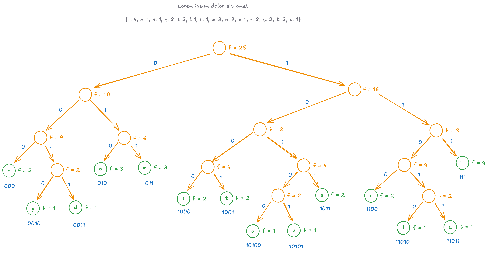

# Huffman Coding

## About

Huffman coding is optimal prefix code for lossless data compression. See [demo](../../labs/huffman-encoding/index.md).

<div markdown class="grid">

<div markdown>
Calculate frequency of each $token$ in the input. In our concrete example, we treat each `Char` as a token.
</div>

```kotlin linenums="1"
fun charCount(content: String): Map<Char, Long> {
  return content
    .chars()
    .mapToObj { c -> c.toChar() }
    .collect(groupingBy({ it }, counting()))
}
```

<div markdown>
Create a min-heap where each node contains a `Char` and its frequency.
</div>

```kotlin linenums="1"
data class TreeNode(
  var frequency: Int,
  val char: Char? = null,
  val left: TreeNode? = null,
  val right: TreeNode? = null,
) : Comparable<TreeNode> {

  val isLeaf: Boolean
    get() = left == null && right == null

  override fun compareTo(other: TreeNode): Int =
    frequency - other.frequency
}

val minHeap = PriorityQueue<TreeNode>()
for ((ch, count) in charCount(content)) {
  minHeap.offer(TreeNode(ch.toInt(), char))
}
```

<div markdown>
Now as long as min-heap has two or more element, do the following:

- Pop two elements (least frequent and second least frequent).
- Create a new node that's their parent with frequency that's sum of theirs.
- Insert this parent node back in min-heap.

Once done, we'll be left with a single $root$ node in the min-heap.

</div>

```kotlin linenums="1"
while (minHeap.size >= 2) {
  val first = minHeap.poll()
  val second = minHeap.poll()
  minHeap.offer(
    TreeNode(
      frequency = first.frequency + second.frequency,
      char = null,
      left = first,
      right = second
    )
  )
}

val root = minHeap.poll()
```

</div>

At this point, we'll end up with a tree like this. Notice that the actual token from the input are our leaf nodes.



<div markdown class="grid">

<div markdown>
Next we do a DFS traversal of this tree via recursion. The left/right turn we take will lead us to the shortest prefix coding for each token.
</div>

```kotlin linenums="1"
val dictionary = HashMap<Char, String>()
fun encode(node: TreeNode?, code: String) {
  if (node == null) return
  if (node.isLeaf) {
    dictionary[node.char!!] = code
  }
  encode(node.left, code + '0')
  encode(node.right, code + '1')
}

encode(root, code = "")
```

<div markdown>
We are left with a dictionary which maps input token to their compressed counterparts.

The mapping is such that no code is a prefix of another.

</div>

```
dictionary={
  e=000,
  o=010,
  m=011,
  _=111,

  p=0010,
  d=0011,
  i=1000,
  t=1001,
  s=1011,
  r=1100,

  a=10100,
  u=10101,
  l=11010,
  L=11011,
}
```

</div>
