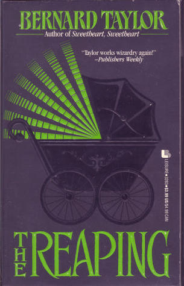

# The Reaping by Bernard Taylor

| {width=140px}                                                                                  |
| ------------------------------------------------------------------------------------------------------------------- |
| DNF :material-star: :material-star-outline: :material-star-outline: :material-star-outline: :material-star-outline: |

Another disappointing read, or an attempt thereof. This book was a random recommendation from YouTube, and the premise initially sounded quite intriguing.

At some point during the read I realized that I had progressed to 41% and the main plot was just starting. A bit concerned, but sure.

Then the story did a series of things and I lost all interest:

- The protagonist, who's in his 40s (50?), has some r/menwritingwomen thoughts about the subject of his potrait, a girl decades younger than him.
- He suspect the girl is being abused but does nothing about it.
- Gets "miscusi" by the butler, and trampolines into prey on the young girl, who is obviously trying to get away from an abusive situation.

At this point I checked when was this novel written and that turned out to be 1980. So this was going to be played straight. It was not going to be an introspection of our protagnoist's actions. It was not going to be subversion of some trope. I put the book down after that.

I can't find Wiki entry for this to get the summary, but the story so far didn't impress me enough to be curious either.
