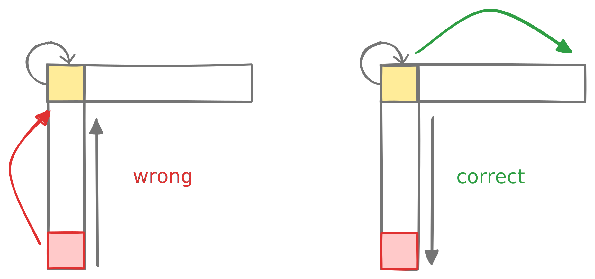
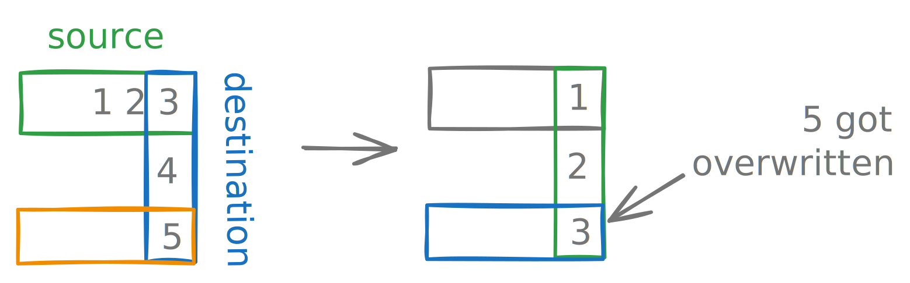
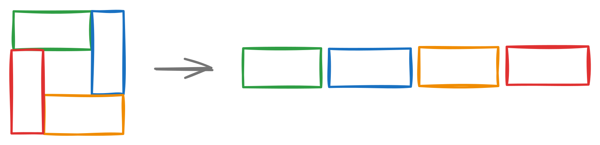
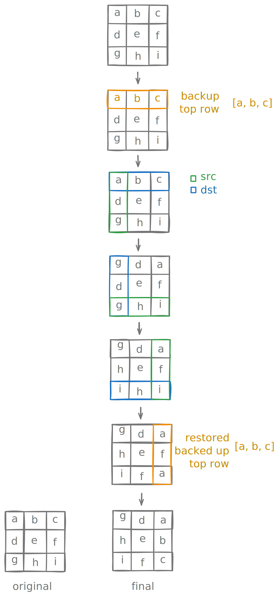

# 2D array rotation

## Examples

<div markdown class="grid">

**From**

**To**

```
1  2  3
4  5  6
7  8  9
```

```
7  4  1 
8  5  2 
9  6  3 
```

```
 1  2  3  4 
 5  6  7  8 
 8 10 11 12 
13 14 15 16 
```

```
13  8  5  1 
14 10  6  2 
15 11  7  3 
16 12  8  4 
```

</div>

## Pitfalls

### 1. Overwriting the hinge element



Pay attention to the hinge element during rotation! It share shared between the row/column being overwritten and column/row being moved there.

If the source row/column is being processed from start-to-end, this will corrupt the hinge element. The very first iteration will overwrite the hinge element before it can be moved.

!!! tip

	So process each row/column from end to start.

	```kotlin
	for (i in side - 1 downTo 0) {
		...
	}
	```

### 2. Pushing on instead of pulling in

Recall the two key mistakes we covered in [± 1 step](/array/rotation/1-step) section. The following is wrong and will corrupt your matrix:

1. Copy top-row to left-column.
2. Copy left-column to bottom-row.
3. Copy bottom-row to left-column.
4. Copy left-column to top-row.



!!! tip

	So as we said previously, each row/column should be pulling in the update being applied


## Approaches

The above section should help clarify why we do the things the way we do. The section below discusses two strategies of rotating a 2D array.

### Rotate indices 



{==The core idea in this approach is to reduce the problem of 2D rotation by $90^{\circ}$ to 1D rotation by $n$ steps; where $n \times n$ is the size of the matrix.==}

For each layer, we create a list `l` which contains `(r, c)` pair denoting the position of the cells being rotated. As an example, consider the first layer rotation of a $3 \times 3$ matrix:

```
1 2 3
4 5 6
7 8 9
```

We will produce $l = (0, 0) (0, 1) (0, 2) (1, 2) (2, 2) (2, 1) (2, 0) (1, 0)$ of size $8$. To rotate out 2D matrix, we need to rotate these indices by $\text{side}-1 = 2$ steps. We already discussed how to rotate by [$\pm k$ steps](/array/rotation/k-steps). The implementation below will be adaptation of the Juggling method:

=== "Main rotation method"

	```kotlin
	// Rotates the matrix from outer to inner layer.
	fun rotateMatrix(squareMatrix: MutableList<MutableList<Int>>) {
		val layers = squareMatrix.size / 2
		for (l in 0 until layers) {
			squareMatrix.rotateLayer(l)
		}
	}

	// Helper method to generate the list of indices to be rotated.
	private fun MutableList<MutableList<Int>>.rotateLayer(l: Int) {
		val n = this.size
		val side = n - 2 * l

		val indices = mutableListOf<Pair<Int, Int>>()
		for (i in 0 until side - 1) {
			indices.add(l to l + i)
		}
		for (i in 0 until side - 1) {
			indices.add(l + i to n - 1 - l)
		}
		for (i in 0 until side - 1) {
			indices.add(n - 1 - l to n - 1 - l - i)
		}
		for (i in 0 until side - 1) {
			indices.add(n - 1 - l - i to l)
		}

		rotateIndicesLeft(this, indices, -(side - 1))
	}
	```

=== "Indices rotation method"

	```kotlin
	// Implements 1D rotation of elements with specified indices.
	// note that the `indices` itself is not mutated.
	private fun rotateIndicesLeft(
		m: MutableList<MutableList<Int>>,
		indices: List<Pair<Int, Int>>,
		k: Int
	) {
		val n = indices.size
		val k = (n + k % n) % n
		for (g in 0 until gcd(n, k)) {
			val backup = m[indices[g]]
			var curr = g
			var next = (g + k) % n
			while (next != g) {
				m[indices[curr]] = m[indices[next]]
				curr = next
				next = (curr + k) % n
			}
			m[indices[curr]] = backup
		}
	}
	```

=== "Utilities"

	```kotlin
	// Operator overload of get[i] for syntactical sugar.
	private operator fun MutableList<MutableList<Int>>.get(index: Pair<Int, Int>): Int {
		val (r, c) = index
		return this[r][c]
	}

	// Operator overload of set[i] for syntactical sugar.
	private operator fun MutableList<MutableList<Int>>.set(index: Pair<Int, Int>, value: Int) {
		val (r, c) = index
		this[r][c] = value
	}

	// Calculates gcd for juggling algo.
	private fun gcd(x: Int, y: Int): Int { // (1)
		var (a, b) = x to y
		while (b != 0) {
			val t = b
			b = a % b
			a = t
		}
		return a
	}


	// Prints the matrix. Useful for debugging.
	private fun MutableList<MutableList<Int>>.print() {
		for (r in 0 until size) {
			for (c in 0 until size) {
				print("%2d ".format(this[r][c]))
			}
			println()
		}
	}
	```

	1. From [gcd discussion](/algorithms/maths/gcd/).


### Rotate arm-by-arm

Previous method was motivated by me messing up the good old arm-by-arm rotation. At the time it felt like a simpler implementation. But it ends up being far too complicated when accounting for all the utilities needed to make it work.

So below is the plain approach which ends up being quite simple to implement.




```kotlin
fun rotateMatrix(m: MutableList<MutableList<Int>>) {
	val n = m.size
	for (l in 0 until n / 2) { // (1)
		val top = l
		val bottom = n - 1 - l
		val left = l
		val right = n - 1 - l
		val side = right - left + 1
		val backup = Array(side) { 0 }

		// Backup the top-row
		// and overwrite it with left-column.
		for (i in side - 1 downTo 0) {
			val temp = m[top][left + i]
			m[top][left + i] = m[bottom - i][left]
			backup[i] = temp
		}

		// Overwrite the left-column with bottom-row.
		for (i in side - 1 downTo 0) {
			m[bottom - i][left] = m[bottom][right - i]
		}

		// Overwrite the bottom-row with right-column.
		for (i in side - 1 downTo 0) {
			m[bottom][right - i] = m[top + i][right]
		}

		// Restore the backed-up top-row on right-column.
		for (i in side - 1 downTo 0) {
			m[top + i][right] = backup[i]
		}
	}
}
```

1. Number of layers is `n/2`.