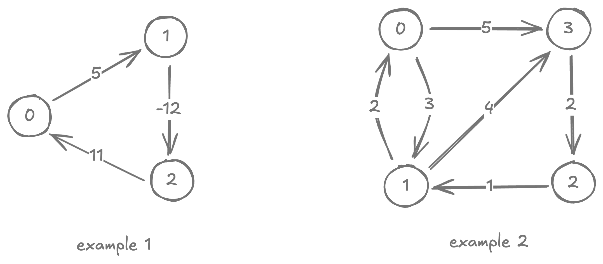
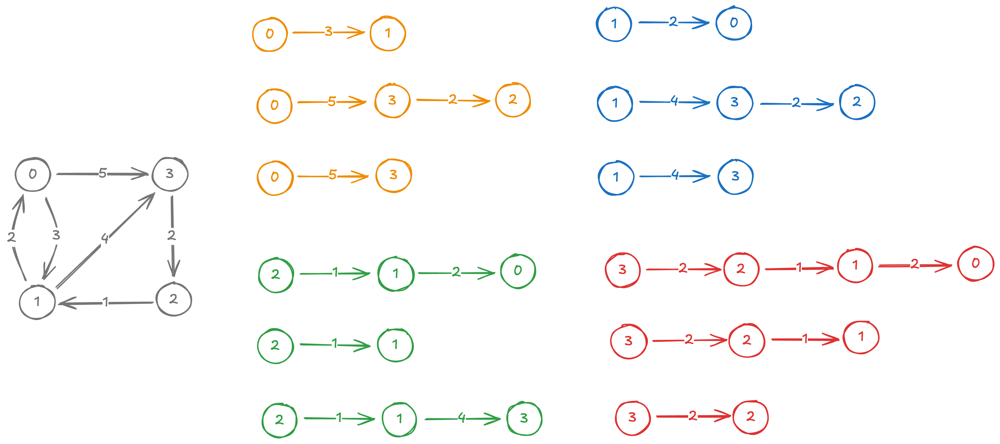

# Floyd-Warshall Algorithm

<style>
.md-logo img {
  content: url('/data-structures/graph/network-light.svg');
}

:root [data-md-color-scheme=slate] .md-logo img  {
  content: url('/data-structures/graph/network-dark.svg');
}
</style>

## About

Floyd-Warshall algorithm solves the all-pair shortest paths problem for directed weighted graph, as long as **no negative-weight cycle is reachable from the $\textbf{source}$**. Think of this as Bellman-Ford, but for APSP.

## Setup

Unlike SSSP problems, APSP work better on adjacency matrix data structure. For this reason, we first need to reimplement our `Graph` class.

=== "Implementation"

    ```kotlin linenums="1"
    private const val DEFAULT_CAPACITY = 4

    class Graph(capacity: Int = DEFAULT_CAPACITY) {

      var matrix = Array(capacity) { Array(capacity) { 0 } }
      private var size = 0
      private var digits = 1 // Number of digits to use

      fun size(): Int = size

      fun addVertex(v: Int) {
        if (v >= matrix.size) resize(v + 1)
        size = max(size, v + 1)
        digits = max(digits, "$v".length)
      }

      fun connect(src: Int, dst: Int, weight: Int) {
        addVertex(src)
        addVertex(dst)
        matrix[src][dst] = weight
        digits = max(digits, "$weight".length)
      }

      private fun resize(newCapacity: Int) {
        val resized = Array(newCapacity) { Array(newCapacity) { 0 } }

        for (i in 0..<matrix.size) {
          for (j in 0..<matrix.size) {
            resized[i][j] = matrix[i][j]
          }
        }

        matrix = resized
      }

      override fun toString(): String {
        val sb = StringBuilder()

        sb.append(" ".repeat(digits)).append('|')
        for (i in 0..<size) {
          sb.append("%${digits}d ".format(i))
        }
        sb.append('\n')
        sb.append("─".repeat(digits)).append('┼')
        sb.append("─".repeat((digits + 1) * size - 1))
        sb.append('\n')

        for (r in 0..<size) {
          sb.append("%${digits}d|".format(r))
          for (c in 0..<size) {
            sb.append("%${digits}d ".format(matrix[r][c]))
          }
          sb.append('\n')
        }

        return sb.trimEnd().toString()
      }
    }
    ```

=== "Unit tests"

    {width=500px}

    ```kotlin linenums="1"
    @Test
    fun example_1() {
      val g = Graph()
      g.connect(0, 1, 5)
      g.connect(1, 2, -12)
      g.connect(2, 0, 11)

      assertThat(g.toString()).isEqualTo("""
           |  0   1   2
        ───┼───────────
          0|  0   5   0
          1|  0   0 -12
          2| 11   0   0
      """.trimIndent())
    }

    @Test
    fun example_2() {
      val g = Graph()
      g.connect(0, 1, 3)
      g.connect(1, 0, 2)
      g.connect(0, 3, 5)
      g.connect(3, 2, 2)
      g.connect(2, 1, 1)
      g.connect(1, 3, 4)
      assertThat(g.toString()).isEqualTo("""
         |0 1 2 3
        ─┼───────
        0|0 3 0 5
        1|2 0 0 4
        2|0 1 0 0
        3|0 0 2 0
      """.trimIndent())
    }
    ```

## Pseudocode

$\ \ \ \ \ \ \ \ \underline{\text{FloydWarshall}(G)}$ <br>
${\small \ \ 1} \ \ \ \ \ \textbf{for }\text{each edge }(u, v) \in E\textbf{ do}$ <br>
${\small \ \ 2} \ \ \ \ \ \ \ \ \ \ \ \text{ dist[u, v]} = w_{uv}$ <br>
${\small \ \ 3} \ \ \ \ \ \ \ \ \ \ \ \text{pred[u, v]} = u$ <br>
${\small \ \ 4}$ <br>
${\small \ \ 5} \ \ \ \ \ \textbf{for }\text{each vertex }u \in V\textbf{ do}$ <br>
${\small \ \ 6} \ \ \ \ \ \ \ \ \ \ \ \text{ dist[u, u]} = 0$ <br>
${\small \ \ 7} \ \ \ \ \ \ \ \ \ \ \ \text{pred[u, u]} = u$ <br>
${\small \ \ 8}$ <br>
${\small \ \ 9} \ \ \ \ \ \textbf{for }k := 1 \dots V\textbf{ do}$ <br>
${\small 10} \ \ \ \ \ \ \ \ \ \ \ \textbf{for }i := 1 \dots V\textbf{ do}$ <br>
${\small 11} \ \ \ \ \ \ \ \ \ \ \ \ \ \ \ \ \ \textbf{for }j := 1 \dots V\textbf{ do}$ <br>
${\small 12} \ \ \ \ \ \ \ \ \ \ \ \ \ \ \ \ \ \ \ \ \ \ \ \textbf{if }\text{dist[i, j]} > \text{dist[i, k]} + \text{dist[k, j]}\textbf{ do}$ <br>
${\small 13} \ \ \ \ \ \ \ \ \ \ \ \ \ \ \ \ \ \ \ \ \ \ \ \ \ \ \ \ \ \text{ dist[i, j]} = \text{dist[i, k]} + \text{dist[k, j]}$ <br>
${\small 14} \ \ \ \ \ \ \ \ \ \ \ \ \ \ \ \ \ \ \ \ \ \ \ \ \ \ \ \ \ \text{pred[i, j]} = \text{pred[k, j]}$ <br>

## Runtime

$O(V^3)$

## Implementation

=== "AllPairsShortestPaths"

    ```kotlin linenums="1"
    data class AllPairsShortestPaths(val size: Int) {
      val prev = Array(size) { Array(size) { -1 } }
      val distance = Array(size) { Array(size) { Float.POSITIVE_INFINITY } }

      override fun toString(): String {
        val dist = StringBuilder()
        val pred = StringBuilder()
        for (u in 0..<size) {
          for (v in 0..<size) {
            dist.append('\n').append("    ").append("(%d, %d) -> %.2f ".format(u, v, distance[u][v]))
            pred.append('\n').append("    ").append("(%d, %d) -> %d ".format(u, v, prev[u][v]))
          }
        }

        return """
    AllPairsShortestPaths {
      distance: $dist
      pred: $pred
    }
        """.trimIndent()
      }
    }
    ```

=== "Floyd-Warshall Algorithm"

    ```kotlin linenums="1"
    fun Graph.floydWarshall(): AllPairsShortestPaths {
      val result = AllPairsShortestPaths(size())

      for (u in 0..<size()) {
        for (v in 0..<size()) {
          if (matrix[u][v] == 0) continue
          result.prev[u][v] = u
          result.distance[u][v] = matrix[u][v].toFloat()
        }
      }

      for (u in 0..<size()) {
        result.prev[u][u] = u
        result.distance[u][u] = 0f
      }

      for (k in 0..<size()) {
        for (i in 0..<size()) {
          for (j in 0..<size()) {
            if (result.distance[i][j] > result.distance[i][k] + result.distance[k][j]) {
              result.prev[i][j] = result.prev[k][j]
              result.distance[i][j] = result.distance[i][k] + result.distance[k][j]
            }
          }
        }
      }

      return result
    }
    ```

## Unit tests



```kotlin linenums="1"
@Test
fun example() {
  val g = Graph()
  g.connect(0, 1, 3)
  g.connect(1, 0, 2)
  g.connect(0, 3, 5)
  g.connect(3, 2, 2)
  g.connect(2, 1, 1)
  g.connect(1, 3, 4)

  assertThat(g.floydWarshall().toString()).isEqualTo("""
    AllPairsShortestPaths {
      distance:
        (0, 0) -> 0.00
        (0, 1) -> 3.00
        (0, 2) -> 7.00
        (0, 3) -> 5.00
        (1, 0) -> 2.00
        (1, 1) -> 0.00
        (1, 2) -> 6.00
        (1, 3) -> 4.00
        (2, 0) -> 3.00
        (2, 1) -> 1.00
        (2, 2) -> 0.00
        (2, 3) -> 5.00
        (3, 0) -> 5.00
        (3, 1) -> 3.00
        (3, 2) -> 2.00
        (3, 3) -> 0.00
      pred:
        (0, 0) -> 0
        (0, 1) -> 0
        (0, 2) -> 3
        (0, 3) -> 0
        (1, 0) -> 1
        (1, 1) -> 1
        (1, 2) -> 3
        (1, 3) -> 1
        (2, 0) -> 1
        (2, 1) -> 2
        (2, 2) -> 2
        (2, 3) -> 1
        (3, 0) -> 1
        (3, 1) -> 2
        (3, 2) -> 3
        (3, 3) -> 3
    }
  """.trimIndent())
}
```
