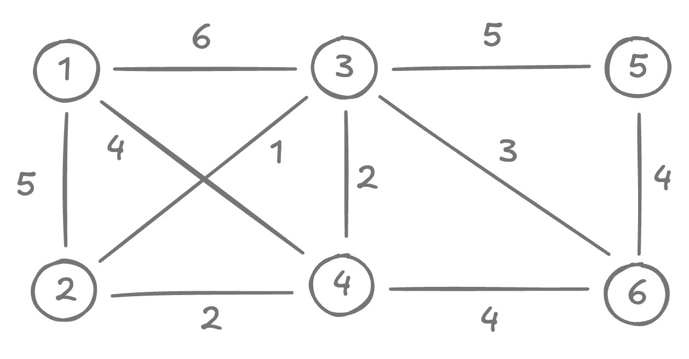
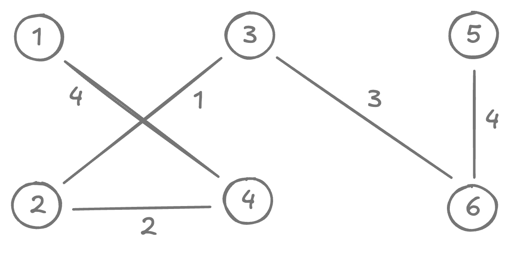

# Prim's algorithm

<style>
.md-logo img {
  content: url('/data-structures/graph/network-light.svg');
}

:root [data-md-color-scheme=slate] .md-logo img  {
  content: url('/data-structures/graph/network-dark.svg');
}
</style>

## About

This too is a greedy algorithm for finding MST of a graph. Structure-wise, it's very similar to Dijkstra'a algorithm.

## Pseudocode

$\ \ \ \ \ \ \ \ \underline{\text{Prim}(G)}$ <br>
${\small \ \ 1} \ \ \ \ \ H = \phi \ \ \ \ {\Tiny\text{ // min-heap}}$ <br>
${\small \ \ 2} \ \ \ \ \ \textbf{for }u \in V \textbf{ do}$ <br>
${\small \ \ 3} \ \ \ \ \ \ \ \ \ \ \ u.\pi = \text{nil}$ <br>
${\small \ \ 4} \ \ \ \ \ \ \ \ \ \ \ u.cost = \infty$ <br>
${\small \ \ 5} \ \ \ \ \ \text{pick any vertex as }root$ <br>
${\small \ \ 6} \ \ \ \ \ root.cost = 0$ <br>
${\small \ \ 7}$ <br>
${\small \ \ 8} \ \ \ \ \ \textbf{while }H \ne \phi\textbf{ do}$ <br>
${\small \ \ 9} \ \ \ \ \ \ \ \ \ \ \ u = H.\text{poll}()$ <br>
${\small 10} \ \ \ \ \ \ \ \ \ \ \ \textbf{for }(u, v) \in E \textbf{ do}$ <br>
${\small 11} \ \ \ \ \ \ \ \ \ \ \ \ \ \ \ \ \ \textbf{if }v.cost > w_{uv} \textbf{ do}$ <br>
${\small 12} \ \ \ \ \ \ \ \ \ \ \ \ \ \ \ \ \ \ \ \ \ \ \ v.\pi = u$ <br>
${\small 13} \ \ \ \ \ \ \ \ \ \ \ \ \ \ \ \ \ \ \ \ \ \ \ v.cost = w_{uv}$ <br>
${\small 14} \ \ \ \ \ \ \ \ \ \ \ \ \ \ \ \ \ \ \ \ \ \ \ H.\text{update}(v, w_{uv})$ <br>
${\small 15}$ <br>
${\small 16} \ \ \ \ \ \textbf{return }\text{edges from predecessor }(\pi)\text{ map}$ <br>

## Running time

$O(E \log V)$

## Concrete implementation

=== "Prim's Algorithm"

    ```kotlin linenums="1"
    fun prim(graph: Graph): List<Edge> {
      // Add all nodes in min-heap with ∞ cost.
      val minHeap = PriorityQueue<Vertex>(graph.vertices.size) { a, b -> a.cost - b.cost }

      // Pick any node as the starting point and give it cost 0.
      val root = graph.vertices.first()
      for (u in graph.vertices) {
        minHeap.add(Vertex(u, if (root == u) 0 else Int.MAX_VALUE))
      }

      // Predecessor map. This will hold the edges of MST.
      val pred = mutableMapOf<Int, Neighbour>()

      while (minHeap.isNotEmpty()) {
        // Remove the vertex with least estimated cost from the min-heap.
        val u = minHeap.poll().node

        // Update the estimated cost of all its neighbours.
        for ((v, w) in graph.neighbours(u)) {

          // Find this neighbour in min-heap.
          val c = minHeap.firstOrNull { it.node == v }?.cost ?: continue

          // Relax the neighbour.
          if (c > w) {
            minHeap.removeIf { it.node == v }
            minHeap.add(Vertex(v, w))
            pred[v] = Neighbour(u, w)
          }
        }
      }

      // Reconstruct the edges that are part of MST
      // from the predecessor map.
      val out = mutableListOf<Edge>()
      for ((u, e) in pred) {
        out.add(Edge(u, e.dst, e.weight))
      }
      return out
    }

    // Holds the estimated cost of each node in priority queue.
    data class Vertex(val node: Int, val cost: Int)
    ```

=== "Graph setup"

    ```kotlin linenums="1"
    // Data class for holding weight of an edge.
    data class Neighbour(val dst: Int, val weight: Int)

    class Graph {
      private val adjacency: MutableMap<Int, MutableList<Neighbour>> = HashMap()

      val vertices: List<Int>
        get() = adjacency.keys.stream().toList()

      fun neighbours(vertex: Int): List<Neighbour> = adjacency[vertex] ?: listOf()

      fun add(vararg vertices: Int): Graph {
        for (v in vertices)
          adjacency.putIfAbsent(v, ArrayList())
        return this
      }

      fun connect(src: Int, dst: Int, weight: Int): Graph {
        add(src, dst)
        if (src == dst) return this   // disallow self-loops.

        adjacency[src]?.add(Neighbour(dst, weight))
        adjacency[dst]?.add(Neighbour(src, weight))

        return this
      }
    }
    ```

=== "Set up example graph"

    ```kotlin linenums="1"
    fun main() {
      val graph = Graph()
        .connect(1, 2, 5)
        .connect(1, 3, 6)
        .connect(1, 4, 4)
        .connect(2, 3, 1)
        .connect(2, 4, 2)
        .connect(3, 4, 2)
        .connect(3, 5, 5)
        .connect(3, 6, 3)
        .connect(4, 6, 4)
        .connect(5, 6, 4)
      println(prim(graph))
    }
    ```

## Example Run

<div markdown class="grid">

{width=250}

{width=250}

$\text{Graph }G$

$\text{Minimum Spanning Tree }T$

</div>

MST has the edges $(2, 4), (3, 2), (4, 1), (6, 3), (5, 6)$, summing up to $14$.
