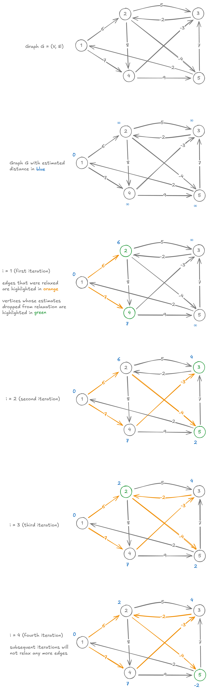

# Bellman-Ford Algorithm

<style>
.md-logo img {
  content: url('/data-structures/graph/network-light.svg');
}

:root [data-md-color-scheme=slate] .md-logo img  {
  content: url('/data-structures/graph/network-dark.svg');
}
</style>

## About

Bellman-Ford algorithm solves the single-source shortest paths problem for directed weighted graph, as long as **no negative-weight cycle is reachable from the $\textbf{source}$**.

## Pseudocode

$\ \ \ \ \ \ \ \ \underline{\text{BellmanFord}(G, s)}$ <br>
${\small \ \ 1} \ \ \ \ \ \text{InitializeSingleSource}(s)$ <br>
${\small \ \ 2} \ \ \ \ \ \textbf{for }1 \dots (V - 1)\textbf{ do}$ <br>
${\small \ \ 3} \ \ \ \ \ \ \ \ \ \ \ \textbf{for }\text{each edge }(u, v) \in E\textbf{ do}$ <br>
${\small \ \ 4} \ \ \ \ \ \ \ \ \ \ \ \ \ \ \ \ \ \text{Relax}(u, v, w_{uv})$ <br>
${\small \ \ 5}$ <br>
${\small \ \ 6} \ \ \ \ \ \textbf{for }\text{each edge }(u, v) \in E\textbf{ do}$ <br>
${\small \ \ 7} \ \ \ \ \ \ \ \ \ \ \textbf{if }\text{Relax}(u, v, w_{uv}) = {\small \text{ TRUE}}\textbf{ do}$ <br>
${\small \ \ 8} \ \ \ \ \ \ \ \ \ \ \ \ \ \ \ \ \text{throw}(\text{negative-weight cycle reachable from } s)$ <br>
${\small \ \ 9} \ \ \ \ \ \text{return}{\small \text{ TRUE}}$ <br>

Loop at line $2$ can be optimized further. Check if loop $3-4$ ended up relaxing no edges. If so, then we have already relaxed all edges and calculated all shortest distances, and can exit early.

## In English Please

Loop over all edges in the graph and try and _relax_ them. After $V-1$ such loops, all the edges should be relaxed, and we should've ended up with shortest distance calculated for all vertices.

If we can still relax any edge after this, then there is a negative-weight cycle is reachable from the specified $source$.

## Implementation

=== "Graph"

    ```kotlin linenums="1"
    class Graph(val directed: Boolean = false) {
      // Use a [HashSet] instead to disallow parallel edges out of the box.
      private val adjacency: MutableMap<Int, MutableList<Neighbour>> = HashMap()

      val vertices: List<Int>
        get() = adjacency.keys.stream().toList()

      fun edges(): List<Edge> {
        val list = mutableListOf<Edge>()
        for ((src, neighbours) in adjacency) {
          for (neighbour in neighbours) {
            list.add(Edge(src, neighbour.node, neighbour.weight))
          }
        }
        return list
      }

      fun neighbours(vertex: Int): List<Neighbour> = adjacency[vertex] ?: listOf()

      fun add(vararg vertices: Int) {
        for (v in vertices)
          adjacency.putIfAbsent(v, ArrayList())
      }

      fun connect(src: Int, dst: Int, weight: Int) {
        add(src, dst)
        if (src == dst) return   // disallow self-loops.

        adjacency[src]?.add(Neighbour(dst, weight))
        if (!directed) {
          adjacency[dst]?.add(Neighbour(src, weight)) // Remove this for directed graph.
        }
      }
    }

    data class Edge(val first: Int, val second: Int, val weight: Int)
    data class Neighbour(val node: Int, val weight: Int)
    ```

=== "SingleSourceShortestPaths"

    This class encapsulates the shortest distance and path information generated by the graph algorithm. The $\text{InitializeSingleSource}$ and $\text{Relax}$ methods are located here.

    ```kotlin linenums="1"
    data class SingleSourceShortestPaths(val source: Int, val weights: HashMap<Int, Float>, val predecessors: HashMap<Int, Int>) {
      /**
      * Try to relax edge (u, v). That is, shortest distance estimate of v, v.d is more than the estimate through u.
      *
      * @param u source of edge (u, v).
      * @param v destination of edge (u, v).
      * @return true if edge was related.
      */
      fun relax(u: Int, v: Int, w: Int): Boolean {
        val alt = weights[u]!! + w
        if (alt < weights[v]!!) {
          weights[v] = alt
          predecessors[v] = u
          return true
        }
        return false
      }

      override fun toString(): String {
        return """
          SingleSourceShortestPaths($source) {
            weights: $weights
            predecessors: $predecessors
          }
        """.trimIndent()
      }

      companion object {
        fun initialize(source: Int, graph: Graph): SingleSourceShortestPaths {
          val weights = HashMap<Int, Float>()
          val predecessors = HashMap<Int, Int>()

          for (v in graph.vertices) {
            if (v == source) {
              weights[source] = 0f
              predecessors[source] = source
            } else {
              weights[v] = Float.POSITIVE_INFINITY
            }
          }

          return SingleSourceShortestPaths(source, weights, predecessors)
        }
      }
    }
    ```

=== "Bellman-Ford"

    ```kotlin linenums="1"
    fun Graph.bellmanFord(source: Int): SingleSourceShortestPaths {
      val estimates = SingleSourceShortestPaths.initialize(source, graph = this)

      for (i in 1..<vertices.size) { // |V| - 1 times
        var anyRelaxation = false
        for (e in edges()) {
          anyRelaxation = estimates.relax(e.first, e.second, e.weight) || anyRelaxation
        }
        if (!anyRelaxation) break // Done early.
      }

      for (e in edges()) {
        if (estimates.relax(e.first, e.second, e.weight)) {
          throw IllegalArgumentException("Cycle with negative weight reachable from $source")
        }
      }

      return estimates
    }
    ```

## Example



## Unit tests

```kotlin linenums="1"
@Test
fun sample() {
  val graph = Graph(directed = true)

  graph.connect(1, 2, 6)
  graph.connect(1, 4, 7)
  graph.connect(2, 3, 5)
  graph.connect(2, 4, 8)
  graph.connect(2, 5, -4)
  graph.connect(3, 2, -2)
  graph.connect(4, 3, -3)
  graph.connect(4, 5, 9)
  graph.connect(5, 3, 7)

  assertThat(graph.bellmanFord(1).toString()).isEqualTo("""
    SingleSourceShortestPaths(1) {
      weights: {1=0.0, 2=2.0, 3=4.0, 4=7.0, 5=-2.0}
      predecessors: {1=1, 2=3, 3=4, 4=1, 5=2}
    }
  """.trimIndent())
}
```
