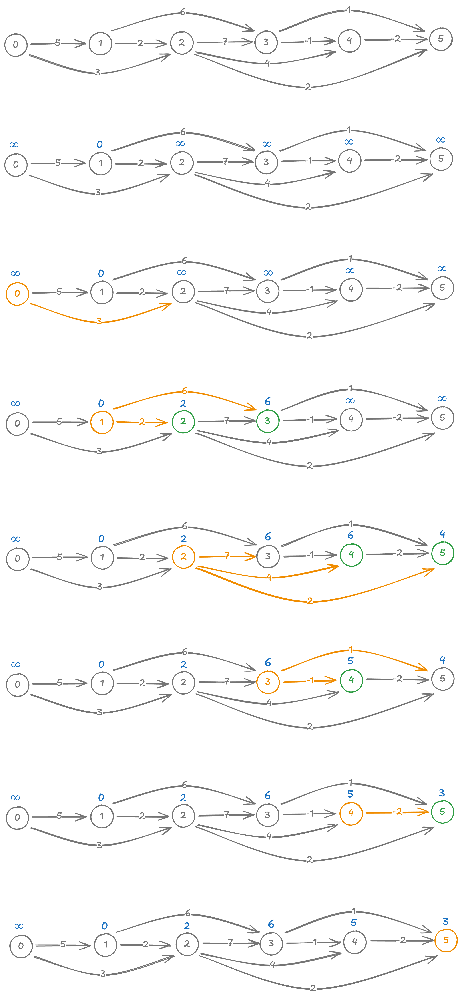

# Single-source shortest paths in directed acyclic graphs

<style>
.md-logo img {
  content: url('/data-structures/graph/network-light.svg');
}

:root [data-md-color-scheme=slate] .md-logo img  {
  content: url('/data-structures/graph/network-dark.svg');
}
</style>

## About

Removing the cycles from the graph altogether, the algorithm is simplified greatly.

## Pseudocode

$\ \ \ \ \ \ \ \ \underline{\text{DagSSSP}(G, s)}$ <br>
${\small \ \ 1} \ \ \ \ \ \text{TopologicalSort}()$ <br>
${\small \ \ 2} \ \ \ \ \ \text{InitializeSingleSource}(s)$ <br>
${\small \ \ 3} \ \ \ \ \ \textbf{for }\text{each vertex }u \in V\text{, in topological order}\textbf{ do}$ <br>
${\small \ \ 4} \ \ \ \ \ \ \ \ \ \ \ \textbf{for }\text{each edge} (u, v) \in E\textbf{ do}$ <br>
${\small \ \ 5} \ \ \ \ \ \ \ \ \ \ \ \ \ \ \ \ \ \text{Relax}(u, v, w_{uv})$ <br>

This works even if graph has negative edges.

## Runtime

$O(V+E)$

## Implementation

=== "Graph"

    ```kotlin linenums="1"
    class Graph(val directed: Boolean = false) {
      // Use a [HashSet] instead to disallow parallel edges out of the box.
      private val adjacency: MutableMap<Int, MutableList<Neighbour>> = HashMap()

      val vertices: List<Int>
        get() = adjacency.keys.stream().toList()

      fun edges(): List<Edge> {
        val list = mutableListOf<Edge>()
        for ((src, neighbours) in adjacency) {
          for (neighbour in neighbours) {
            list.add(Edge(src, neighbour.node, neighbour.weight))
          }
        }
        return list
      }

      fun neighbours(vertex: Int): List<Neighbour> = adjacency[vertex] ?: listOf()

      fun add(vararg vertices: Int) {
        for (v in vertices)
          adjacency.putIfAbsent(v, ArrayList())
      }

      fun connect(src: Int, dst: Int, weight: Int) {
        add(src, dst)
        if (src == dst) return   // disallow self-loops.

        adjacency[src]?.add(Neighbour(dst, weight))
        if (!directed) {
          adjacency[dst]?.add(Neighbour(src, weight)) // Remove this for directed graph.
        }
      }
    }

    data class Edge(val first: Int, val second: Int, val weight: Int)
    data class Neighbour(val node: Int, val weight: Int)
    ```

=== "SingleSourceShortestPaths"

    This class encapsulates the shortest distance and path information generated by the graph algorithm. The $\text{InitializeSingleSource}$ and $\text{Relax}$ methods are located here.

    ```kotlin linenums="1"
    data class SingleSourceShortestPaths(val source: Int, val weights: HashMap<Int, Float>, val predecessors: HashMap<Int, Int>) {
      /**
      * Try to relax edge (u, v). That is, shortest distance estimate of v, v.d is more than the estimate through u.
      *
      * @param u source of edge (u, v).
      * @param v destination of edge (u, v).
      * @return true if edge was related.
      */
      fun relax(u: Int, v: Int, w: Int): Boolean {
        val alt = weights[u]!! + w
        if (alt < weights[v]!!) {
          weights[v] = alt
          predecessors[v] = u
          return true
        }
        return false
      }

      override fun toString(): String {
        return """
          SingleSourceShortestPaths($source) {
            weights: $weights
            predecessors: $predecessors
          }
        """.trimIndent()
      }

      companion object {
        fun initialize(source: Int, graph: Graph): SingleSourceShortestPaths {
          val weights = HashMap<Int, Float>()
          val predecessors = HashMap<Int, Int>()

          for (v in graph.vertices) {
            weights[source] = if (v == source) 0f else Float.POSITIVE_INFINITY
          }

          return SingleSourceShortestPaths(source, weights, predecessors)
        }
      }
    }
    ```

=== "Topological Sort"

    ```kotlin linenums="1"
    fun Graph.topologicalSort(): List<Int>? {
      val degree = HashMap<Int, Int>()
      for (u in vertices) {
        degree.putIfAbsent(u, 0)
        for (v in neighbours(u))
          degree[v.node] = (degree[v.node] ?: 0) + 1
      }

      val result = ArrayList<Int>()
      val queue = degree.filter { it.value == 0 }.map { it.key }.toCollection(ArrayList())
      while (queue.isNotEmpty()) {
        val u = queue.removeFirst()
        result.add(u)

        for (v in neighbours(u)) {
          degree[v.node] = (degree[v.node] ?: 0) - 1
          if (degree[v.node] == 0) queue.add(v.node)
        }
      }

      if (degree.map { it.value }.sum() > 0) return null
      return result
    }
    ```

=== "SSSP in DAG"

    ```kotlin linenums="1"
    fun Graph.forDag(source: Int): SingleSourceShortestPaths {
      val estimates = SingleSourceShortestPaths.initialize(source, graph = this)

      val sorted = topologicalSort()
      if (sorted == null) throw IllegalStateException("Cycle found")

      for (u in sorted) {
        for (v in neighbours(u)) {
          estimates.relax(u, v.node, v.weight)
        }
      }

      return estimates
    }
    ```

## Example



## Unit tests

```kotlin linenums="1"
@Test
fun dag_example_1() {
  val graph = Graph(directed = true)

  graph.connect(0, 1, 5)
  graph.connect(0, 2, 3)
  graph.connect(1, 2, 2)
  graph.connect(1, 3, 6)
  graph.connect(2, 3, 7)
  graph.connect(2, 4, 4)
  graph.connect(2, 5, 2)
  graph.connect(3, 4, -1)
  graph.connect(3, 5, 1)
  graph.connect(4, 5, -2)

  assertThat(graph.forDag(1).toString()).isEqualTo("""
    SingleSourceShortestPaths(1) {
      weights: {0=Infinity, 1=0.0, 2=2.0, 3=6.0, 4=5.0, 5=3.0}
      predecessors: {2=1, 3=1, 4=3, 5=4}
    }
  """.trimIndent())
  assertThat(graph.forDag(1).toString()).isEqualTo(graph.bellmanFord(1).toString())
}
```
