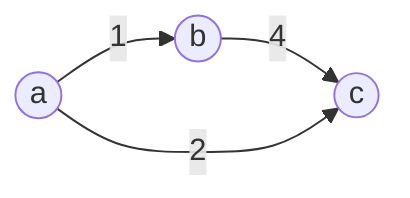
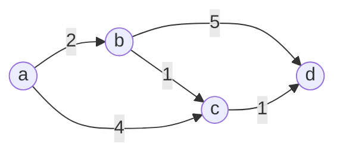
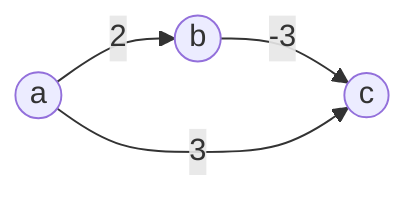

# Dijkstra's Algorithm

<style>
.md-logo img {
  content: url('/data-structures/graph/network-light.svg');
}

:root [data-md-color-scheme=slate] .md-logo img  {
  content: url('/data-structures/graph/network-dark.svg');
}
</style>

## About

In this section we will talk about the single-source shortest paths (SSSP) problem and its many variants.

## Problem

Given a _weighted_, _directed_ graph $G = (V, E)$, and a vertex $s \in V$, find the shortest path from $s$ to all other vertices $v \in V$.

## Variants

- **Single-pair shortest-path:** find shortest path from vertex $s$ to $t$. All known algorithms for this problem have the same worst-case asymptotic running time as best SSSP algorithms.
- **Single-desitnation shortest-paths:** find shortest path from every vertex $v \in V$ to a given destination vertex $t \in V$. It reduces to SSSP by reversing the direction of all edges $e \in E$.
- **All-pairs shortest-paths:**. We can run SSSP for all vertices, but it can be solved faster. We'll cover them in a separate section.

## Optimal Substructure

<div markdown class="grid">

An unsubtle greedy approach will not work.



It has the _optimal substructure_ property to it, i.e. shortest path between two vertices contains other shortest paths within it.



</div>

This hints towards greedy (Dijkstra) and dynamic programming (Floyd-Warshall) approaches, which we will soon cover.

## Representing Shortest Paths

We need a way to represent the output generated by the algorithms to be discussed ahead. This output will include two key details for each vertex $v \in V, v \ne s$:

1. shortest distance of $v$ from $s$, denoted as $v.d$.
2. predecessor of $v$ in the shortest path from $s$ to $v$, denoted as $v.\pi$.

We will create a new class `SingleSourceShortestPaths` to encapsulate this information.

```kotlin linenums="1"
data class SingleSourceShortestPaths(
  val source: Int,
  val weights: HashMap<Int, Float>,
  val predecessors: HashMap<Int, Int>
) {
  override fun toString(): String {
    return """
      SingleSourceShortestPaths($source) {
        weights: $weights
        predecessors: $predecessors
      }
    """.trimIndent()
  }
}
```

This class will have two key methods that will be used by all algorithms being discussed, namely:

1. $\text{InitializeSingleSource}$
2. $\text{Relax}$

### $\text{InitializeSingleSource}$

At the time `SingleSourceShortestPaths`'s initialization we will not know the shortest distance of any vertex. That's where $\text{InitializeSingleSource}$ comes in.

=== "Pseudocode"

    $\ \ \ \ \ \ \ \ \underline{\text{InitializeSingleSource}(s)}$ <br>
    ${\small \ \ 1} \ \ \ \ \ \textbf{for }\text{each vertex }v \in V\textbf{ do}$ <br>
    ${\small \ \ 2} \ \ \ \ \ \ \ \ \ \ \ v.d = \infty$ <br>
    ${\small \ \ 3} \ \ \ \ \ \ \ \ \ \ \ v.\pi = {\small\text{ NIL}}$ <br>
    ${\small \ \ 4} \ \ \ \ \ v.d = 0$ <br>

=== "Kotlin"

    ```kotlin linenums="1"
    fun initialize(source: Int, graph: Graph): SingleSourceShortestPaths {
      val weights = HashMap<Int, Float>()
      val predecessors = HashMap<Int, Int>()

      for (v in graph.vertices) {
        if (v == source) {
          weights[source] = 0f
          predecessors[source] = source
        } else {
          weights[v] = Float.POSITIVE_INFINITY
        }
      }

      return SingleSourceShortestPaths(source, weights, predecessors)
    }
    ```

    `Float` allows us to represent $\infty$ in a safe manner. Addition to `Int.MAX_VALUE` will result in underflow which can slip through inequality checks. Whereas `Float.POSITIVE_INFINITY` will poison all expressions, which is what we want.

### $\text{Relax}$

The process of _relaxing_ an edge $(u, v)$ is to check whether the initially estimated distance $v.d$ can be shortened by reaching $v$ through $u$.



=== "Pseudocode"

    $\ \ \ \ \ \ \ \ \underline{\text{Relax}(u, v, w_{uv})}$ <br>
    ${\small \ \ 1} \ \ \ \ \ \textbf{if }v.d > u.d + w_{uv}\ \textbf{ do}$ <br>
    ${\small \ \ 2} \ \ \ \ \ \ \ \ \ \ \ v.d = u.d + w_{uv}$ <br>
    ${\small \ \ 3} \ \ \ \ \ \ \ \ \ \ \ v.\pi = u$ <br>
    ${\small \ \ 4} \ \ \ \ \ \ \ \ \ \ \ \text{return}{\small \text{ TRUE}}$ <br>
    ${\small \ \ 5} \ \ \ \ \text{return}{\small \text{ FALSE}}$ <br>

=== "Kotlin"

    ```kotlin linenums="1"
    // Method of `SingleSourceShortestPaths`

    /**
      * Try to relax edge (u, v). That is, shortest distance estimate of v, v.d is more than the estimate through u.
      *
      * @param u source of edge (u, v).
      * @param v destination of edge (u, v).
      * @return true if edge was related.
      */
    fun relax(u: Int, v: Int, w: Int): Boolean {
      val alt = weights[u]!! + w
      if (alt < weights[v]!!) {
        weights[v] = alt
        predecessors[v] = u
        return true
      }
      return false
    }
    ```
