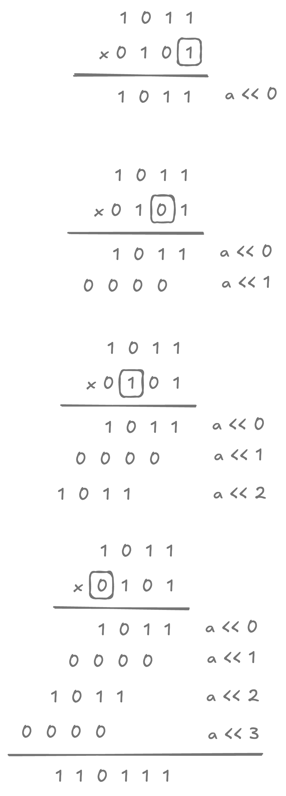

# Multiply two integers without arithmetic operators

## Problem

Given two numbers, multiply them with bit operations.

## Hint

??? "Expand"

    No need of clever tricks.

## Solution

??? "Notes"

    Unlike multiplication in any other base, multiplication in binary is much more straightforward. $a \times 0$ is a row skipped. $a \times 1$ is a row added.

    {width=300px}

??? "Expand"

    ```kotlin linenums="1"
    fun multiply(a: Int, b: Int): Int {
      var product = 0

      var row = a
      var other = b
      while (other != 0) {
        if ((other and 1) != 0) {
          product = add(product, row)
        }
        other = other ushr 1
        row = row shl 1 // pad zero to right
      }

      return product
    }
    ```

    here `add` comes from [previous question](../add-two-integers-without-arithmetic-operator).

### Unit tests

```kotlin linenums="1"
@Test
fun example_multiply() {
  assertThat(multiply(8, 7)).isEqualTo(56)
  assertThat(multiply(19, 201)).isEqualTo(3819)
}

@Test
fun random_multiply() {
  val rand = ThreadLocalRandom.current()

  for (i in 1..100) {
    val a = rand.nextInt(-100, 100)
    val b = rand.nextInt(-100, 100)

    assertThat(multiply(a, b)).isEqualTo(a * b)
  }
}
```
