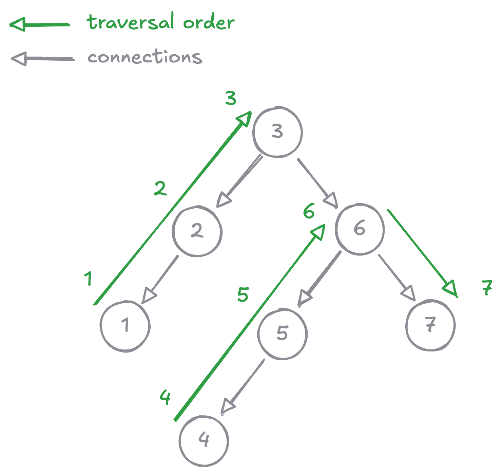
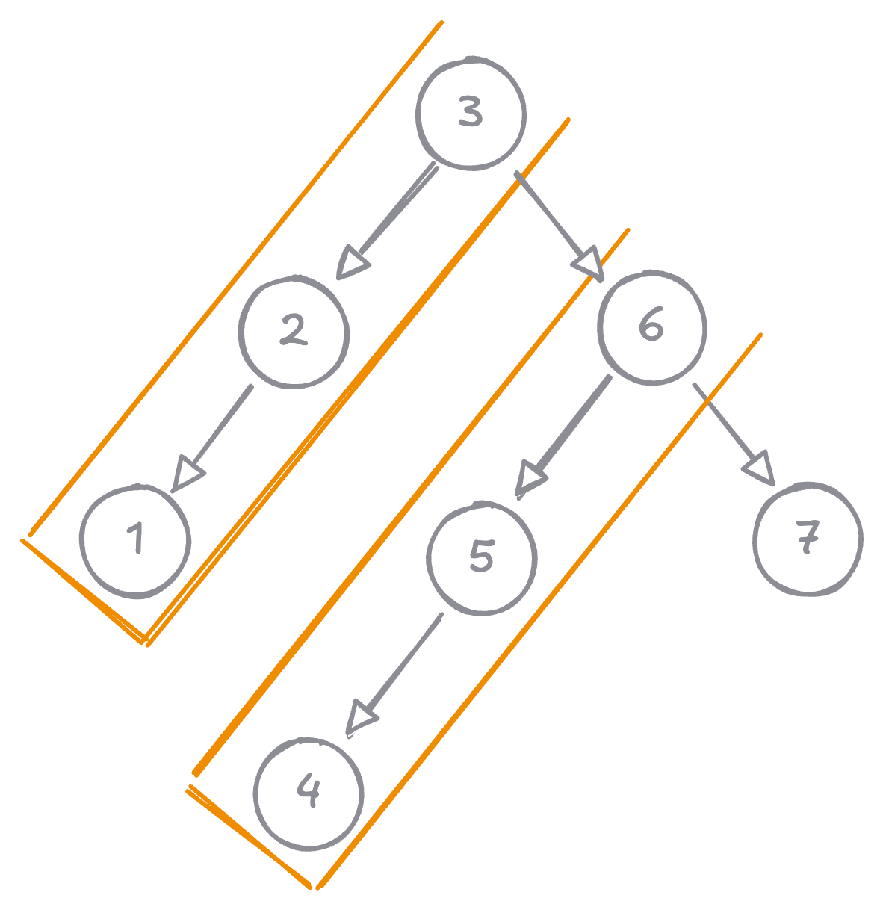

# Inorder tree traversal

<style>
.md-logo img {
  content: url('/data-structures/tree/logo.svg');
}
:root [data-md-color-scheme=slate] .md-logo img  {
  content: url('/data-structures/tree/logo.svg');
}
</style>

## Problem

Inorder traverse a binary tree iteratively. That is:

1. visit current node's left subtree
2. visit currect root
3. visit current node's right subtree

## Example

{width=400}

## Minimum setup

```kotlin linenums="1"
class Node(val value: Int, val left: Node? = null, val right: Node? = null) {

  override fun toString(): String {
    return "$value"
  }
}
```

## Hint

??? "First"

    Follow the example diagram.

??? "Second"

    process first left-diagonal, then second, and so on.

    {width=300}

## Solution

??? "Recursive"

    ```kotlin linenums="1"
    fun inorderRecursive(node: Node?): List<Int> {
      val list = ArrayList<Int>()
      helper(node, list)
      return list
    }

    private fun helper(node: Node?, list: MutableList<Int>) {
      if (node == null) return
      node.left?.let {
        helper(it, list)
      }
      list.add(node.value)
      node.right?.let {
        helper(it, list)
      }
    }
    ```

??? "Iterative"

    ```kotlin linenums="1"
    fun inorderIterative(node: Node?): List<Int> {
      val result = ArrayList<Int>()
      if (node == null) return result

      val stack = ArrayDeque<Node>()
      traverseLeftDiagonal(node, stack)

      while (stack.isNotEmpty()) {
        val cursor = stack.removeLast()
        result.add(cursor.value)
        if (cursor.right != null) {
          traverseLeftDiagonal(cursor.right, stack)
        }
      }

      return result
    }

    private fun traverseLeftDiagonal(node: Node?, stack: ArrayDeque<Node>) {
      var cursor = node
      while (cursor != null) {
        stack.add(cursor)
        cursor = cursor.left
      }
    }
    ```

## Unit tests

```kotlin linenums="1"
import org.assertj.core.api.Assertions.assertThat
import org.junit.jupiter.api.Test

class NodeTest {

  @Test
  fun inorder_empty() {
    val root: Node? = null
    assertThat(inorderRecursive(root)).isEqualTo(listOf<Int>())
    assertThat(inorderIterative(root)).isEqualTo(listOf<Int>())
  }

  @Test
  fun inorder_leaf() {
    val root = Node(1)
    assertThat(inorderRecursive(root)).isEqualTo(listOf(1))
    assertThat(inorderIterative(root)).isEqualTo(listOf(1))
  }

  @Test
  fun inorder_onlyLeftChild() {
    val root = Node(2, Node(1))
    assertThat(inorderRecursive(root)).isEqualTo(listOf(1, 2))
    assertThat(inorderIterative(root)).isEqualTo(listOf(1, 2))
  }

  @Test
  fun inorder_onlyRightChild() {
    val root = Node(1,  left = null, right = Node(2))
    assertThat(inorderRecursive(root)).isEqualTo(listOf(1, 2))
    assertThat(inorderIterative(root)).isEqualTo(listOf(1, 2))
  }

  @Test
  fun inorder_bothLeftRightChild() {
    val root = Node(2,  left = Node(1), right = Node(3))
    assertThat(inorderRecursive(root)).isEqualTo(listOf(1, 2, 3))
    assertThat(inorderIterative(root)).isEqualTo(listOf(1, 2, 3))
  }

  @Test
  fun inorder_leftLeftChild() {
    val root = Node(3,
      left = Node(2, left = Node(1)),
      right = Node(4)
    )
    assertThat(inorderRecursive(root)).isEqualTo(listOf(1, 2, 3, 4))
    assertThat(inorderIterative(root)).isEqualTo(listOf(1, 2, 3, 4))
  }

  @Test
  fun inorder_leftRightChild() {
    val root = Node(3,
      left = Node(1, left = null, right = Node(2)),
      right = Node(4)
    )
    assertThat(inorderRecursive(root)).isEqualTo(listOf(1, 2, 3, 4))
    assertThat(inorderIterative(root)).isEqualTo(listOf(1, 2, 3, 4))
  }

  @Test
  fun inorder_leftBothChild() {
    val root = Node(4,
      left = Node(2, left = Node(1), right = Node(3)),
      right = Node(5)
    )
    assertThat(inorderRecursive(root)).isEqualTo(listOf(1, 2, 3, 4, 5))
    assertThat(inorderIterative(root)).isEqualTo(listOf(1, 2, 3, 4, 5))
  }

  @Test
  fun inorder_rightLeftChild() {
    val root = Node(2,
      left = Node(1),
      right = Node(4, left = Node(3), right = Node(5))
    )
    assertThat(inorderRecursive(root)).isEqualTo(listOf(1, 2, 3, 4, 5))
    assertThat(inorderIterative(root)).isEqualTo(listOf(1, 2, 3, 4, 5))
  }
}
```
