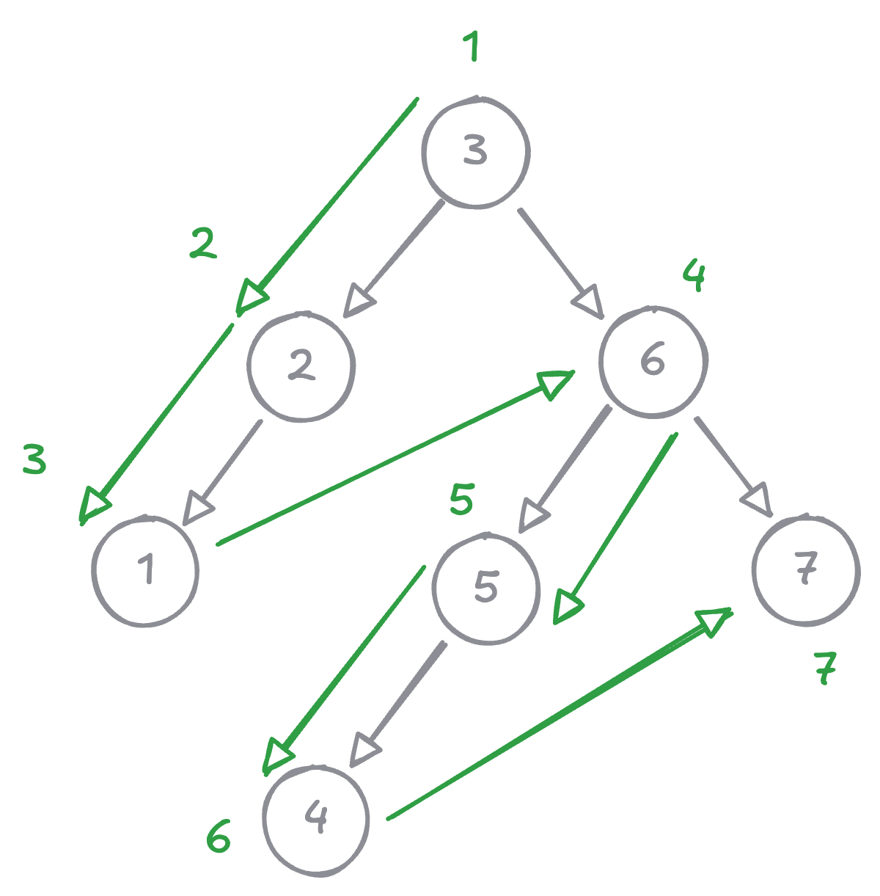

# Preorder tree traversal

<style>
.md-logo img {
  content: url('/data-structures/tree/logo.svg');
}
:root [data-md-color-scheme=slate] .md-logo img  {
  content: url('/data-structures/tree/logo.svg');
}
</style>

## Problem

Preorder traverse a binary tree iteratively. That is:

1. visit currect root
2. visit current node's left subtree
3. visit current node's right subtree

## Example

{width=400}

## Minimum setup

```kotlin linenums="1"
class Node(val value: Int, val left: Node? = null, val right: Node? = null) {

  override fun toString(): String {
    return "$value"
  }
}
```

## Hint

??? "First"

    Follow the example diagram.

??? "Second"

    No reversal needed.

## Solution

??? "Recursive"

    ```kotlin linenums="1"
    fun preorderRecursive(node: Node?): List<Int> {
      val list = ArrayList<Int>()
      preHelper(node, list)
      return list
    }

    private fun preHelper(node: Node?, list: MutableList<Int>) {
      if (node == null) return
      list.add(node.value)
      node.left?.let {
        preHelper(it, list)
      }
      node.right?.let {
        preHelper(it, list)
      }
    }
    ```

??? "Iterative"

    ```kotlin linenums="1"
    fun preorderIterative(node: Node?): List<Int> {
      val result = ArrayList<Int>()
      if (node == null) return result

      val stack = ArrayDeque<Node>()
      stack.add(node)

      while (stack.isNotEmpty()) {
        val n = stack.removeLast()
        result.add(n.value)

        n.right?.let { stack.add(it) }
        n.left?.let { stack.add(it) }
      }

      return result
    }
    ```

## Unit tests

```kotlin linenums="1"
@Test
fun preorder_empty() {
  val root: Node? = null
  assertThat(preorderRecursive(root)).isEqualTo(listOf<Int>())
  assertThat(preorderIterative(root)).isEqualTo(listOf<Int>())
}

@Test
fun preorder_leaf() {
  val root = Node(1)
  assertThat(preorderRecursive(root)).isEqualTo(listOf(1))
  assertThat(preorderIterative(root)).isEqualTo(listOf(1))
}

@Test
fun preorder_onlyLeftChild() {
  val root = Node(2, Node(1))
  assertThat(preorderRecursive(root)).isEqualTo(listOf(2, 1))
  assertThat(preorderIterative(root)).isEqualTo(listOf(2, 1))
}

@Test
fun preorder_onlyRightChild() {
  val root = Node(1,  left = null, right = Node(2))
  assertThat(preorderRecursive(root)).isEqualTo(listOf(1, 2))
  assertThat(preorderIterative(root)).isEqualTo(listOf(1, 2))
}

@Test
fun preorder_bothLeftRightChild() {
  val root = Node(2,  left = Node(1), right = Node(3))
  assertThat(preorderRecursive(root)).isEqualTo(listOf(2, 1, 3))
  assertThat(preorderIterative(root)).isEqualTo(listOf(2, 1, 3))
}

@Test
fun preorder_leftLeftChild() {
  val root = Node(3,
    left = Node(2, left = Node(1)),
    right = Node(4)
  )
  assertThat(preorderRecursive(root)).isEqualTo(listOf(3, 2, 1, 4))
  assertThat(preorderIterative(root)).isEqualTo(listOf(3, 2, 1, 4))
}

@Test
fun preorder_leftRightChild() {
  val root = Node(3,
    left = Node(1, left = null, right = Node(2)),
    right = Node(4)
  )
  assertThat(preorderRecursive(root)).isEqualTo(listOf(3, 1, 2, 4))
  assertThat(preorderIterative(root)).isEqualTo(listOf(3, 1, 2, 4))
}

@Test
fun preorder_leftBothChild() {
  val root = Node(4,
    left = Node(2, left = Node(1), right = Node(3)),
    right = Node(5)
  )
  assertThat(preorderRecursive(root)).isEqualTo(listOf(4, 2, 1, 3, 5))
  assertThat(preorderIterative(root)).isEqualTo(listOf(4, 2, 1, 3, 5))
}

@Test
fun preorder_rightLeftChild() {
  val root = Node(2,
    left = Node(1),
    right = Node(4, left = Node(3), right = Node(5))
  )
  assertThat(preorderRecursive(root)).isEqualTo(listOf(2, 1, 4, 3, 5))
  assertThat(preorderIterative(root)).isEqualTo(listOf(2, 1, 4, 3, 5))
}
```
