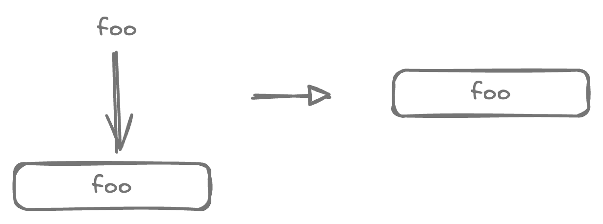
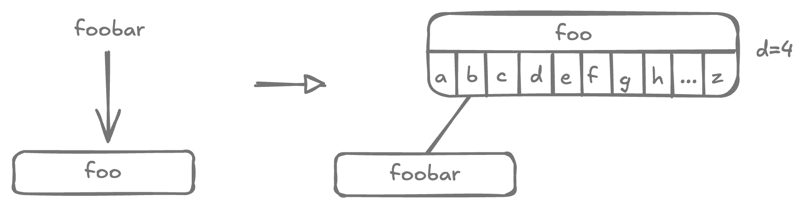
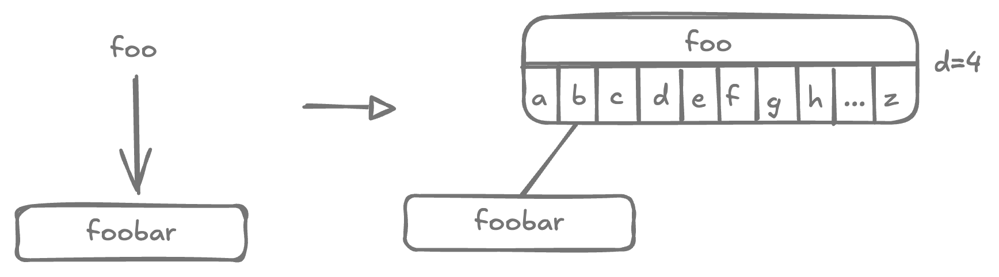
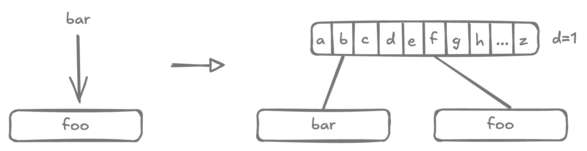
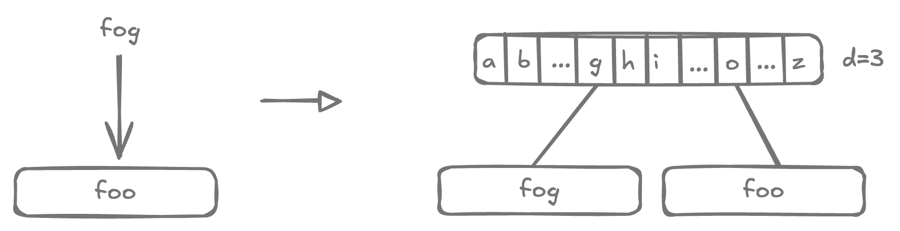
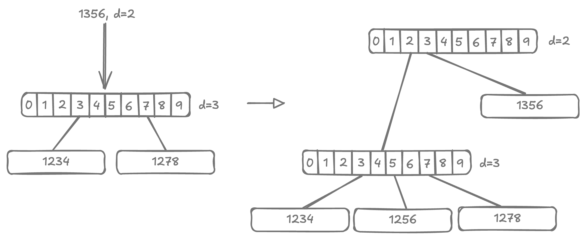
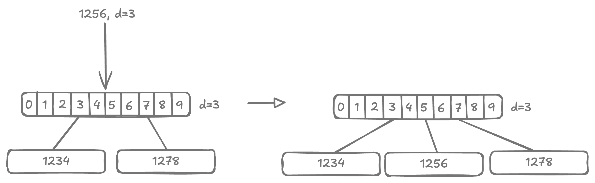
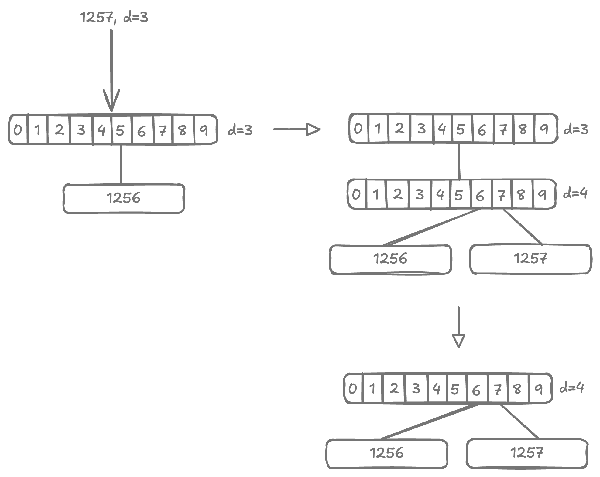
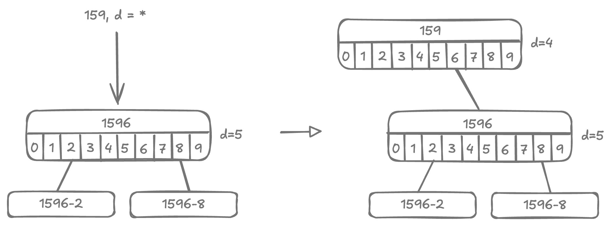
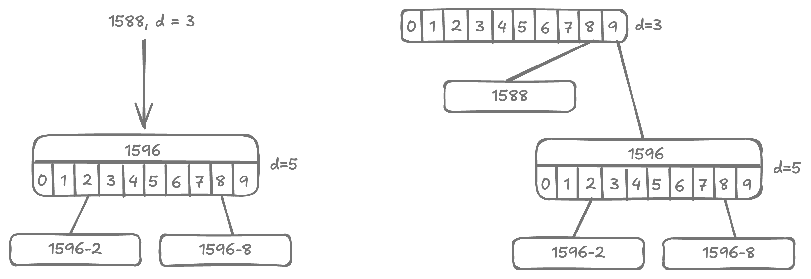

# Compressed Trie

<style>
.md-logo img {
  content: url('/data-structures/trie/logo.png');
}

:root [data-md-color-scheme=slate] .md-logo img  {
  content: url('/data-structures/trie/logo.png');
}
</style>

## Demo

```
                                                                                                                                                                                                                                                                                                                                                                                                                                                                                                                                                                                                                                                                                                                                                                                                                                                                                                                                                                                                                                                                                                                                                                                                                                                                                                                                                                                                                                                                                                                                                                                                    b(1▹A,B,C,D,E,F,G,H,I,J,K,L,M,N,O,P,Q,R,S,T,U,V,Y,Z,w)
                                                                                                      +---------------------------------------------------------------------------------------------------------------------------------------------------------------------------------------------------------------------+------------------------------------------------------------------------------------------------------------------------------------------------------------------------------------------------------------------------------------+-------------------------------------------------------------------------+---------------------------------------------------------+-------------------------------------------------------------------------------------------+---------------------------------------------------------------------------------------+----------------------------------------------------------------------------------------------------------------------------------------------------------+--------------------------------------------------------------------------------------+-----------------------------------------------------------------+----------------------------------------------------------+-------------------------------------------------------------------------------------------------------+----------------------------------------------------------------------------------------------------------------------------------------------------------------------------------------------------------------------------------------------+-----------------------------------------------------------------------------------------------------------------------------------------------------------------------------------------------+----------------------------------------------------+-------------------------------------------------------------------------+------------------------------------------------------+-------------------------------+-----------------------------------------------------------------------------------------------------------------------------+------------------------------------------------------------------------------------------------------------------------------------------------------------------+--------------------------------------------------------------------------------------------------------------+-----------------------------------------------+---------------------+------------------+-------------------+
                                                                                              b(2▹f,l,n,r,u,z)                                                                                                                                                                                                      b(2▹a,e,h,o,r,u)                                                                                                                                                                                                                    b(2▹a,h,o,r,u,y,z)                                                            b(2▹e,j,o)                                             b(2▹c,g,r,s,t,u)                                                                                b(2▹i,r)                                                                            b(2▹a,e,h,i,r,u)                                                                                                                                              b(2▹a,o,u)                                                                           b(2▹c,n,r,s,t)                                                      b(2▹a,e,o)                                              b(2▹a,e,i,o,u,y)                                                                                          b(2▹a,e,i,u)                                                                                                                                                                                                                                   b(2▹a,e,i,o)                                                                                                                                                                                    b(2▹a,e,i,o)                                            l(Oman)                                                                b(2▹a,e,h,o)                                             l(Qatar)                      b(2▹o,u,w,é)                                                                                                             b(2▹a,e,i,l,o,p,u,w,y)                                                                                                                                                b(2▹a,h,i,o,u,ü)                                                                                                 b(2▹g,k,r,z)                                     b(2▹a,e,i)             l(Yemen)           b(2▹a,i)            l(world)
       +----------------------+-----------------------------+-----------------------------------------+-------------------------+-------------------------------+--------------------+                                           +-------------------------------------------------------+--------------------+-------------+----------------------+-----------------------------+-----------------------------+                                                  +-------------------------+---------------------------------------------+----------------------+---------------------+------------------+----------+          +----------+-----------+           +---------+---------+-------------+----------------------+--------------------+----------+                 +------------------+-------+                  +----------------------------+------------------+------------+-------------+-----------------------+---------------------------------------------------------------------+                                    +---------+-----------+          +------------------+--------------------------------------------+------------------+---------+                   +----------------+---------+           +-----------+---------+--------------+-----------+---------+-----------+                   +----------------------------+--------------------+-----------------------------------------+---------------------------+                                                                                                  +---------------------------------------------------------+-----------+-----------+----------------------------------------------------------------------------------+                                             +-------------------------+------------------------+------------------------+------------------+                                        +------------------------------+----------+------------+---------------------+                             +---------+-----------+---------+----------+         +-------------------+-------------------------+----------------------+-------------------------+---------------+-----------------+-----------------------------+----------------------+                    +------------------------+-------------+---------------+--------------------+--------------------------------+-----------------------+         +----------+-----------+----------+-----------+            +-----------+-----------+                  +---------+--------+
l(Afghanistan)            b(3▹b,g)                      b(3▹d,g)                                                           b(3▹g,m,u)                       b(6▹a,i)           l(Azerbaijan)                                b(3▹h,n,r)                                              b(3▹l,n,r)            l(Bhutan)                            b(3▹l,t)                      b(3▹a,u)                      b(3▹l,r)                                           b(3▹m,n)                  b(3▹a,i)                                      b(3▹l,m)              l(Croatia)             b(3▹b,r)           l(Cyprus) l(Czechia) l(Denmark) l(Djibouti) l(Dominica) l(Ecuador) l(Egypt) l(Eritrea)                            b(3▹t,w)            l(Ethiopia) l(Europe)         b(3▹j,n)                   l(France)          b(3▹b,m)                     b(3▹o,r)           l(Ghana)                 l(Gibraltar)              b(4▹e,n)                                                            b(3▹a,e,i,y)                           l(Haiti) l(Honduras) l(Hungary) l(Iceland)          b(4▹i,o)                                     b(3▹a,e)           l(Israel) l(Italy)            b(3▹m,p)         l(Jersey) l(Jordan) l(Kazakhstan) l(Kenya) l(Kiribati)                 l(Kosovo) l(Kuwait) l(Kyrgyzstan)         b(3▹o,t)                     b(3▹b,s)                                                      b(3▹b,e,t)                 l(Luxembourg)                                                                                     b(3▹d,l,r,u,y)                                               l(Mexico)             l(Micronesia)                                                                      b(3▹l,n,r,z)                                    b(3▹m,u)                  b(3▹p,t)                                         b(3▹c,g,u)          l(Norway)                              b(3▹k,l,n,r)                      l(Peru)             l(Philippines)           b(3▹l,r)                     l(Romania) l(Russia)             l(Rwanda) l(Réunion) l(Samoa)           b(3▹n,r,y)               l(Singapore)             b(5▹a,e)                 l(Somalia)       l(Spain)          b(3▹d,r)                      b(3▹e,i)               l(Syria)            b(3▹i,j,n)               l(Thailand) l(Timor-Leste)                         b(3▹g,k,n)                       b(3▹n,r,v)              l(Türkiye) l(Uganda) l(Ukraine)             l(Uruguay) l(Uzbekistan) l(Vanuatu) l(Venezuela) l(Vietnam)          l(Zambia)         l(Zimbabwe)
                    +---------+--------+          +---------+-----------------+                                     +-----------+---------+          +----------+--------+                                  +--------------------+------------+                      +-------------------+----------+                                    +---------+--------+          +---------+-------+          +----------+--------+                     +-------------------+-------+        +--------+----------------+                 +----------+--------+                          +--------+--------+                                                                                                                 +---------+--------+                               +--------+--------+                           +--------+-------+          +---------+--------+                                                 +----------+--------+                       +-----------------------+------------+-------------+------------+                                                    +--------+---------+                  +---------------+--------+                             +---------+-------+                                                                                                                +--------+-------+          +---------+--------+                                +--------------------+--------------+                          +-------------------------------------------------------+----------------------------+-------------------------+---------------------+                                              +--------------------+------------------------------------------------+----------+-----------+            +---------+-------+        +--------+----------+                         +------------+---------+                           +----------+----------+---------+----------+                                             +---------+--------+                                                                                   +---------+-----------+                         +----------+--------+                                         +--------+--------+          +---------+----------+                    +-----------+------------+                                                    +---------+---------+         +------------+------------+
               l(Albania)         l(Algeria) l(Andorra)                   b(4▹o,u)                            l(Argentina) l(Armenia) l(Aruba) l(Australia)         l(Austria)                          b(4▹a,r)           l(Bangladesh) l(Barbados)            b(4▹a,g,i)           l(Benin)  l(Bermuda)                           l(Bolivia)         l(Botswana) l(Brazil)         l(Brunei) l(Bulgaria)         l(Burundi)             b(4▹b,e)                    l(Canada) l(Chad)                  b(4▹l,n)         l(Colombia)         l(Comoros)                   l(Cuba)         l(Curaçao)                                                                                                        l(Estonia)         l(Eswatini)                       l(Fiji)         l(Finland)                   l(Gabon)         l(Gambia) l(Georgia)         l(Germany)                                       l(Greenland)         l(Grenada)              b(4▹d,m,t)              l(Guernsey)               p(7▹Guinea|-)  l(Guyana)                                            l(India)         l(Indonesia)         b(4▹n,q)                l(Ireland)                    l(Jamaica)         l(Japan)                                                                                                          l(Laos)         l(Latvia) l(Lebanon)         l(Lesotho)                        b(4▹e,y)         l(Liechtenstein) l(Lithuania)               l(Madagascar)                                           b(4▹a,d,i,t)                 l(Martinique)               b(7▹a,i)             l(Mayotte)                                     l(Moldova)           b(4▹a,g,t)                                                  l(Morocco) l(Mozambique) l(Namibia)         l(Nauru) l(Nepal)         l(Netherlands)             l(Nicaragua) p(6▹Niger|i) l(Niue)                   l(Pakistan) l(Palau)             l(Panama) l(Paraguay)                                    l(Poland)         l(Portugal)                                                                         l(Senegal) l(Serbia) l(Seychelles)              l(Slovakia)         l(Slovenia)                                l(Sudan)         l(Suriname) l(Sweden)         l(Switzerland)          l(Taiwan) l(Tajikistan) l(Tanzania)                                            l(Togo) l(Tokelau) l(Tonga) l(Tunisia) l(Turkmenistan) l(Tuvalu)
                                                                    +---------+--------+                                                                                                          +---------+--------+                                    +----------+---------+                                                                                                                                                   +----------+--------+                                            +--------+-------+                                                                                                                                                                                                                                                                                                                                                                                                                              +-----------+-----------+                                      |                                                                                              +--------+------+                                                                                                                                                                                                                                                        +---------+-------+                                                                            +--------------------+------------+--------+--------+                        +-----------+---------+                                                                    +----------+------------------------+                                                                                                                                                 |
                                                                l(Angola)         l(Anguilla)                                                                                                l(Bahamas)         l(Bahrain)                           l(Belarus) l(Belgium) l(Belize)                                                                                                                                          l(Cambodia)         l(Cameroon)                                   l(Chile)         l(China)                                                                                                                                                                                                                                                                                                                                                                                                                     l(Guadeloupe)  l(Guam)  l(Guatemala)                         l(Guinea-Bissau)                                                                                    l(Iran)         l(Iraq)                                                                                                                                                                                                                                                l(Liberia)         l(Libya)                                                                     b(5▹w,y)            l(Maldives)             l(Mali) l(Malta)               l(Mauritania)         l(Mauritius)                                                           l(Monaco) l(Mongolia)               b(5▹e,s)                                                                                                                                         l(Nigeria)
                                                                                                                                                                                                                                                                                                                                                                                                                                                                                                                                                                                                                                                                                                                                                                                                                                                                                                                                                                                                                                                                                                                                                                                                                                                                                                                                                                                                                                                                                +---------+--------+                                                                                                                                                                                      +-----------+---------+
                                                                                                                                                                                                                                                                                                                                                                                                                                                                                                                                                                                                                                                                                                                                                                                                                                                                                                                                                                                                                                                                                                                                                                                                                                                                                                                                                                                                                                                                            l(Malawi)         l(Malaysia)                                                                                                                                                                           l(Montenegro)         l(Montserrat)
```

Let's go back to our example trie and consider the highlighted branch nodes.

{width=600px}

These branch nodes do not connect to any leaf nodes, but rather lead to another single branch node. These "highlighted" nodes and their descendant branches can be flattened, resulting into a compressed trie.

Branch nodes in compressed trie include an additional bit `digit`. This is the index of the key at which we are to branch.

## Insertion

### 1. In Leaf Node

<div markdown class="grid">

<div markdown>

<u>Case 1</u>) $\text{key} = \text{node.key}$

: Key already exists in trie, so nothing needs to be done.

</div>

<div markdown>



</div>

<hr>

<hr>

<div markdown>

<u>Case 2</u>) $\text{key}.starts\_with(\text{node.key})$ or the other way round

: either `key` is a prefix of `node.key`, or `node.key` is prefix of `key`.

</div>

<div markdown>





</div>

<hr>

<hr>

<div markdown>

<u>Case 3</u>) $\text{key} \ne \text{node.key}$

: fallback case, `key` and `node.key` are not the same and differ at some index.

</div>

<div markdown>





</div>

<hr>

<hr>

</div>

### 2. In Branch Node

<div markdown class="grid">

<div markdown>

<u>Case 1a</u>) $\text{depth} < \text{node.digit}$, inserting a lexicographically neighbouring key.

: key being inserted is close to existing keys of this node.

</div>

<div markdown>

{width=100%}

</div>

<br>

<hr>

<div markdown>

<u>Case 1b</u>) $\text{depth} < \text{node.digit}$, and inserting a lexicographically distant key.

: key being inserted is very far from existing keys of this node by dictionary order.

</div>

<div markdown>

{width=100%}

</div>

<hr>

<hr>

<div markdown>

<u>Case 2a</u>) $\text{depth} = \text{node.digit}$

: base case. `key` is at its intended depth.

</div>

<div markdown>

{width=100%}

</div>

<br>

<hr>

<div markdown>

<u>Case 2b</u>) $\text{depth} = \text{node.digit}$, leading to extraneous branch node

: base case. `key` is at its intended depth.

</div>

<div markdown>

{width=100%}

</div>

<hr>

<hr>

<div markdown>

<u>Case 3</u>) $\text{depth} > \text{node.digit}$

: not possible. In a valid compressed trie, $parent.digit < child.digit$, and $depth$ can only increment by $+1$ at each level.

</div>

<div></div>

</div>

### 3. In Prefix Node

<div markdown class="grid">

<div markdown>

<u>Case 1</u>) $\text{key}.starts\_with(\text{node.key})$

: $node.key$ is a prefix to the $key$ being inserted. It doesn't matter what $depth$ is.

</div>

<div markdown>

{width=100%}

</div>

<hr>

<hr>

<div markdown>

<u>Case 2</u>) $\text{node.key}.starts\_with(\text{key})$

: $key$ is a prefix to the $node$ itself.

</div>

<div markdown>

{width=100%}

</div>

<hr>

<hr>

<div markdown>

<u>Case 3</u>) $\text{otherwise}$

: $key$ has a mismatch with $node.key$.

</div>

<div markdown>

{width=100%}

</div>

<hr>

<hr>

</div>

## Implementation

```kotlin linenums="1"
package com.example.trie

import com.example.tree.PrintableNode
import com.example.tree.print
import java.util.LinkedList
import java.util.TreeMap

private interface Node : PrintableNode

private interface HasKey: Node {
  val key: String
}

private interface IsBranch: Node {
  val digit: Int
  val branches: TreeMap<Char, Node>

  operator fun get(key: String): Node? = branches[key[digit]]
  operator fun set(key: String, child: Node?) {
    if (child == null) branches.remove(key[digit])
    else branches[key[digit]] = child
  }
}

private class LeafNode(override val key: String) : HasKey {
  override fun content(): String = "l($key)"
  override fun children(): List<PrintableNode> = listOf()
}

private class BranchNode(override val digit: Int) : IsBranch {
  override val branches = TreeMap<Char, Node> { a, b -> a.code - b.code }
  override fun content(): String = "b(${digit+1}▹${branches.keys.joinToString(separator = ",")})"
  override fun children(): List<PrintableNode> = branches.values.toList()
}

private class PrefixNode(override val key: String, override val digit: Int) : HasKey, IsBranch {
  override val branches = TreeMap<Char, Node> { a, b -> a.code - b.code }
  override fun content(): String = "p(${digit+1}▹$key|${branches.keys.joinToString(separator = ",")})"
  override fun children(): List<PrintableNode> = branches.values.toList()
}

class Trie {
  private var root: Node = BranchNode(digit = 0)

  fun remove(key: String) {
    val trace = LinkedList<Node>()
    if (!internalSearch(root, key, trace)) return

    while (trace.isNotEmpty()) {
      val node = trace.poll()
      // Delete node from parent and propagate deletion up the chain.
      if (node is LeafNode) {
        val parent = (trace.poll() ?: continue) as IsBranch
        parent[node.key] = null
        continue
      }
      // We'd be here only if in some previous iteration a leaf node was deleted.
      if (node is BranchNode) {
        if (node.branches.isNotEmpty()) continue
        val parent = (trace.poll() ?: return) as IsBranch
        for ((k, v) in parent.branches) {
          if (v == node) {
            parent.branches.remove(k)
            break
          }
        }
        continue
      }
      if (node is PrefixNode) {
        val parent = (trace.poll() ?: continue) as IsBranch
        val branch = BranchNode(node.digit)
        branch.branches.putAll(node.branches)
        for ((k, v) in parent.branches) {
          if (v == node) {
            parent.branches[k] = branch
            break
          }
        }
      }
    }
    root = compress(root) ?: root
  }

  private fun compress(node: Node): Node? {
    if (node is LeafNode) return node
    if (node is IsBranch) {
      val iter = node.branches.iterator()
      while (iter.hasNext()) {
        val (k, v) = iter.next()
        with(compress(v)) {
          if (this == null) iter.remove()
          else node.branches[k] = this
        }
      }
    }
    if (node is PrefixNode) return node
    if (node is BranchNode) {
      if (node.branches.isEmpty()) return null
      if (node.branches.size > 1) return node
      val onlyChild = node.branches.values.first()
      if (onlyChild is BranchNode) return onlyChild
    }
    return node
  }

  fun search(key: String): Boolean {
    return internalSearch(root, key, LinkedList())
  }

  private fun internalSearch(node: Node?, key: String, trace: MutableList<Node>): Boolean {
    if (node == null) return false

    trace.addFirst(node)
    if (node is LeafNode) return key == node.key
    if (node is PrefixNode) {
      if (key == node.key) return true
      return internalSearch(node[key], key, trace)
    }
    if (node is BranchNode) {
      return internalSearch(node[key], key, trace)
    }
    return false
  }

  fun insert(key: String) {
    root = insert(root, key, keyRemaining = 0)
  }

  private fun insert(node: Node?, key: String, keyRemaining: Int): Node {
    return when(node) {
      null -> LeafNode(key)
      is LeafNode -> insertInLeaf(node, key)
      is BranchNode -> insertInBranch(node, key, keyRemaining)
      is PrefixNode -> insertInPrefix(node, key, keyRemaining)
      else -> throw IllegalStateException()
    }
  }

  private fun insertInLeaf(node: LeafNode, key: String): Node {
    // Case 1: node.key == key, nothing to do.
    val mismatch = mismatchAt(key, node.key) ?: return node

    // Case 3: node.key != key.
    if (mismatch < key.length && mismatch < node.key.length) {
      val branch = BranchNode(digit = mismatch)
      branch[node.key] = node
      branch[key] = LeafNode(key)
      return branch
    }

    // Case 2: node.key starts with key or key starts with node.key
    var str = key
    var startsWith = node.key
    if (key.length < startsWith.length) {
      str = node.key
      startsWith = key
    }

    val prefix = PrefixNode(key = startsWith, digit = mismatch)
    prefix[str] = LeafNode(str)
    return prefix
  }

  private fun insertInBranch(node: BranchNode, key: String, keyRemaining: Int): Node {
    // Case 1: depth < node.digit
    if (keyRemaining < node.digit) {
      val otherKey = anyKey(node)
      val mismatch = mismatchAt(key, otherKey ?: "") ?: return node
      // Case 1b: inserting a key lexicographically distant key.
      if (mismatch < node.digit) {
        val branch = BranchNode(digit = mismatch)
        branch[key] = LeafNode(key)
        if (otherKey != null) {
          branch[otherKey] = node
        }
        return branch
      }
      // inserting a lexicographically neighbouring key.
      node[key] = LeafNode(key)
      return node
    }

    // Case 2: depth = node.digit
    node[key] = insert(node[key], key, keyRemaining + 1)
    // Case 2b: key is at intended depth, can be compressed.
    if (node.branches.size == 1 && node.branches.values.first() is BranchNode) {
      return node.branches.values.first()
    }
    // Case 2a: key is at intended depth, no compression needed.
    return node
  }

  private fun insertInPrefix(node: PrefixNode, key: String, keyRemaining: Int): Node {
    val mismatch = mismatchAt(key, node.key) ?: return node
    // Case 1: node.key is prefix to key.
    if (mismatch >= node.key.length) {
      node[key] = insert(node[key], key, keyRemaining + 1)
      return node
    }
    // Case 2: key is prefix to node.key.
    if (mismatch == key.length) {
      val prefix = PrefixNode(key, mismatch)
      prefix[node.key] = node
      return prefix
    }
    // Case 3: otherwise
    val branch = BranchNode(digit = mismatch)
    branch[key] = LeafNode(key)
    branch[node.key] = node
    return branch
  }

  // Given a node, find any key it.
  private fun anyKey(node: Node) : String? {
    return when(node) {
      is LeafNode -> node.key
      is PrefixNode -> node.key
      is BranchNode -> node.branches.values.firstNotNullOfOrNull { anyKey(it) }
      else -> null
    }
  }

  override fun toString(): String {
    return print(root)
  }
}

/**
 * Find at which character two strings mismatch.
 *
 * @return index at which they differ. null is they are exact match.
 */
private fun mismatchAt(first: String, second: String, startIndex: Int = 0): Int? {
  var i = startIndex
  while (i < first.length && i < second.length) {
    if (first[i] != second[i]) return i
    i++
  }
  // if length were same, then all characters matched.
  return if (first.length == second.length) null else i
}
```

## Unit tests

```kotlin linenums="1"
package com.example.trie

import org.assertj.core.api.Assertions.assertThat
import org.junit.jupiter.api.BeforeEach
import org.junit.jupiter.api.Test
import java.util.*

class TrieTest {

  private lateinit var trie: Trie

  @BeforeEach
  fun setup() {
    trie = Trie()
  }

  @Test
  fun empty() {
    assertThat(trie.toString()).isEqualTo("b(1▹)")
  }

  @Test
  fun singleKey() {
    trie.insert("hello")
    assertThat(trie.toString()).isEqualTo(
      """
       b(1▹h)
          |
      l(hello)
    """.trimIndent()
    )

    assertThat(trie.search("hello")).isTrue()
  }

  @Test
  fun branchAtFirstCharacter() {
    trie.insert("hello")
    trie.insert("aloha")
    trie.insert("bonjour")
    assertThat(trie.toString()).isEqualTo(
      """
             b(1▹a,b,h)
        +---------+---------+
    l(aloha) l(bonjour) l(hello)
    """.trimIndent()
    )

    assertThat(trie.search("hello")).isTrue()
    assertThat(trie.search("aloha")).isTrue()
    assertThat(trie.search("bonjour")).isTrue()
  }

  @Test
  fun branchAtSecondCharacter() {
    trie.insert("hello")
    trie.insert("hola")
    trie.insert("aloha")
    trie.insert("bonjour")
    assertThat(trie.toString()).isEqualTo(
      """
               b(1▹a,b,h)
          +---------+------------------+
      l(aloha) l(bonjour)          b(2▹e,o)
                              +--------+------+
                          l(hello)         l(hola)
    """.trimIndent()
    )

    assertThat(trie.search("hello")).isTrue()
    assertThat(trie.search("hola")).isTrue()
    assertThat(trie.search("aloha")).isTrue()
    assertThat(trie.search("bonjour")).isTrue()
  }

  @Test
  fun branchCompression() {
    trie.insert("plant")
    trie.insert("planet")
    assertThat(trie.toString()).isEqualTo(
      """
                b(5▹e,t)
          +---------+-------+
      l(planet)         l(plant)
    """.trimIndent()
    )

    assertThat(trie.search("plant")).isTrue()
    assertThat(trie.search("planet")).isTrue()
  }

  @Test
  fun branchDecompression() {
    trie.insert("plant")
    trie.insert("planet")
    assertThat(trie.toString()).isEqualTo(
      """
              b(5▹e,t)
        +---------+-------+
    l(planet)         l(plant)
    """.trimIndent()
    )

    trie.insert("plywood")
    assertThat(trie.toString()).isEqualTo(
      """
                               b(3▹a,y)
                  +----------------+--------+
              b(5▹e,t)                 l(plywood)
        +---------+-------+
    l(planet)         l(plant)
    """.trimIndent()
    )

    trie.insert("plenty")
    assertThat(trie.toString()).isEqualTo(
      """
                              b(3▹a,e,y)
                  +----------------+----------+
              b(5▹e,t)         l(plenty) l(plywood)
        +---------+-------+
    l(planet)         l(plant)
    """.trimIndent()
    )

    trie.insert("alert")
    assertThat(trie.toString()).isEqualTo(
      """
             b(1▹a,p)
        +--------+----------------------------------+
    l(alert)                                   b(3▹a,e,y)
                                   +----------------+----------+
                               b(5▹e,t)         l(plenty) l(plywood)
                         +---------+-------+
                     l(planet)         l(plant)
    """.trimIndent()
    )

    assertThat(trie.search("alert")).isTrue()
    assertThat(trie.search("plant")).isTrue()
    assertThat(trie.search("planet")).isTrue()
    assertThat(trie.search("plywood")).isTrue()
    assertThat(trie.search("plenty")).isTrue()
  }

  @Test
  fun prefix() {
    trie.insert("1596")
    assertThat(trie.toString()).isEqualTo(
      """
      b(1▹1)
         |
      l(1596)
    """.trimIndent()
    )

    trie.insert("15962")
    trie.insert("15968")
    assertThat(trie.toString()).isEqualTo(
      """
                b(1▹1)
                   |
             p(5▹1596|2,8)
        +----------+----------+
    l(15962)              l(15968)
    """.trimIndent()
    )

    trie.insert("159688")
    assertThat(trie.toString()).isEqualTo(
      """
                b(1▹1)
                   |
             p(5▹1596|2,8)
        +----------+-------------+
    l(15962)              p(6▹15968|8)
                               |
                           l(159688)
    """.trimIndent()
    )

    trie.insert("159")
    assertThat(trie.toString()).isEqualTo(
      """
                b(1▹1)
                   |
              p(4▹159|6)
                   |
             p(5▹1596|2,8)
        +----------+-------------+
    l(15962)              p(6▹15968|8)
                               |
                           l(159688)
    """.trimIndent()
    )

    trie.insert("1588")
    assertThat(trie.toString()).isEqualTo(
      """
            b(3▹8,9)
       +--------+------------------+
    l(1588)                   p(4▹159|6)
                                   |
                             p(5▹1596|2,8)
                        +----------+-------------+
                    l(15962)              p(6▹15968|8)
                                               |
                                           l(159688)
    """.trimIndent()
    )

    assertThat(trie.search("1588")).isTrue()
    assertThat(trie.search("159")).isTrue()
    assertThat(trie.search("1596")).isTrue()
    assertThat(trie.search("15962")).isTrue()
    assertThat(trie.search("15968")).isTrue()
    assertThat(trie.search("159688")).isTrue()
  }

  @Test
  fun example_sahani() {
    trie.insert("562-44-2169")
    trie.insert("271-16-3624")
    trie.insert("278-49-1515")
    trie.insert("951-23-7625")
    trie.insert("951-94-1654")
    assertThat(trie.toString()).isEqualTo(
      """
                                            b(1▹2,5,9)
                       +-------------------------+--------------------------+
                   b(3▹1,8)               l(562-44-2169)                b(5▹2,9)
           +-----------+----------+                             +-----------+----------+
    l(271-16-3624)         l(278-49-1515)                l(951-23-7625)         l(951-94-1654)
    """.trimIndent()
    )

    trie.insert("987-26-1615")
    assertThat(trie.toString()).isEqualTo(
      """
                                            b(1▹2,5,9)
                       +-------------------------+-------------------------------------------------+
                   b(3▹1,8)               l(562-44-2169)                                       b(2▹5,8)
           +-----------+----------+                                         +----------------------+----------+
    l(271-16-3624)         l(278-49-1515)                               b(5▹2,9)                       l(987-26-1615)
                                                                +-----------+----------+
                                                         l(951-23-7625)         l(951-94-1654)
    """.trimIndent()
    )

    trie.insert("958-36-4194")
    assertThat(trie.toString()).isEqualTo(
      """
                                            b(1▹2,5,9)
                       +-------------------------+------------------------------------------------------------------------+
                   b(3▹1,8)               l(562-44-2169)                                                              b(2▹5,8)
           +-----------+----------+                                                                +----------------------+----------+
    l(271-16-3624)         l(278-49-1515)                                                      b(3▹1,8)                       l(987-26-1615)
                                                                            +----------------------+----------+
                                                                        b(5▹2,9)                       l(958-36-4194)
                                                                +-----------+----------+
                                                         l(951-23-7625)         l(951-94-1654)
    """.trimIndent()
    )

    assertThat(trie.search("271-16-3624")).isTrue()
    assertThat(trie.search("562-44-2169")).isTrue()
    assertThat(trie.search("278-49-1515")).isTrue()
    assertThat(trie.search("951-23-7625")).isTrue()
    assertThat(trie.search("951-94-1654")).isTrue()
    assertThat(trie.search("987-26-1615")).isTrue()
    assertThat(trie.search("958-36-4194")).isTrue()
  }

  @Test
  fun remove() {
    trie.insert("562-44-2169")
    trie.insert("271-16-3624")
    trie.insert("278-49-1515")
    trie.insert("951-23-7625")
    trie.insert("951-94-1654")
    trie.insert("987-26-1615")
    trie.insert("958-36-4194")
    assertThat(trie.toString()).isEqualTo(
      """
                                            b(1▹2,5,9)
                       +-------------------------+------------------------------------------------------------------------+
                   b(3▹1,8)               l(562-44-2169)                                                              b(2▹5,8)
           +-----------+----------+                                                                +----------------------+----------+
    l(271-16-3624)         l(278-49-1515)                                                      b(3▹1,8)                       l(987-26-1615)
                                                                            +----------------------+----------+
                                                                        b(5▹2,9)                       l(958-36-4194)
                                                                +-----------+----------+
                                                         l(951-23-7625)         l(951-94-1654)
    """.trimIndent()
    )

    trie.remove("562-44-2169")
    assertThat(trie.toString()).isEqualTo(
      """
                                          b(1▹2,9)
                       +----------------------+--------------------------------------------------------------------+
                   b(3▹1,8)                                                                                    b(2▹5,8)
           +-----------+----------+                                                         +----------------------+----------+
    l(271-16-3624)         l(278-49-1515)                                               b(3▹1,8)                       l(987-26-1615)
                                                                     +----------------------+----------+
                                                                 b(5▹2,9)                       l(958-36-4194)
                                                         +-----------+----------+
                                                  l(951-23-7625)         l(951-94-1654)
    """.trimIndent()
    )

    trie.remove("958-36-4194")
    assertThat(trie.toString()).isEqualTo(
      """
                                          b(1▹2,9)
                       +----------------------+---------------------------------------------+
                   b(3▹1,8)                                                             b(2▹5,8)
           +-----------+----------+                                  +----------------------+----------+
    l(271-16-3624)         l(278-49-1515)                        b(5▹2,9)                       l(987-26-1615)
                                                         +-----------+----------+
                                                  l(951-23-7625)         l(951-94-1654)
    """.trimIndent()
    )

    trie.remove("987-26-1615")
    assertThat(trie.toString()).isEqualTo(
      """
                                          b(1▹2,9)
                       +----------------------+----------------------+
                   b(3▹1,8)                                      b(5▹2,9)
           +-----------+----------+                      +-----------+----------+
    l(271-16-3624)         l(278-49-1515)         l(951-23-7625)         l(951-94-1654)
    """.trimIndent()
    )

    trie.remove("271-16-3624")
    assertThat(trie.toString()).isEqualTo(
      """
                   b(1▹2,9)
           +-----------+----------------------+
        b(3▹8)                            b(5▹2,9)
           |                      +-----------+----------+
    l(278-49-1515)         l(951-23-7625)         l(951-94-1654)
    """.trimIndent()
    )

    trie.remove("951-94-1654")
    assertThat(trie.toString()).isEqualTo(
      """
                   b(1▹2,9)
           +-----------+----------+
        b(3▹8)                 b(5▹2)
           |                      |
    l(278-49-1515)         l(951-23-7625)
    """.trimIndent()
    )

    trie.remove("278-49-1515")
    assertThat(trie.toString()).isEqualTo(
      """
          b(5▹2)
             |
      l(951-23-7625)
    """.trimIndent()
    )

    trie.remove("951-23-7625")
    assertThat(trie.toString()).isEqualTo("b(5▹)")

    trie.insert("278-49-1515")
    assertThat(trie.toString()).isEqualTo(
      """
          b(1▹2)
             |
      l(278-49-1515)
    """.trimIndent()
    )

    trie.insert("271-16-3624")
    assertThat(trie.toString()).isEqualTo(
      """
                   b(3▹1,8)
           +-----------+----------+
    l(271-16-3624)         l(278-49-1515)
    """.trimIndent()
    )
  }

  @Test
  fun countries() {
    for (locale in Locale.getAvailableLocales()) {
      if (locale.displayCountry.isEmpty()) continue
      if (locale.displayCountry.contains(" ")) continue
      trie.insert(locale.displayCountry)
    }
    assertThat(trie.toString()).isEqualTo("""
                                                                                                                                                                                                                                                                                                                                                                                                                                                                                                                                                                                                                                                                                                                                                                                                                                                                                                                                                                                                                                                                                                                                                                                                                                                                                                                                                                                                                                                                                                                                                                                                    b(1▹A,B,C,D,E,F,G,H,I,J,K,L,M,N,O,P,Q,R,S,T,U,V,Y,Z,w)
                                                                                                      +---------------------------------------------------------------------------------------------------------------------------------------------------------------------------------------------------------------------+------------------------------------------------------------------------------------------------------------------------------------------------------------------------------------------------------------------------------------+-------------------------------------------------------------------------+---------------------------------------------------------+-------------------------------------------------------------------------------------------+---------------------------------------------------------------------------------------+----------------------------------------------------------------------------------------------------------------------------------------------------------+--------------------------------------------------------------------------------------+-----------------------------------------------------------------+----------------------------------------------------------+-------------------------------------------------------------------------------------------------------+----------------------------------------------------------------------------------------------------------------------------------------------------------------------------------------------------------------------------------------------+-----------------------------------------------------------------------------------------------------------------------------------------------------------------------------------------------+----------------------------------------------------+-------------------------------------------------------------------------+------------------------------------------------------+-------------------------------+-----------------------------------------------------------------------------------------------------------------------------+------------------------------------------------------------------------------------------------------------------------------------------------------------------+--------------------------------------------------------------------------------------------------------------+-----------------------------------------------+---------------------+------------------+-------------------+
                                                                                              b(2▹f,l,n,r,u,z)                                                                                                                                                                                                      b(2▹a,e,h,o,r,u)                                                                                                                                                                                                                    b(2▹a,h,o,r,u,y,z)                                                            b(2▹e,j,o)                                             b(2▹c,g,r,s,t,u)                                                                                b(2▹i,r)                                                                            b(2▹a,e,h,i,r,u)                                                                                                                                              b(2▹a,o,u)                                                                           b(2▹c,n,r,s,t)                                                      b(2▹a,e,o)                                              b(2▹a,e,i,o,u,y)                                                                                          b(2▹a,e,i,u)                                                                                                                                                                                                                                   b(2▹a,e,i,o)                                                                                                                                                                                    b(2▹a,e,i,o)                                            l(Oman)                                                                b(2▹a,e,h,o)                                             l(Qatar)                      b(2▹o,u,w,é)                                                                                                             b(2▹a,e,i,l,o,p,u,w,y)                                                                                                                                                b(2▹a,h,i,o,u,ü)                                                                                                 b(2▹g,k,r,z)                                     b(2▹a,e,i)             l(Yemen)           b(2▹a,i)            l(world)
       +----------------------+-----------------------------+-----------------------------------------+-------------------------+-------------------------------+--------------------+                                           +-------------------------------------------------------+--------------------+-------------+----------------------+-----------------------------+-----------------------------+                                                  +-------------------------+---------------------------------------------+----------------------+---------------------+------------------+----------+          +----------+-----------+           +---------+---------+-------------+----------------------+--------------------+----------+                 +------------------+-------+                  +----------------------------+------------------+------------+-------------+-----------------------+---------------------------------------------------------------------+                                    +---------+-----------+          +------------------+--------------------------------------------+------------------+---------+                   +----------------+---------+           +-----------+---------+--------------+-----------+---------+-----------+                   +----------------------------+--------------------+-----------------------------------------+---------------------------+                                                                                                  +---------------------------------------------------------+-----------+-----------+----------------------------------------------------------------------------------+                                             +-------------------------+------------------------+------------------------+------------------+                                        +------------------------------+----------+------------+---------------------+                             +---------+-----------+---------+----------+         +-------------------+-------------------------+----------------------+-------------------------+---------------+-----------------+-----------------------------+----------------------+                    +------------------------+-------------+---------------+--------------------+--------------------------------+-----------------------+         +----------+-----------+----------+-----------+            +-----------+-----------+                  +---------+--------+
l(Afghanistan)            b(3▹b,g)                      b(3▹d,g)                                                           b(3▹g,m,u)                       b(6▹a,i)           l(Azerbaijan)                                b(3▹h,n,r)                                              b(3▹l,n,r)            l(Bhutan)                            b(3▹l,t)                      b(3▹a,u)                      b(3▹l,r)                                           b(3▹m,n)                  b(3▹a,i)                                      b(3▹l,m)              l(Croatia)             b(3▹b,r)           l(Cyprus) l(Czechia) l(Denmark) l(Djibouti) l(Dominica) l(Ecuador) l(Egypt) l(Eritrea)                            b(3▹t,w)            l(Ethiopia) l(Europe)         b(3▹j,n)                   l(France)          b(3▹b,m)                     b(3▹o,r)           l(Ghana)                 l(Gibraltar)              b(4▹e,n)                                                            b(3▹a,e,i,y)                           l(Haiti) l(Honduras) l(Hungary) l(Iceland)          b(4▹i,o)                                     b(3▹a,e)           l(Israel) l(Italy)            b(3▹m,p)         l(Jersey) l(Jordan) l(Kazakhstan) l(Kenya) l(Kiribati)                 l(Kosovo) l(Kuwait) l(Kyrgyzstan)         b(3▹o,t)                     b(3▹b,s)                                                      b(3▹b,e,t)                 l(Luxembourg)                                                                                     b(3▹d,l,r,u,y)                                               l(Mexico)             l(Micronesia)                                                                      b(3▹l,n,r,z)                                    b(3▹m,u)                  b(3▹p,t)                                         b(3▹c,g,u)          l(Norway)                              b(3▹k,l,n,r)                      l(Peru)             l(Philippines)           b(3▹l,r)                     l(Romania) l(Russia)             l(Rwanda) l(Réunion) l(Samoa)           b(3▹n,r,y)               l(Singapore)             b(5▹a,e)                 l(Somalia)       l(Spain)          b(3▹d,r)                      b(3▹e,i)               l(Syria)            b(3▹i,j,n)               l(Thailand) l(Timor-Leste)                         b(3▹g,k,n)                       b(3▹n,r,v)              l(Türkiye) l(Uganda) l(Ukraine)             l(Uruguay) l(Uzbekistan) l(Vanuatu) l(Venezuela) l(Vietnam)          l(Zambia)         l(Zimbabwe)
                    +---------+--------+          +---------+-----------------+                                     +-----------+---------+          +----------+--------+                                  +--------------------+------------+                      +-------------------+----------+                                    +---------+--------+          +---------+-------+          +----------+--------+                     +-------------------+-------+        +--------+----------------+                 +----------+--------+                          +--------+--------+                                                                                                                 +---------+--------+                               +--------+--------+                           +--------+-------+          +---------+--------+                                                 +----------+--------+                       +-----------------------+------------+-------------+------------+                                                    +--------+---------+                  +---------------+--------+                             +---------+-------+                                                                                                                +--------+-------+          +---------+--------+                                +--------------------+--------------+                          +-------------------------------------------------------+----------------------------+-------------------------+---------------------+                                              +--------------------+------------------------------------------------+----------+-----------+            +---------+-------+        +--------+----------+                         +------------+---------+                           +----------+----------+---------+----------+                                             +---------+--------+                                                                                   +---------+-----------+                         +----------+--------+                                         +--------+--------+          +---------+----------+                    +-----------+------------+                                                    +---------+---------+         +------------+------------+
               l(Albania)         l(Algeria) l(Andorra)                   b(4▹o,u)                            l(Argentina) l(Armenia) l(Aruba) l(Australia)         l(Austria)                          b(4▹a,r)           l(Bangladesh) l(Barbados)            b(4▹a,g,i)           l(Benin)  l(Bermuda)                           l(Bolivia)         l(Botswana) l(Brazil)         l(Brunei) l(Bulgaria)         l(Burundi)             b(4▹b,e)                    l(Canada) l(Chad)                  b(4▹l,n)         l(Colombia)         l(Comoros)                   l(Cuba)         l(Curaçao)                                                                                                        l(Estonia)         l(Eswatini)                       l(Fiji)         l(Finland)                   l(Gabon)         l(Gambia) l(Georgia)         l(Germany)                                       l(Greenland)         l(Grenada)              b(4▹d,m,t)              l(Guernsey)               p(7▹Guinea|-)  l(Guyana)                                            l(India)         l(Indonesia)         b(4▹n,q)                l(Ireland)                    l(Jamaica)         l(Japan)                                                                                                          l(Laos)         l(Latvia) l(Lebanon)         l(Lesotho)                        b(4▹e,y)         l(Liechtenstein) l(Lithuania)               l(Madagascar)                                           b(4▹a,d,i,t)                 l(Martinique)               b(7▹a,i)             l(Mayotte)                                     l(Moldova)           b(4▹a,g,t)                                                  l(Morocco) l(Mozambique) l(Namibia)         l(Nauru) l(Nepal)         l(Netherlands)             l(Nicaragua) p(6▹Niger|i) l(Niue)                   l(Pakistan) l(Palau)             l(Panama) l(Paraguay)                                    l(Poland)         l(Portugal)                                                                         l(Senegal) l(Serbia) l(Seychelles)              l(Slovakia)         l(Slovenia)                                l(Sudan)         l(Suriname) l(Sweden)         l(Switzerland)          l(Taiwan) l(Tajikistan) l(Tanzania)                                            l(Togo) l(Tokelau) l(Tonga) l(Tunisia) l(Turkmenistan) l(Tuvalu)
                                                                    +---------+--------+                                                                                                          +---------+--------+                                    +----------+---------+                                                                                                                                                   +----------+--------+                                            +--------+-------+                                                                                                                                                                                                                                                                                                                                                                                                                              +-----------+-----------+                                      |                                                                                              +--------+------+                                                                                                                                                                                                                                                        +---------+-------+                                                                            +--------------------+------------+--------+--------+                        +-----------+---------+                                                                    +----------+------------------------+                                                                                                                                                 |
                                                                l(Angola)         l(Anguilla)                                                                                                l(Bahamas)         l(Bahrain)                           l(Belarus) l(Belgium) l(Belize)                                                                                                                                          l(Cambodia)         l(Cameroon)                                   l(Chile)         l(China)                                                                                                                                                                                                                                                                                                                                                                                                                     l(Guadeloupe)  l(Guam)  l(Guatemala)                         l(Guinea-Bissau)                                                                                    l(Iran)         l(Iraq)                                                                                                                                                                                                                                                l(Liberia)         l(Libya)                                                                     b(5▹w,y)            l(Maldives)             l(Mali) l(Malta)               l(Mauritania)         l(Mauritius)                                                           l(Monaco) l(Mongolia)               b(5▹e,s)                                                                                                                                         l(Nigeria)
                                                                                                                                                                                                                                                                                                                                                                                                                                                                                                                                                                                                                                                                                                                                                                                                                                                                                                                                                                                                                                                                                                                                                                                                                                                                                                                                                                                                                                                                                +---------+--------+                                                                                                                                                                                      +-----------+---------+
                                                                                                                                                                                                                                                                                                                                                                                                                                                                                                                                                                                                                                                                                                                                                                                                                                                                                                                                                                                                                                                                                                                                                                                                                                                                                                                                                                                                                                                                            l(Malawi)         l(Malaysia)                                                                                                                                                                           l(Montenegro)         l(Montserrat)
    """.trimIndent())
  }

}
```
