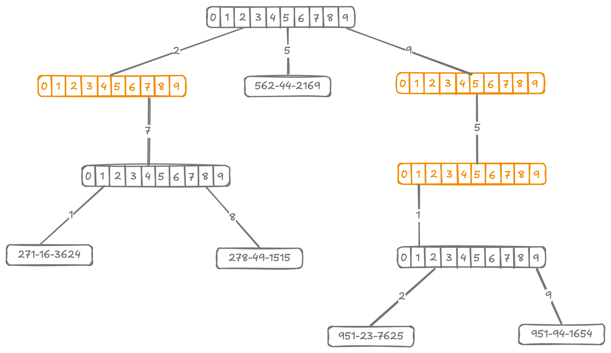

# Compressed Trie

<style>
.md-logo img {
  content: url('/data-structures/trie/logo.png');
}

:root [data-md-color-scheme=slate] .md-logo img  {
  content: url('/data-structures/trie/logo.png');
}
</style>

<script type="text/javascript" src="https://www.gstatic.com/charts/loader.js"></script>
<script type="text/javascript">
  google.charts.load('current', {'packages':['corechart']});
</script>

## Demo

```
                                                                                                                                                                                                                                                                                                                                                                                                                                                                                                                                                                                                                                                                                                                                                                                                                                                                                                                                                                                                                                                                                                                                                                                                                                                                                                                                                                                                                                                                                                                                                                                                                                                                                                                                                                                                                                                                                                                                                                                                                                                                                                                                                                                                                                                                                                                                                                                                                                                                                                    b(1▹a,b,c,d,e,f,g,h,i,j,k,l,m,n,o,p,q,r,s,t,u,v,w,y,z,å)
                                                                                        +--------------------------------------------------------------------------------------------------------------------------------------------------------------------------------------------------------------------------------------------------+------------------------------------------------------------------------------------------------------------------------------------------------------------------------------------------------------------------------------------------------------------------------------------------------------------------------------------------------------------------------------------------------------------------------------------------------------------------------------------------------------------------------------------------------------------------------------------------------------------+-------------------------------------------------------------------------------------------------------------+---------------------------------------------------------------------------------------------------------+----------------------------------------------------------------------------------------------------------------------------------+-------------------------------------------------------------------------------------------------------------------------------------------------------+---------------------------------------------------------------------------------------------------------------------------------------------------------------------+----------------------------------------------------------------------------------------------------------+----------------------------------------------------------------------------------------+----------------------------------------------------------+--------------------------------------------------------------------------------------------------------------------------------+-------------------------------------------------------------------------------------------------------------------------------------------------------------------------------------------------------------------------------------------------------------------------------------------------------------+----------------------------------------------------------------------------------------------------------------------------------------------------------------+-----------------------------------------------------------------------------------------------------------------------------+-------------------------------------------------------------------------------------+-----------------------------------------------------------------------------------------------------------------------------------------+----------------------------------------------------------------------------+-------------------------------+-------------------------------------------------------------------------------------------------------------------------------------------------------------------------------------------------------------------------------------------------------------------------------------------------------------------+-----------------------------------------------------------------------------------------------------------------------------------------------------------------------------------------------------------------------------------------------------------------------------------------------------------------------------------------------------------+----------------------------------------------------------------------------------------------------------------------------------------------------------------------------------------------------------+------------------------------------------------------------------------------------------------------------------------------------+--------------------------------------------+----------------------+------------------+-----------------------+
                                                                               b(2▹f,l,m,n,r,u,z)                                                                                                                                                                                                                                  b(2▹a,e,h,o,r,u)                                                                                                                                                                                                                                                                                                                                                                                                                                                                                                                                                                                          b(2▹a,e,h,o,r,u,y,z,ô)                                                                                             b(2▹e,i,j,o)                                                                                          b(2▹c,g,l,q,r,s,t,u)                                                                                                                    b(2▹a,i,r)                                                                                                                                           b(2▹a,e,h,i,r,u)                                                                                                                                                         b(2▹a,o,u)                                                                                               b(2▹c,n,r,s,t)                                                                             b(2▹a,e,o)                                              b(2▹a,e,i,o,u,y)                                                                                                                   b(2▹a,e,i,u)                                                                                                                                                                                                                                                                                                 b(2▹a,e,i,o,y)                                                                                                                                                                                                                                                                                  b(2▹a,e,i,o)                                                                             l(oman)                                                                                                                              b(2▹a,e,h,i,o,u)                                                                 l(qatar)                      b(2▹o,u,w,é)                                                                                                                                                                                                                                                                                               b(2▹a,e,i,l,o,p,r,t,u,v,w,y,ã)                                                                                                                                                                                                                                                                                                                                    b(2▹a,h,i,o,r,u,ü)                                                                                                                                                                                          b(2▹.,g,k,n,r,z)                                                                                                                        b(2▹a,e,i)                                   b(2▹a,e,o)              l(yemen)           b(2▹a,i)            l(åland islands)
       +----------------------+----------------------+----------------------------------+------------------------------------------------------+-------------------------------+--------------------+                                           +-------------------------------------------------------+--------------------+-------------+-----------------------------+------------------------------------------------------------------------+-------------------------------------------------------+                                                                                                                +----------------------------------------------------------------------------------+-------------------------------------------+------------------------------------------------------------------------------------------+--------------------------------------------------------------------------------------------------+-----------------------+------------------+----------+-------------+             +------------+--------------+----------+----------------+                +---------+-----------+-----------------+--------------------+--------------+--------------------+--------------------+----------+                             +--------------------------------+----------------------------+                                                             +----------------------------+------------------+------------+-------------+-----------------------+---------------------------------------------------------------------+                                    +--------------------+-------------------------------+          +------------------+--------------------------------------------+---------------------------------+-----------------+                   +----------------+---------+           +-----------+---------+--------------+-----------+---------+-----------+                   +-----------------------------------------------------+--------------------+-----------------------------------------+---------------------------+                                                                                                                       +---------------------------------------------------------------------------------------------------+-----------+----------------------------------------------------------------------------------+---------------------------------------+                                                                                +----------------------------+-----------------------------------------------------+------------------------+---------------------------------------+                                                                                       +------------------------------------------+-----------+---------------+----------------+------------------------+----------------------+                     +---------+-----------+---------+----------+                    +----------------------------------------------+----------------------------------------------+--------------------------------------------------------+---------------------------------------+-------------------------------------------------------+------------------+----------------------------------------------------------------------------+-----------------------------------------------------------------------------------------+--------------------------+--------------------------+----------------------+---------------+                           +------------------------+-------------+--------------------+------------------------+-----------------------------------------+--------------------------------------------+                                  +------------------------------+----------+-------------+---------------------------------------+-------------------------------+-----------+                      +-------------------------+-----------+              +-----------------+-------------+                 +---------+--------+
l(afghanistan)            b(3▹b,g)           l(american samoa)                     b(3▹d,g,t)                                             b(3▹g,m,u)                       b(6▹a,i)           l(azerbaijan)                                b(3▹h,n,r)                                              b(3▹l,n,r)            l(bhutan)                                  b(3▹l,s,t)                                                               b(3▹a,i,u)                                               b(3▹l,r)                                                                                                      b(3▹m,n,p,r,y)                                                                        b(3▹n,u)                                   b(3▹a,i,r)                                                                              b(3▹c,l,m,n,o,s)                                                                                      l(croatia)               b(3▹b,r)           l(cyprus) l(czechia) l(côte d’ivoire) l(denmark) l(diego garcia)             l(djibouti)    p(9▹dominica|n)    l(ecuador) l(egypt) l(el salvador) l(equatorial guinea)                     l(eritrea)            b(3▹t,w)            l(ethiopia) l(europe)                     b(3▹l,r)                         b(3▹j,n)                     b(3▹a,e)                                                      b(3▹b,m)                     b(3▹o,r)           l(ghana)                 l(gibraltar)              b(4▹e,n)                                                            b(3▹a,e,i,y)                           l(haiti)             b(4▹d,g)                       l(hungary) l(iceland)          b(4▹i,o)                                     b(3▹a,e)                          b(3▹l,r)          l(italy)            b(3▹m,p)         l(jersey) l(jordan) l(kazakhstan) l(kenya) l(kiribati)                 l(kosovo) l(kuwait) l(kyrgyzstan)         b(3▹o,t)                                              b(3▹b,s)                                                      b(3▹b,e,t)                 l(luxembourg)                                                                                                         b(3▹c,d,l,r,u,y)                                                                                        l(mexico) l(micronesia)                                                                      b(3▹l,n,r,z)                         l(myanmar (burma))                                                                    b(3▹m,u)                    b(3▹p,t,w)                                                                     b(3▹c,g,u)                              b(4▹f,t,w)                                                                            b(3▹k,l,n,p,r)                                 l(peru) l(philippines)                 l(pitcairn islands)           b(3▹l,r)            l(puerto rico)          l(romania) l(russia)             l(rwanda) l(réunion)           b(3▹m,n,u)                                     b(3▹n,r,y)                                      b(3▹e,n)                                                 b(5▹a,e)                               b(3▹l,m,u)                                               l(spain)         l(sri lanka)                                                              b(5▹b,h,k,l,m,p,v)                                                                             b(3▹d,r)            l(svalbard & jan mayen)           b(3▹e,i)               l(syria) l(são tomé & príncipe)            b(3▹i,j,n)               l(thailand) l(timor-leste)         b(3▹g,k,n)          l(trinidad & tobago)                           b(3▹n,r,v)                                   l(türkiye)                          b(6▹o,v)                       l(uganda) l(ukraine)                                            b(8▹a,k,s)                      l(uruguay) l(uzbekistan)            b(3▹n,t)                l(venezuela) l(vietnam) l(wallis & futuna) l(western sahara) l(world)          l(zambia)         l(zimbabwe)
                    +---------+--------+                            +-------------------+-------------------------+                +-----------+---------+          +----------+--------+                                  +--------------------+------------+                      +-------------------+----------+                                    +----------------+-----------------+          +-------------------------------------------+---------------------------------+          +----------+-----------------------+                              +-----------------------------+---------------------------+-------------------+--------------------+                      +------------------+------------+            +-----------------+---------------------+                       +------------------+-----------+-------------+----------------------------------+------------------------------+--------------+                                +--------+--------+                                                                                                        |                                                                                                       +---------+--------+                                     +--------------+-----------+           +--------+--------+         +---------+------------------------+                           +--------+-------+          +---------+--------+                                                 +----------+--------+                       +-----------------------+------------+-------------+------------+                   +----------+--------------+                                     +--------+---------+                  +---------------+--------+            +-----------+-------+                   +---------+-------+                                                                                                                +--------+------------------------+                  +---------+--------+                                +--------------------+--------------+                             +---------------+-------------------------------------------------------+------------------------------+-------------------------------+-----------------------------------+---------------------+                                  +--------------------+------------------------------------------------+----------+-----------+                                                                                       +---------+-------+        +-----------+----------------------------+                                    +------------+---------+            +----------------+-----------+                  +-------------------+------------------------------------+----------------+---------------+                                                                     +---------+--------+                                                                                        +----------+--------------+             +-----------------+------------------+              +------------+--------------------+                        +----------+--------+               +--------------+----------------------------+                                                                     +---------------+-----------------+------------------+---------------+-------------------+-------------------------+                  +--------+--------+                                  +---------+----------+                                           +-----------+------------+                                    +---------+---------+                              +-------------------------+---------------------------------+                            +----------------+--------------+                                                           +--------------------+-----------------+                                      +---------+----------+
               l(albania)         l(algeria)                   l(andorra)           b(4▹o,u)            l(antigua & barbuda) l(argentina) l(armenia) l(aruba) l(australia)         l(austria)                          b(4▹a,r)           l(bangladesh) l(barbados)            b(4▹a,g,i)           l(benin)  l(bermuda)                           l(bolivia) l(bosnia & herzegovina) l(botswana) l(brazil)                                   b(9▹i,v)                          l(brunei) l(bulgaria)                         b(4▹k,u)                       b(4▹b,e)                      b(5▹d,r)                  l(cape verde) l(caribbean netherlands) l(cayman islands) l(central african republic)         l(ceuta & melilla) l(chad)          b(4▹l,n)         l(christmas island) l(cocos (keeling) islands) l(colombia) l(comoros)                                        b(9▹b,k)                    l(cook islands) l(costa rica)                       l(cuba)         l(curaçao)                                                                                          l(dominican republic)                                                                                        l(estonia)         l(eswatini)                       l(falkland islands)         l(faroe islands) l(fiji)         l(finland) l(france)                          b(8▹g,p)                    l(gabon)         l(gambia) l(georgia)         l(germany)                                       l(greenland)         l(grenada)              b(4▹d,m,t)              l(guernsey)               p(7▹guinea|-)  l(guyana)          l(honduras)         l(hong kong sar china)                       l(india)         l(indonesia)         b(4▹n,q)                l(ireland) l(isle of man)         l(israel)          l(jamaica)         l(japan)                                                                                                          l(laos)                          b(4▹i,v)          l(lebanon)         l(lesotho)                        b(4▹e,y)         l(liechtenstein) l(lithuania)               l(macao sar china) l(madagascar)                                           b(4▹a,d,i,t)                                                     b(4▹s,t)                            b(7▹a,i)             l(mayotte)                         l(moldova)           b(4▹a,g,t)                                                  l(morocco) l(mozambique)                                                                            l(namibia)         l(nauru) l(nepal) l(netherlands)                  b(5▹c,z)                           l(nicaragua) p(6▹niger|i) l(niue) l(norfolk island) l(north korea) l(norway)         l(pakistan)          b(4▹a,e)                             l(panama)   l(papua new guinea) l(paraguay)                                                            l(poland)         l(portugal)                                                                               l(samoa) l(san marino) l(saudi arabia) l(senegal)       p(7▹serbia| )      l(seychelles) l(sierra leone)                      b(4▹g,t)                l(slovakia)         l(slovenia) l(solomon islands) l(somalia)                   b(7▹a,k,s)                                                         l(st. barthélemy) l(st. helena) l(st. kitts & nevis)   l(st. lucia)    l(st. martin) l(st. pierre & miquelon) l(st. vincent & grenadines) l(sudan)         l(suriname)                         l(sweden)         l(switzerland)                                 l(taiwan) l(tajikistan) l(tanzania)                            l(togo) l(tokelau) l(tonga)                      l(tunisia)                 b(5▹m,s)                          l(tuvalu)            l(u.s. outlying islands)         l(u.s. virgin islands)                                      l(united arab emirates) l(united kingdom) l(united states)                          l(vanuatu)         l(vatican city)
                                                                              +---------+--------+                                                                                                               +---------+--------+                                    +----------+---------+                                                                                                                             +---------------------+---------------+                                                  +------------+--------+          +----------+--------+          +---------+-----------+                                                                                                                                     +--------+-------+                                                                                                     +---------------+------------+                                                                                                                                                                                                                                                                                                                                                                                                                                                      +------------+------------+                                                                                                                                               +-----------+-----------+                                      |                                                                                                                             +--------+------+                                                                                                                                                                                                                              +------------+-------+                                                    +---------+-------+                                                                                               +--------------------+------------+--------+--------+                             +--------------+---------+             +-----------+---------+                                                        +----------+------------------------+                                                                                                                                                                                             +------------+----------+                                      |                                                                                 +--------+----------------+                                                                                                                                                                                                                                                                                                |                                                        +----------+----------+                                                                             +---------------+--------------+                                                                                                                                                                                                                                                                                                                                                                                                                                                +------------+---------------+
                                                                          l(angola)         l(anguilla)                                                                                                     l(bahamas)         l(bahrain)                           l(belarus) l(belgium) l(belize)                                                                                                         l(british indian ocean territory)         l(british virgin islands)                               l(burkina faso)         l(burundi) l(cambodia)         l(cameroon) l(canada)         l(canary islands)                                                                                                                         l(chile)         l(china)                                                                                       l(congo - brazzaville)         l(congo - kinshasa)                                                                                                                                                                                                                                                                                                                                                                                                                                     l(french guiana)         l(french polynesia)                                                                                                                                l(guadeloupe)  l(guam)  l(guatemala)                         l(guinea-bissau)                                                                                                                   l(iran)         l(iraq)                                                                                                                                                                                                                   l(latin america)         l(latvia)                                           l(liberia)         l(libya)                                                                                        b(5▹w,y)            l(maldives)             l(mali) l(malta)                 l(marshall islands)         l(martinique) l(mauritania)         l(mauritius)                                               l(monaco) l(mongolia)               b(5▹e,s)                                                                                                                                                                                  l(new caledonia)         l(new zealand)                           l(nigeria)                                                                         l(palau)         l(palestinian territories)                                                                                                                                                                                                                                                                        l(serbia and montenegro)                                       l(singapore)         l(sint maarten)                                                               l(south africa) l(south korea) l(south sudan)                                                                                                                                                                                                                                                                                                                                                                                                                                   l(turkmenistan)         l(turks & caicos islands)
                                                                                                                                                                                                                                                                                                                                                                                                                                                                                                                                                                                                                                                                                                                                                                                                                                                                                                                                                                                                                                                                                                                                                                                                                                                                                                                                                                                                                                                                                                                                                                                                                                                                                                                                                                                                                                                                                                                                                                                                                                                                                                                                                                    +---------+--------+                                                                                                                                                                                                                      +-----------+---------+
                                                                                                                                                                                                                                                                                                                                                                                                                                                                                                                                                                                                                                                                                                                                                                                                                                                                                                                                                                                                                                                                                                                                                                                                                                                                                                                                                                                                                                                                                                                                                                                                                                                                                                                                                                                                                                                                                                                                                                                                                                                                                                                                                                l(malawi)         l(malaysia)                                                                                                                                                                                                           l(montenegro)         l(montserrat)
```

Let's go back to our example trie and consider the highlighted branch nodes.

{width=600px}

These branch nodes do not connect to any leaf nodes, but rather lead to another single branch node. These "highlighted" nodes and their descendant branches can be flattened, resulting into a compressed trie.

Branch nodes in compressed trie include an additional bit `digit`. This is the index of the key at which we are to branch.

## Insertion

### 1. In Leaf Node

<div markdown class="grid">

<div markdown>

<u>Case 1</u>) $\text{key} = \text{node.key}$

: Key already exists in trie, so nothing needs to be done.

</div>

<div markdown>


</div>

<hr>

<hr>

<div markdown>

<u>Case 2</u>) $\text{key}.starts\_with(\text{node.key})$ or the other way round

: either `key` is a prefix of `node.key`, or `node.key` is prefix of `key`.

</div>

<div markdown>


</div>

<hr>

<hr>

<div markdown>

<u>Case 3</u>) $\text{key} \ne \text{node.key}$

: fallback case, `key` and `node.key` are not the same and differ at some index.

</div>

<div markdown>


</div>

<hr>

<hr>

</div>

### 2. In Branch Node

<div markdown class="grid">

<div markdown>

<u>Case 1a</u>) $\text{depth} < \text{node.digit}$, inserting a lexicographically neighbouring key.

: key being inserted is close to existing keys of this node.

</div>

<div markdown>

{width=100%}

</div>

<br>

<hr>

<div markdown>

<u>Case 1b</u>) $\text{depth} < \text{node.digit}$, and inserting a lexicographically distant key.

: key being inserted is very far from existing keys of this node by dictionary order.

</div>

<div markdown>

{width=100%}

</div>

<hr>

<hr>

<div markdown>

<u>Case 2a</u>) $\text{depth} = \text{node.digit}$

: base case. `key` is at its intended depth.

</div>

<div markdown>

{width=100%}

</div>

<br>

<hr>

<div markdown>

<u>Case 2b</u>) $\text{depth} = \text{node.digit}$, leading to extraneous branch node

: base case. `key` is at its intended depth.

</div>

<div markdown>

{width=100%}

</div>

<hr>

<hr>

<div markdown>

<u>Case 3</u>) $\text{depth} > \text{node.digit}$

: not possible. In a valid compressed trie, $parent.digit < child.digit$, and $depth$ can only increment by $+1$ at each level.

</div>

<div></div>

</div>

### 3. In Prefix Node

<div markdown class="grid">

<div markdown>

<u>Case 1</u>) $\text{key}.starts\_with(\text{node.key})$

: $node.key$ is a prefix to the $key$ being inserted. It doesn't matter what $depth$ is.

</div>

<div markdown>

{width=100%}

</div>

<hr>

<hr>

<div markdown>

<u>Case 2</u>) $\text{node.key}.starts\_with(\text{key})$

: $key$ is a prefix to the $node$ itself.

</div>

<div markdown>

{width=100%}

</div>

<hr>

<hr>

<div markdown>

<u>Case 3</u>) $\text{otherwise}$

: $key$ has a mismatch with $node.key$.

</div>

<div markdown>

{width=100%}

</div>

<hr>

<hr>

</div>

## Benchmark

<div id="benchmark1" markdown></div>

<div id="benchmark2" markdown></div>

## Implementation

```kotlin linenums="1"
package com.example.trie

import com.example.tree.PrintableNode
import com.example.tree.print
import java.util.LinkedList
import java.util.TreeMap

private interface Node : PrintableNode

private interface HasKey: Node {
  val key: String
}

private interface IsBranch: Node {
  val digit: Int
  val branches: TreeMap<Char, Node>

  operator fun get(key: String): Node? = branches[key[digit]]
  operator fun set(key: String, child: Node?) {
    if (child == null) branches.remove(key[digit])
    else branches[key[digit]] = child
  }
}

private class LeafNode(override val key: String) : HasKey {
  override fun content(): String = "l($key)"
  override fun children(): List<PrintableNode> = listOf()
}

private class BranchNode(override val digit: Int) : IsBranch {
  override val branches = TreeMap<Char, Node> { a, b -> a.code - b.code }
  override fun content(): String = "b(${digit+1}▹${branches.keys.joinToString(separator = ",")})"
  override fun children(): List<PrintableNode> = branches.values.toList()
}

private class PrefixNode(override val key: String, override val digit: Int) : HasKey, IsBranch {
  override val branches = TreeMap<Char, Node> { a, b -> a.code - b.code }
  override fun content(): String = "p(${digit+1}▹$key|${branches.keys.joinToString(separator = ",")})"
  override fun children(): List<PrintableNode> = branches.values.toList()
}

class Trie {
  private var root: Node = BranchNode(digit = 0)

  fun remove(key: String) {
    val trace = LinkedList<Node>()
    if (!internalSearch(root, key, trace)) return

    while (trace.isNotEmpty()) {
      val node = trace.poll()
      // Delete node from parent and propagate deletion up the chain.
      if (node is LeafNode) {
        val parent = (trace.poll() ?: continue) as IsBranch
        parent[node.key] = null
        continue
      }
      // We'd be here only if in some previous iteration a leaf node was deleted.
      if (node is BranchNode) {
        if (node.branches.isNotEmpty()) continue
        val parent = (trace.poll() ?: return) as IsBranch
        for ((k, v) in parent.branches) {
          if (v == node) {
            parent.branches.remove(k)
            break
          }
        }
        continue
      }
      if (node is PrefixNode) {
        val parent = (trace.poll() ?: continue) as IsBranch
        val branch = BranchNode(node.digit)
        branch.branches.putAll(node.branches)
        for ((k, v) in parent.branches) {
          if (v == node) {
            parent.branches[k] = branch
            break
          }
        }
      }
    }
    root = compress(root) ?: root
  }

  private fun compress(node: Node): Node? {
    if (node is LeafNode) return node
    if (node is IsBranch) {
      val iter = node.branches.iterator()
      while (iter.hasNext()) {
        val (k, v) = iter.next()
        with(compress(v)) {
          if (this == null) iter.remove()
          else node.branches[k] = this
        }
      }
    }
    if (node is PrefixNode) return node
    if (node is BranchNode) {
      if (node.branches.isEmpty()) return null
      if (node.branches.size > 1) return node
      val onlyChild = node.branches.values.first()
      if (onlyChild is BranchNode) return onlyChild
    }
    return node
  }

  fun search(key: String): Boolean {
    return internalSearch(root, key, LinkedList())
  }

  private fun internalSearch(node: Node?, key: String, trace: MutableList<Node>): Boolean {
    if (node == null) return false

    trace.addFirst(node)
    if (node is LeafNode) return key == node.key
    if (node is PrefixNode) {
      if (key == node.key) return true
      return internalSearch(node[key], key, trace)
    }
    if (node is BranchNode) {
      return internalSearch(node[key], key, trace)
    }
    return false
  }

  fun insert(key: String) {
    root = insert(root, key, keyRemaining = 0)
  }

  private fun insert(node: Node?, key: String, keyRemaining: Int): Node {
    return when(node) {
      null -> LeafNode(key)
      is LeafNode -> insertInLeaf(node, key)
      is BranchNode -> insertInBranch(node, key, keyRemaining)
      is PrefixNode -> insertInPrefix(node, key, keyRemaining)
      else -> throw IllegalStateException()
    }
  }

  private fun insertInLeaf(node: LeafNode, key: String): Node {
    // Case 1: node.key == key, nothing to do.
    val mismatch = mismatchAt(key, node.key) ?: return node

    // Case 3: node.key != key.
    if (mismatch < key.length && mismatch < node.key.length) {
      val branch = BranchNode(digit = mismatch)
      branch[node.key] = node
      branch[key] = LeafNode(key)
      return branch
    }

    // Case 2: node.key starts with key or key starts with node.key
    var str = key
    var startsWith = node.key
    if (key.length < startsWith.length) {
      str = node.key
      startsWith = key
    }

    val prefix = PrefixNode(key = startsWith, digit = mismatch)
    prefix[str] = LeafNode(str)
    return prefix
  }

  private fun insertInBranch(node: BranchNode, key: String, keyRemaining: Int): Node {
    // Case 1: depth < node.digit
    if (keyRemaining < node.digit) {
      val otherKey = anyKey(node)
      val mismatch = mismatchAt(key, otherKey ?: "") ?: return node
      // Case 1b: inserting a key lexicographically distant key.
      if (mismatch < node.digit) {
        val branch = BranchNode(digit = mismatch)
        branch[key] = LeafNode(key)
        if (otherKey != null) {
          branch[otherKey] = node
        }
        return branch
      }
      // inserting a lexicographically neighbouring key.
      node[key] = LeafNode(key)
      return node
    }

    // Case 2: depth = node.digit
    node[key] = insert(node[key], key, keyRemaining + 1)
    // Case 2b: key is at intended depth, can be compressed.
    if (node.branches.size == 1 && node.branches.values.first() is BranchNode) {
      return node.branches.values.first()
    }
    // Case 2a: key is at intended depth, no compression needed.
    return node
  }

  private fun insertInPrefix(node: PrefixNode, key: String, keyRemaining: Int): Node {
    val mismatch = mismatchAt(key, node.key) ?: return node
    // Case 1: node.key is prefix to key.
    if (mismatch >= node.key.length) {
      node[key] = insert(node[key], key, keyRemaining + 1)
      return node
    }
    // Case 2: key is prefix to node.key.
    if (mismatch == key.length) {
      val prefix = PrefixNode(key, mismatch)
      prefix[node.key] = node
      return prefix
    }
    // Case 3: otherwise
    val branch = BranchNode(digit = mismatch)
    branch[key] = LeafNode(key)
    branch[node.key] = node
    return branch
  }

  // Given a node, find any key it.
  private fun anyKey(node: Node) : String? {
    return when(node) {
      is LeafNode -> node.key
      is PrefixNode -> node.key
      is BranchNode -> node.branches.values.firstNotNullOfOrNull { anyKey(it) }
      else -> null
    }
  }

  override fun toString(): String {
    return print(root)
  }
}

/**
 * Find at which character two strings mismatch.
 *
 * @return index at which they differ. null is they are exact match.
 */
private fun mismatchAt(first: String, second: String, startIndex: Int = 0): Int? {
  var i = startIndex
  while (i < first.length && i < second.length) {
    if (first[i] != second[i]) return i
    i++
  }
  // if length were same, then all characters matched.
  return if (first.length == second.length) null else i
}
```

## Unit tests

```kotlin linenums="1"
package com.example.trie

import org.assertj.core.api.Assertions.assertThat
import org.junit.jupiter.api.BeforeEach
import org.junit.jupiter.api.Test
import java.util.*

class TrieTest {

  private lateinit var trie: Trie

  @BeforeEach
  fun setup() {
    trie = Trie()
  }

  @Test
  fun empty() {
    assertThat(trie.toString()).isEqualTo("b(1▹)")
  }

  @Test
  fun singleKey() {
    trie.insert("hello")
    assertThat(trie.toString()).isEqualTo(
      """
       b(1▹h)
          |
      l(hello)
    """.trimIndent()
    )

    assertThat(trie.search("hello")).isTrue()
  }

  @Test
  fun branchAtFirstCharacter() {
    trie.insert("hello")
    trie.insert("aloha")
    trie.insert("bonjour")
    assertThat(trie.toString()).isEqualTo(
      """
             b(1▹a,b,h)
        +---------+---------+
    l(aloha) l(bonjour) l(hello)
    """.trimIndent()
    )

    assertThat(trie.search("hello")).isTrue()
    assertThat(trie.search("aloha")).isTrue()
    assertThat(trie.search("bonjour")).isTrue()
  }

  @Test
  fun branchAtSecondCharacter() {
    trie.insert("hello")
    trie.insert("hola")
    trie.insert("aloha")
    trie.insert("bonjour")
    assertThat(trie.toString()).isEqualTo(
      """
               b(1▹a,b,h)
          +---------+------------------+
      l(aloha) l(bonjour)          b(2▹e,o)
                              +--------+------+
                          l(hello)         l(hola)
    """.trimIndent()
    )

    assertThat(trie.search("hello")).isTrue()
    assertThat(trie.search("hola")).isTrue()
    assertThat(trie.search("aloha")).isTrue()
    assertThat(trie.search("bonjour")).isTrue()
  }

  @Test
  fun branchCompression() {
    trie.insert("plant")
    trie.insert("planet")
    assertThat(trie.toString()).isEqualTo(
      """
                b(5▹e,t)
          +---------+-------+
      l(planet)         l(plant)
    """.trimIndent()
    )

    assertThat(trie.search("plant")).isTrue()
    assertThat(trie.search("planet")).isTrue()
  }

  @Test
  fun branchDecompression() {
    trie.insert("plant")
    trie.insert("planet")
    assertThat(trie.toString()).isEqualTo(
      """
              b(5▹e,t)
        +---------+-------+
    l(planet)         l(plant)
    """.trimIndent()
    )

    trie.insert("plywood")
    assertThat(trie.toString()).isEqualTo(
      """
                               b(3▹a,y)
                  +----------------+--------+
              b(5▹e,t)                 l(plywood)
        +---------+-------+
    l(planet)         l(plant)
    """.trimIndent()
    )

    trie.insert("plenty")
    assertThat(trie.toString()).isEqualTo(
      """
                              b(3▹a,e,y)
                  +----------------+----------+
              b(5▹e,t)         l(plenty) l(plywood)
        +---------+-------+
    l(planet)         l(plant)
    """.trimIndent()
    )

    trie.insert("alert")
    assertThat(trie.toString()).isEqualTo(
      """
             b(1▹a,p)
        +--------+----------------------------------+
    l(alert)                                   b(3▹a,e,y)
                                   +----------------+----------+
                               b(5▹e,t)         l(plenty) l(plywood)
                         +---------+-------+
                     l(planet)         l(plant)
    """.trimIndent()
    )

    assertThat(trie.search("alert")).isTrue()
    assertThat(trie.search("plant")).isTrue()
    assertThat(trie.search("planet")).isTrue()
    assertThat(trie.search("plywood")).isTrue()
    assertThat(trie.search("plenty")).isTrue()
  }

  @Test
  fun prefix() {
    trie.insert("1596")
    assertThat(trie.toString()).isEqualTo(
      """
      b(1▹1)
         |
      l(1596)
    """.trimIndent()
    )

    trie.insert("15962")
    trie.insert("15968")
    assertThat(trie.toString()).isEqualTo(
      """
                b(1▹1)
                   |
             p(5▹1596|2,8)
        +----------+----------+
    l(15962)              l(15968)
    """.trimIndent()
    )

    trie.insert("159688")
    assertThat(trie.toString()).isEqualTo(
      """
                b(1▹1)
                   |
             p(5▹1596|2,8)
        +----------+-------------+
    l(15962)              p(6▹15968|8)
                               |
                           l(159688)
    """.trimIndent()
    )

    trie.insert("159")
    assertThat(trie.toString()).isEqualTo(
      """
                b(1▹1)
                   |
              p(4▹159|6)
                   |
             p(5▹1596|2,8)
        +----------+-------------+
    l(15962)              p(6▹15968|8)
                               |
                           l(159688)
    """.trimIndent()
    )

    trie.insert("1588")
    assertThat(trie.toString()).isEqualTo(
      """
            b(3▹8,9)
       +--------+------------------+
    l(1588)                   p(4▹159|6)
                                   |
                             p(5▹1596|2,8)
                        +----------+-------------+
                    l(15962)              p(6▹15968|8)
                                               |
                                           l(159688)
    """.trimIndent()
    )

    assertThat(trie.search("1588")).isTrue()
    assertThat(trie.search("159")).isTrue()
    assertThat(trie.search("1596")).isTrue()
    assertThat(trie.search("15962")).isTrue()
    assertThat(trie.search("15968")).isTrue()
    assertThat(trie.search("159688")).isTrue()
  }

  @Test
  fun example_sahani() {
    trie.insert("562-44-2169")
    trie.insert("271-16-3624")
    trie.insert("278-49-1515")
    trie.insert("951-23-7625")
    trie.insert("951-94-1654")
    assertThat(trie.toString()).isEqualTo(
      """
                                            b(1▹2,5,9)
                       +-------------------------+--------------------------+
                   b(3▹1,8)               l(562-44-2169)                b(5▹2,9)
           +-----------+----------+                             +-----------+----------+
    l(271-16-3624)         l(278-49-1515)                l(951-23-7625)         l(951-94-1654)
    """.trimIndent()
    )

    trie.insert("987-26-1615")
    assertThat(trie.toString()).isEqualTo(
      """
                                            b(1▹2,5,9)
                       +-------------------------+-------------------------------------------------+
                   b(3▹1,8)               l(562-44-2169)                                       b(2▹5,8)
           +-----------+----------+                                         +----------------------+----------+
    l(271-16-3624)         l(278-49-1515)                               b(5▹2,9)                       l(987-26-1615)
                                                                +-----------+----------+
                                                         l(951-23-7625)         l(951-94-1654)
    """.trimIndent()
    )

    trie.insert("958-36-4194")
    assertThat(trie.toString()).isEqualTo(
      """
                                            b(1▹2,5,9)
                       +-------------------------+------------------------------------------------------------------------+
                   b(3▹1,8)               l(562-44-2169)                                                              b(2▹5,8)
           +-----------+----------+                                                                +----------------------+----------+
    l(271-16-3624)         l(278-49-1515)                                                      b(3▹1,8)                       l(987-26-1615)
                                                                            +----------------------+----------+
                                                                        b(5▹2,9)                       l(958-36-4194)
                                                                +-----------+----------+
                                                         l(951-23-7625)         l(951-94-1654)
    """.trimIndent()
    )

    assertThat(trie.search("271-16-3624")).isTrue()
    assertThat(trie.search("562-44-2169")).isTrue()
    assertThat(trie.search("278-49-1515")).isTrue()
    assertThat(trie.search("951-23-7625")).isTrue()
    assertThat(trie.search("951-94-1654")).isTrue()
    assertThat(trie.search("987-26-1615")).isTrue()
    assertThat(trie.search("958-36-4194")).isTrue()
  }

  @Test
  fun remove() {
    trie.insert("562-44-2169")
    trie.insert("271-16-3624")
    trie.insert("278-49-1515")
    trie.insert("951-23-7625")
    trie.insert("951-94-1654")
    trie.insert("987-26-1615")
    trie.insert("958-36-4194")
    assertThat(trie.toString()).isEqualTo(
      """
                                            b(1▹2,5,9)
                       +-------------------------+------------------------------------------------------------------------+
                   b(3▹1,8)               l(562-44-2169)                                                              b(2▹5,8)
           +-----------+----------+                                                                +----------------------+----------+
    l(271-16-3624)         l(278-49-1515)                                                      b(3▹1,8)                       l(987-26-1615)
                                                                            +----------------------+----------+
                                                                        b(5▹2,9)                       l(958-36-4194)
                                                                +-----------+----------+
                                                         l(951-23-7625)         l(951-94-1654)
    """.trimIndent()
    )

    trie.remove("562-44-2169")
    assertThat(trie.toString()).isEqualTo(
      """
                                          b(1▹2,9)
                       +----------------------+--------------------------------------------------------------------+
                   b(3▹1,8)                                                                                    b(2▹5,8)
           +-----------+----------+                                                         +----------------------+----------+
    l(271-16-3624)         l(278-49-1515)                                               b(3▹1,8)                       l(987-26-1615)
                                                                     +----------------------+----------+
                                                                 b(5▹2,9)                       l(958-36-4194)
                                                         +-----------+----------+
                                                  l(951-23-7625)         l(951-94-1654)
    """.trimIndent()
    )

    trie.remove("958-36-4194")
    assertThat(trie.toString()).isEqualTo(
      """
                                          b(1▹2,9)
                       +----------------------+---------------------------------------------+
                   b(3▹1,8)                                                             b(2▹5,8)
           +-----------+----------+                                  +----------------------+----------+
    l(271-16-3624)         l(278-49-1515)                        b(5▹2,9)                       l(987-26-1615)
                                                         +-----------+----------+
                                                  l(951-23-7625)         l(951-94-1654)
    """.trimIndent()
    )

    trie.remove("987-26-1615")
    assertThat(trie.toString()).isEqualTo(
      """
                                          b(1▹2,9)
                       +----------------------+----------------------+
                   b(3▹1,8)                                      b(5▹2,9)
           +-----------+----------+                      +-----------+----------+
    l(271-16-3624)         l(278-49-1515)         l(951-23-7625)         l(951-94-1654)
    """.trimIndent()
    )

    trie.remove("271-16-3624")
    assertThat(trie.toString()).isEqualTo(
      """
                   b(1▹2,9)
           +-----------+----------------------+
        b(3▹8)                            b(5▹2,9)
           |                      +-----------+----------+
    l(278-49-1515)         l(951-23-7625)         l(951-94-1654)
    """.trimIndent()
    )

    trie.remove("951-94-1654")
    assertThat(trie.toString()).isEqualTo(
      """
                   b(1▹2,9)
           +-----------+----------+
        b(3▹8)                 b(5▹2)
           |                      |
    l(278-49-1515)         l(951-23-7625)
    """.trimIndent()
    )

    trie.remove("278-49-1515")
    assertThat(trie.toString()).isEqualTo(
      """
          b(5▹2)
             |
      l(951-23-7625)
    """.trimIndent()
    )

    trie.remove("951-23-7625")
    assertThat(trie.toString()).isEqualTo("b(5▹)")

    trie.insert("278-49-1515")
    assertThat(trie.toString()).isEqualTo(
      """
          b(1▹2)
             |
      l(278-49-1515)
    """.trimIndent()
    )

    trie.insert("271-16-3624")
    assertThat(trie.toString()).isEqualTo(
      """
                   b(3▹1,8)
           +-----------+----------+
    l(271-16-3624)         l(278-49-1515)
    """.trimIndent()
    )
  }

  @Test
  fun countries() {
    for (locale in Locale.getAvailableLocales()) {
      if (locale.displayCountry.contains("West")) {
        println("-")
      }
      if (locale.displayCountry.isEmpty()) continue
      trie.insert(locale.displayCountry.lowercase())
    }
    assertThat(trie.toString()).isEqualTo("""
                                                                                                                                                                                                                                                                                                                                                                                                                                                                                                                                                                                                                                                                                                                                                                                                                                                                                                                                                                                                                                                                                                                                                                                                                                                                                                                                                                                                                                                                                                                                                                                                                                                                                                                                                                                                                                                                                                                                                                                                                                                                                                                                                                                                                                                                                                                                                                                                                                                                                                    b(1▹a,b,c,d,e,f,g,h,i,j,k,l,m,n,o,p,q,r,s,t,u,v,w,y,z,å)
                                                                                        +--------------------------------------------------------------------------------------------------------------------------------------------------------------------------------------------------------------------------------------------------+------------------------------------------------------------------------------------------------------------------------------------------------------------------------------------------------------------------------------------------------------------------------------------------------------------------------------------------------------------------------------------------------------------------------------------------------------------------------------------------------------------------------------------------------------------------------------------------------------------+-------------------------------------------------------------------------------------------------------------+---------------------------------------------------------------------------------------------------------+----------------------------------------------------------------------------------------------------------------------------------+-------------------------------------------------------------------------------------------------------------------------------------------------------+---------------------------------------------------------------------------------------------------------------------------------------------------------------------+----------------------------------------------------------------------------------------------------------+----------------------------------------------------------------------------------------+----------------------------------------------------------+--------------------------------------------------------------------------------------------------------------------------------+-------------------------------------------------------------------------------------------------------------------------------------------------------------------------------------------------------------------------------------------------------------------------------------------------------------+----------------------------------------------------------------------------------------------------------------------------------------------------------------+-----------------------------------------------------------------------------------------------------------------------------+-------------------------------------------------------------------------------------+-----------------------------------------------------------------------------------------------------------------------------------------+----------------------------------------------------------------------------+-------------------------------+-------------------------------------------------------------------------------------------------------------------------------------------------------------------------------------------------------------------------------------------------------------------------------------------------------------------+-----------------------------------------------------------------------------------------------------------------------------------------------------------------------------------------------------------------------------------------------------------------------------------------------------------------------------------------------------------+----------------------------------------------------------------------------------------------------------------------------------------------------------------------------------------------------------+------------------------------------------------------------------------------------------------------------------------------------+--------------------------------------------+----------------------+------------------+-----------------------+
                                                                               b(2▹f,l,m,n,r,u,z)                                                                                                                                                                                                                                  b(2▹a,e,h,o,r,u)                                                                                                                                                                                                                                                                                                                                                                                                                                                                                                                                                                                          b(2▹a,e,h,o,r,u,y,z,ô)                                                                                             b(2▹e,i,j,o)                                                                                          b(2▹c,g,l,q,r,s,t,u)                                                                                                                    b(2▹a,i,r)                                                                                                                                           b(2▹a,e,h,i,r,u)                                                                                                                                                         b(2▹a,o,u)                                                                                               b(2▹c,n,r,s,t)                                                                             b(2▹a,e,o)                                              b(2▹a,e,i,o,u,y)                                                                                                                   b(2▹a,e,i,u)                                                                                                                                                                                                                                                                                                 b(2▹a,e,i,o,y)                                                                                                                                                                                                                                                                                  b(2▹a,e,i,o)                                                                             l(oman)                                                                                                                              b(2▹a,e,h,i,o,u)                                                                 l(qatar)                      b(2▹o,u,w,é)                                                                                                                                                                                                                                                                                               b(2▹a,e,i,l,o,p,r,t,u,v,w,y,ã)                                                                                                                                                                                                                                                                                                                                    b(2▹a,h,i,o,r,u,ü)                                                                                                                                                                                          b(2▹.,g,k,n,r,z)                                                                                                                        b(2▹a,e,i)                                   b(2▹a,e,o)              l(yemen)           b(2▹a,i)            l(åland islands)
       +----------------------+----------------------+----------------------------------+------------------------------------------------------+-------------------------------+--------------------+                                           +-------------------------------------------------------+--------------------+-------------+-----------------------------+------------------------------------------------------------------------+-------------------------------------------------------+                                                                                                                +----------------------------------------------------------------------------------+-------------------------------------------+------------------------------------------------------------------------------------------+--------------------------------------------------------------------------------------------------+-----------------------+------------------+----------+-------------+             +------------+--------------+----------+----------------+                +---------+-----------+-----------------+--------------------+--------------+--------------------+--------------------+----------+                             +--------------------------------+----------------------------+                                                             +----------------------------+------------------+------------+-------------+-----------------------+---------------------------------------------------------------------+                                    +--------------------+-------------------------------+          +------------------+--------------------------------------------+---------------------------------+-----------------+                   +----------------+---------+           +-----------+---------+--------------+-----------+---------+-----------+                   +-----------------------------------------------------+--------------------+-----------------------------------------+---------------------------+                                                                                                                       +---------------------------------------------------------------------------------------------------+-----------+----------------------------------------------------------------------------------+---------------------------------------+                                                                                +----------------------------+-----------------------------------------------------+------------------------+---------------------------------------+                                                                                       +------------------------------------------+-----------+---------------+----------------+------------------------+----------------------+                     +---------+-----------+---------+----------+                    +----------------------------------------------+----------------------------------------------+--------------------------------------------------------+---------------------------------------+-------------------------------------------------------+------------------+----------------------------------------------------------------------------+-----------------------------------------------------------------------------------------+--------------------------+--------------------------+----------------------+---------------+                           +------------------------+-------------+--------------------+------------------------+-----------------------------------------+--------------------------------------------+                                  +------------------------------+----------+-------------+---------------------------------------+-------------------------------+-----------+                      +-------------------------+-----------+              +-----------------+-------------+                 +---------+--------+
l(afghanistan)            b(3▹b,g)           l(american samoa)                     b(3▹d,g,t)                                             b(3▹g,m,u)                       b(6▹a,i)           l(azerbaijan)                                b(3▹h,n,r)                                              b(3▹l,n,r)            l(bhutan)                                  b(3▹l,s,t)                                                               b(3▹a,i,u)                                               b(3▹l,r)                                                                                                      b(3▹m,n,p,r,y)                                                                        b(3▹n,u)                                   b(3▹a,i,r)                                                                              b(3▹c,l,m,n,o,s)                                                                                      l(croatia)               b(3▹b,r)           l(cyprus) l(czechia) l(côte d’ivoire) l(denmark) l(diego garcia)             l(djibouti)    p(9▹dominica|n)    l(ecuador) l(egypt) l(el salvador) l(equatorial guinea)                     l(eritrea)            b(3▹t,w)            l(ethiopia) l(europe)                     b(3▹l,r)                         b(3▹j,n)                     b(3▹a,e)                                                      b(3▹b,m)                     b(3▹o,r)           l(ghana)                 l(gibraltar)              b(4▹e,n)                                                            b(3▹a,e,i,y)                           l(haiti)             b(4▹d,g)                       l(hungary) l(iceland)          b(4▹i,o)                                     b(3▹a,e)                          b(3▹l,r)          l(italy)            b(3▹m,p)         l(jersey) l(jordan) l(kazakhstan) l(kenya) l(kiribati)                 l(kosovo) l(kuwait) l(kyrgyzstan)         b(3▹o,t)                                              b(3▹b,s)                                                      b(3▹b,e,t)                 l(luxembourg)                                                                                                         b(3▹c,d,l,r,u,y)                                                                                        l(mexico) l(micronesia)                                                                      b(3▹l,n,r,z)                         l(myanmar (burma))                                                                    b(3▹m,u)                    b(3▹p,t,w)                                                                     b(3▹c,g,u)                              b(4▹f,t,w)                                                                            b(3▹k,l,n,p,r)                                 l(peru) l(philippines)                 l(pitcairn islands)           b(3▹l,r)            l(puerto rico)          l(romania) l(russia)             l(rwanda) l(réunion)           b(3▹m,n,u)                                     b(3▹n,r,y)                                      b(3▹e,n)                                                 b(5▹a,e)                               b(3▹l,m,u)                                               l(spain)         l(sri lanka)                                                              b(5▹b,h,k,l,m,p,v)                                                                             b(3▹d,r)            l(svalbard & jan mayen)           b(3▹e,i)               l(syria) l(são tomé & príncipe)            b(3▹i,j,n)               l(thailand) l(timor-leste)         b(3▹g,k,n)          l(trinidad & tobago)                           b(3▹n,r,v)                                   l(türkiye)                          b(6▹o,v)                       l(uganda) l(ukraine)                                            b(8▹a,k,s)                      l(uruguay) l(uzbekistan)            b(3▹n,t)                l(venezuela) l(vietnam) l(wallis & futuna) l(western sahara) l(world)          l(zambia)         l(zimbabwe)
                    +---------+--------+                            +-------------------+-------------------------+                +-----------+---------+          +----------+--------+                                  +--------------------+------------+                      +-------------------+----------+                                    +----------------+-----------------+          +-------------------------------------------+---------------------------------+          +----------+-----------------------+                              +-----------------------------+---------------------------+-------------------+--------------------+                      +------------------+------------+            +-----------------+---------------------+                       +------------------+-----------+-------------+----------------------------------+------------------------------+--------------+                                +--------+--------+                                                                                                        |                                                                                                       +---------+--------+                                     +--------------+-----------+           +--------+--------+         +---------+------------------------+                           +--------+-------+          +---------+--------+                                                 +----------+--------+                       +-----------------------+------------+-------------+------------+                   +----------+--------------+                                     +--------+---------+                  +---------------+--------+            +-----------+-------+                   +---------+-------+                                                                                                                +--------+------------------------+                  +---------+--------+                                +--------------------+--------------+                             +---------------+-------------------------------------------------------+------------------------------+-------------------------------+-----------------------------------+---------------------+                                  +--------------------+------------------------------------------------+----------+-----------+                                                                                       +---------+-------+        +-----------+----------------------------+                                    +------------+---------+            +----------------+-----------+                  +-------------------+------------------------------------+----------------+---------------+                                                                     +---------+--------+                                                                                        +----------+--------------+             +-----------------+------------------+              +------------+--------------------+                        +----------+--------+               +--------------+----------------------------+                                                                     +---------------+-----------------+------------------+---------------+-------------------+-------------------------+                  +--------+--------+                                  +---------+----------+                                           +-----------+------------+                                    +---------+---------+                              +-------------------------+---------------------------------+                            +----------------+--------------+                                                           +--------------------+-----------------+                                      +---------+----------+
               l(albania)         l(algeria)                   l(andorra)           b(4▹o,u)            l(antigua & barbuda) l(argentina) l(armenia) l(aruba) l(australia)         l(austria)                          b(4▹a,r)           l(bangladesh) l(barbados)            b(4▹a,g,i)           l(benin)  l(bermuda)                           l(bolivia) l(bosnia & herzegovina) l(botswana) l(brazil)                                   b(9▹i,v)                          l(brunei) l(bulgaria)                         b(4▹k,u)                       b(4▹b,e)                      b(5▹d,r)                  l(cape verde) l(caribbean netherlands) l(cayman islands) l(central african republic)         l(ceuta & melilla) l(chad)          b(4▹l,n)         l(christmas island) l(cocos (keeling) islands) l(colombia) l(comoros)                                        b(9▹b,k)                    l(cook islands) l(costa rica)                       l(cuba)         l(curaçao)                                                                                          l(dominican republic)                                                                                        l(estonia)         l(eswatini)                       l(falkland islands)         l(faroe islands) l(fiji)         l(finland) l(france)                          b(8▹g,p)                    l(gabon)         l(gambia) l(georgia)         l(germany)                                       l(greenland)         l(grenada)              b(4▹d,m,t)              l(guernsey)               p(7▹guinea|-)  l(guyana)          l(honduras)         l(hong kong sar china)                       l(india)         l(indonesia)         b(4▹n,q)                l(ireland) l(isle of man)         l(israel)          l(jamaica)         l(japan)                                                                                                          l(laos)                          b(4▹i,v)          l(lebanon)         l(lesotho)                        b(4▹e,y)         l(liechtenstein) l(lithuania)               l(macao sar china) l(madagascar)                                           b(4▹a,d,i,t)                                                     b(4▹s,t)                            b(7▹a,i)             l(mayotte)                         l(moldova)           b(4▹a,g,t)                                                  l(morocco) l(mozambique)                                                                            l(namibia)         l(nauru) l(nepal) l(netherlands)                  b(5▹c,z)                           l(nicaragua) p(6▹niger|i) l(niue) l(norfolk island) l(north korea) l(norway)         l(pakistan)          b(4▹a,e)                             l(panama)   l(papua new guinea) l(paraguay)                                                            l(poland)         l(portugal)                                                                               l(samoa) l(san marino) l(saudi arabia) l(senegal)       p(7▹serbia| )      l(seychelles) l(sierra leone)                      b(4▹g,t)                l(slovakia)         l(slovenia) l(solomon islands) l(somalia)                   b(7▹a,k,s)                                                         l(st. barthélemy) l(st. helena) l(st. kitts & nevis)   l(st. lucia)    l(st. martin) l(st. pierre & miquelon) l(st. vincent & grenadines) l(sudan)         l(suriname)                         l(sweden)         l(switzerland)                                 l(taiwan) l(tajikistan) l(tanzania)                            l(togo) l(tokelau) l(tonga)                      l(tunisia)                 b(5▹m,s)                          l(tuvalu)            l(u.s. outlying islands)         l(u.s. virgin islands)                                      l(united arab emirates) l(united kingdom) l(united states)                          l(vanuatu)         l(vatican city)
                                                                              +---------+--------+                                                                                                               +---------+--------+                                    +----------+---------+                                                                                                                             +---------------------+---------------+                                                  +------------+--------+          +----------+--------+          +---------+-----------+                                                                                                                                     +--------+-------+                                                                                                     +---------------+------------+                                                                                                                                                                                                                                                                                                                                                                                                                                                      +------------+------------+                                                                                                                                               +-----------+-----------+                                      |                                                                                                                             +--------+------+                                                                                                                                                                                                                              +------------+-------+                                                    +---------+-------+                                                                                               +--------------------+------------+--------+--------+                             +--------------+---------+             +-----------+---------+                                                        +----------+------------------------+                                                                                                                                                                                             +------------+----------+                                      |                                                                                 +--------+----------------+                                                                                                                                                                                                                                                                                                |                                                        +----------+----------+                                                                             +---------------+--------------+                                                                                                                                                                                                                                                                                                                                                                                                                                                +------------+---------------+
                                                                          l(angola)         l(anguilla)                                                                                                     l(bahamas)         l(bahrain)                           l(belarus) l(belgium) l(belize)                                                                                                         l(british indian ocean territory)         l(british virgin islands)                               l(burkina faso)         l(burundi) l(cambodia)         l(cameroon) l(canada)         l(canary islands)                                                                                                                         l(chile)         l(china)                                                                                       l(congo - brazzaville)         l(congo - kinshasa)                                                                                                                                                                                                                                                                                                                                                                                                                                     l(french guiana)         l(french polynesia)                                                                                                                                l(guadeloupe)  l(guam)  l(guatemala)                         l(guinea-bissau)                                                                                                                   l(iran)         l(iraq)                                                                                                                                                                                                                   l(latin america)         l(latvia)                                           l(liberia)         l(libya)                                                                                        b(5▹w,y)            l(maldives)             l(mali) l(malta)                 l(marshall islands)         l(martinique) l(mauritania)         l(mauritius)                                               l(monaco) l(mongolia)               b(5▹e,s)                                                                                                                                                                                  l(new caledonia)         l(new zealand)                           l(nigeria)                                                                         l(palau)         l(palestinian territories)                                                                                                                                                                                                                                                                        l(serbia and montenegro)                                       l(singapore)         l(sint maarten)                                                               l(south africa) l(south korea) l(south sudan)                                                                                                                                                                                                                                                                                                                                                                                                                                   l(turkmenistan)         l(turks & caicos islands)
                                                                                                                                                                                                                                                                                                                                                                                                                                                                                                                                                                                                                                                                                                                                                                                                                                                                                                                                                                                                                                                                                                                                                                                                                                                                                                                                                                                                                                                                                                                                                                                                                                                                                                                                                                                                                                                                                                                                                                                                                                                                                                                                                                    +---------+--------+                                                                                                                                                                                                                      +-----------+---------+
                                                                                                                                                                                                                                                                                                                                                                                                                                                                                                                                                                                                                                                                                                                                                                                                                                                                                                                                                                                                                                                                                                                                                                                                                                                                                                                                                                                                                                                                                                                                                                                                                                                                                                                                                                                                                                                                                                                                                                                                                                                                                                                                                                l(malawi)         l(malaysia)                                                                                                                                                                                                           l(montenegro)         l(montserrat)
    """.trimIndent())
  }

  @Test
  fun benchmark() {
    val trie = Trie()
    val set = HashSet<String>()
    val bst = TreeSet<String>{a, b -> a.compareTo(b)}

    for (locale in Locale.getAvailableLocales()) {
      if (locale.displayCountry.isEmpty()) continue
      with(locale.displayCountry) {
        trie.insert(this)
        bst.add(this)
        set.add(this)
      }
    }
    println("""["Sample", "HashTable", "BST", "Trie"],""")
    for ((i, locale) in Locale.getAvailableLocales().toList().shuffled().withIndex()) {
      if (locale.displayCountry.isEmpty()) continue

      val durationSet = measureTime {
        val unused = set.contains(locale.displayCountry)
      }
      val durationBst = measureTime {
        val unused = bst.contains(locale.displayCountry)
      }
      val durationTrie = measureTime {
        val unused = trie.search(locale.displayCountry)
      }
      println("[%d, %d, %d, %d],".format(i+1,
        durationSet.inWholeNanoseconds,
        durationBst.inWholeNanoseconds,
        durationTrie.inWholeNanoseconds,))
    }
  }

}
```

<script type="text/javascript">
  function chart1() {
    var data = google.visualization.arrayToDataTable(
      [
        ["Sample", "HashTable", "BST", "Trie"],
        [1, 172000, 21791, 43083],
        [2, 7542, 11875, 8042],
        [3, 1167, 1917, 2542],
        [4, 958, 1250, 2083],
        [5, 1000, 4917, 2875],
        [6, 834, 1417, 7375],
        [7, 958, 1917, 2542],
        [8, 791, 10334, 2625],
        [9, 959, 1291, 2541],
        [10, 750, 1750, 2041],
        [11, 791, 1042, 5875],
        [12, 917, 1459, 2375],
        [13, 1625, 1625, 1625],
        [14, 917, 2792, 2417],
        [15, 708, 2500, 2333],
        [16, 584, 1042, 1875],
        [17, 625, 958, 2542],
        [18, 750, 1125, 2042],
        [19, 542, 875, 1875],
        [20, 750, 1125, 1958],
        [21, 500, 1041, 4208],
        [22, 1000, 1167, 1542],
        [23, 667, 2209, 2041],
        [24, 667, 1250, 1917],
        [25, 500, 792, 1875],
        [26, 917, 1291, 2209],
        [27, 792, 2292, 2167],
        [28, 625, 1834, 1917],
        [29, 542, 8584, 1667],
        [30, 500, 1042, 1833],
        [31, 750, 1625, 1709],
        [32, 750, 1208, 1875],
        [33, 875, 1000, 2958],
        [34, 541, 1000, 2084],
        [35, 542, 1459, 2000],
        [36, 833, 958, 1833],
        [37, 8958, 709, 1334],
        [38, 583, 708, 1584],
        [39, 583, 1709, 1750],
        [40, 417, 16500, 1708],
        [41, 583, 833, 1583],
        [42, 750, 10792, 2000],
        [43, 667, 8333, 2125],
        [44, 542, 1417, 1750],
        [45, 541, 917, 1458],
        [46, 417, 1792, 1958],
        [47, 708, 709, 1375],
        [48, 500, 2042, 1792],
        [49, 541, 1542, 1792],
        [50, 500, 1542, 1458],
        [51, 667, 833, 1541],
        [52, 541, 1458, 1917],
        [53, 666, 11250, 2417],
        [54, 625, 792, 2000],
        [55, 458, 1583, 1667],
        [56, 875, 1250, 1667],
        [57, 750, 1292, 1375],
        [58, 458, 667, 1250],
        [59, 750, 916, 1708],
        [60, 417, 708, 1709],
        [61, 541, 875, 1750],
        [62, 583, 958, 1458],
        [63, 458, 916, 1292],
        [64, 625, 833, 3042],
        [65, 6667, 24208, 11375],
        [66, 1125, 2000, 3625],
        [67, 500, 1042, 2083],
        [68, 666, 1000, 2084],
        [69, 583, 750, 1917],
        [70, 625, 750, 1666],
        [71, 500, 834, 1667],
        [72, 458, 584, 1375],
        [73, 500, 958, 1584],
        [74, 709, 666, 1667],
        [75, 459, 916, 1750],
        [76, 542, 792, 1625],
        [77, 541, 18291, 2541],
        [78, 500, 875, 1792],
        [79, 541, 1291, 1625],
        [80, 500, 625, 1708],
        [81, 417, 875, 1875],
        [82, 625, 1459, 2042],
        [83, 1208, 1334, 2917],
        [84, 750, 959, 1917],
        [85, 666, 1334, 2417],
        [86, 10458, 24417, 20292],
        [87, 708, 7250, 2709],
        [88, 500, 12250, 2208],
        [89, 625, 1333, 2583],
        [90, 625, 1125, 2167],
        [91, 666, 1041, 1708],
        [92, 583, 1125, 2083],
        [93, 458, 875, 1750],
        [94, 459, 4542, 1792],
        [95, 417, 834, 1541],
        [96, 584, 875, 2500],
        [97, 541, 1250, 1292],
        [98, 416, 667, 11833],
        [99, 500, 750, 1500],
        [100, 666, 1000, 1333],
        [101, 750, 834, 1666],
        [102, 500, 1250, 1750],
        [103, 500, 875, 1292],
        [104, 375, 875, 1416],
        [105, 833, 792, 1708],
        [106, 2708, 5791, 7209],
        [107, 1542, 2208, 9292],
        [108, 1584, 2334, 4250],
        [109, 1459, 5917, 4833],
        [110, 1333, 43625, 5542],
        [111, 584, 1084, 1833],
        [112, 417, 666, 1542],
        [113, 708, 833, 1667],
        [114, 542, 916, 1875],
        [115, 541, 1125, 1333],
        [116, 500, 667, 1583],
        [117, 500, 667, 1792],
        [118, 500, 708, 1666],
        [119, 375, 875, 1375],
        [120, 667, 1125, 1875],
        [121, 458, 1209, 1958],
        [122, 458, 1041, 1792],
        [123, 7250, 1541, 3375],
        [124, 542, 1166, 3083],
        [125, 542, 1208, 1625],
        [126, 500, 917, 1833],
        [127, 459, 959, 2083],
        [128, 584, 1500, 23500],
        [129, 542, 917, 2833],
        [130, 2250, 1166, 2041],
        [131, 542, 1125, 1750],
        [132, 541, 1000, 1792],
        [133, 542, 959, 1583],
        [134, 417, 1125, 1958],
        [135, 500, 500, 1375],
        [136, 542, 666, 1791],
        [137, 2041, 875, 1625],
        [138, 334, 750, 1375],
        [139, 500, 792, 1708],
        [140, 417, 791, 1708],
        [141, 667, 583, 1333],
        [142, 375, 667, 1709],
        [143, 458, 708, 1375],
        [144, 2292, 792, 1666],
        [145, 458, 666, 1459],
        [146, 375, 792, 1458],
        [147, 375, 1042, 1500],
        [148, 417, 667, 1375],
        [149, 333, 625, 1375],
        [150, 542, 625, 1292],
        [151, 542, 2250, 1291],
        [152, 417, 1708, 1375],
        [153, 375, 833, 1959],
        [154, 500, 875, 8875],
        [155, 458, 1041, 1083],
        [156, 375, 1000, 1250],
        [157, 667, 792, 1833],
        [158, 625, 2250, 1750],
        [159, 458, 833, 1333],
        [160, 292, 792, 1833],
        [161, 375, 834, 2750],
        [162, 375, 625, 1333],
        [163, 375, 750, 2000],
        [164, 2792, 833, 1416],
        [165, 500, 2042, 1417],
        [166, 375, 667, 1375],
        [167, 417, 583, 1625],
        [168, 333, 583, 1375],
        [169, 375, 834, 1458],
        [170, 583, 875, 1750],
        [171, 625, 6708, 10000],
        [172, 667, 2583, 2208],
        [173, 500, 833, 1542],
        [174, 416, 875, 1375],
        [175, 459, 625, 1791],
        [176, 375, 666, 1291],
        [177, 375, 1042, 1333],
        [178, 458, 792, 2042],
        [179, 625, 2583, 1375],
        [180, 375, 667, 1750],
        [181, 375, 667, 6625],
        [182, 375, 792, 1541],
        [183, 375, 791, 1500],
        [184, 375, 667, 1500],
        [185, 375, 667, 1625],
        [186, 500, 2833, 1167],
        [187, 375, 708, 2625],
        [188, 417, 541, 1291],
        [189, 459, 500, 1708],
        [190, 334, 708, 1500],
        [191, 500, 958, 1333],
        [192, 417, 625, 1750],
        [193, 583, 2208, 2375],
        [194, 417, 666, 1375],
        [195, 375, 541, 1208],
        [196, 375, 583, 1333],
        [197, 333, 833, 2333],
        [198, 417, 2125, 1292],
        [199, 292, 792, 1167],
        [200, 1125, 1584, 6792],
        [201, 583, 1292, 2250],
        [202, 417, 791, 1541],
        [203, 458, 625, 1458],
        [204, 416, 750, 1666],
        [205, 416, 583, 1458],
        [206, 333, 875, 3500],
        [207, 458, 875, 3750],
        [208, 375, 708, 1250],
        [209, 458, 709, 1458],
        [210, 375, 500, 1208],
        [211, 500, 750, 1333],
        [212, 375, 834, 1500],
        [213, 333, 667, 2167],
        [214, 1250, 792, 3042],
        [215, 500, 750, 1167],
        [216, 416, 583, 1292],
        [217, 458, 667, 1708],
        [218, 958, 1416, 2833],
        [219, 542, 958, 2375],
        [220, 416, 917, 3500],
        [221, 667, 1000, 9583],
        [222, 459, 833, 1375],
        [223, 417, 792, 1209],
        [224, 458, 666, 1375],
        [225, 750, 708, 1250],
        [226, 542, 792, 1500],
        [227, 2458, 667, 1583],
        [228, 917, 792, 25334],
        [229, 542, 625, 16208],
        [230, 542, 875, 1458],
        [231, 416, 792, 1458],
        [232, 416, 792, 1833],
        [233, 375, 1000, 2417],
        [234, 2584, 1875, 2250],
        [235, 1416, 625, 1375],
        [236, 458, 917, 1584],
        [237, 458, 833, 1375],
        [238, 416, 666, 1375],
        [239, 417, 750, 1500],
        [240, 375, 708, 1625],
        [241, 416, 583, 1542],
        [242, 375, 708, 1167],
        [243, 417, 833, 1416],
        [244, 417, 709, 1250],
        [245, 458, 709, 1458],
        [246, 375, 666, 1750],
        [247, 458, 541, 1417],
        [248, 333, 708, 1667],
        [249, 417, 750, 1375],
        [250, 459, 917, 1791],
        [251, 459, 792, 1417],
        [252, 500, 833, 1750],
        [253, 375, 791, 1708],
        [254, 375, 667, 1333],
        [255, 417, 791, 1875],
        [256, 750, 1833, 20250],
        [257, 666, 1125, 2125],
        [258, 541, 875, 2250],
        [259, 333, 667, 1291],
        [260, 375, 625, 2791],
        [261, 375, 708, 1500],
        [262, 375, 792, 1584],
        [263, 375, 708, 1500],
        [264, 375, 625, 1542],
        [265, 458, 833, 1125],
        [266, 416, 667, 1375],
        [267, 375, 542, 1167],
        [268, 375, 667, 1583],
        [269, 500, 875, 1917],
        [270, 500, 917, 1708],
        [271, 417, 958, 1583],
        [272, 459, 750, 1250],
        [273, 459, 958, 1833],
        [274, 500, 875, 13750],
        [275, 542, 792, 5792],
        [276, 417, 666, 1250],
        [277, 500, 792, 1458],
        [278, 541, 916, 1417],
        [279, 541, 834, 1583],
        [280, 417, 1417, 2000],
        [281, 500, 834, 1084],
        [282, 584, 750, 917],
        [283, 500, 1041, 1042],
        [284, 458, 833, 875],
        [285, 625, 1625, 958],
        [286, 500, 750, 3125],
        [287, 417, 792, 959],
        [288, 458, 917, 875],
        [289, 500, 875, 1000],
        [290, 542, 1000, 1083],
        [291, 459, 750, 1000],
        [292, 459, 833, 959],
        [293, 459, 750, 958],
        [294, 542, 792, 917],
        [295, 500, 875, 834],
        [296, 459, 792, 917],
        [297, 500, 833, 709],
        [298, 417, 791, 1041],
        [299, 625, 1625, 792],
        [300, 542, 875, 959],
        [301, 417, 834, 875],
        [302, 500, 584, 667],
        [303, 375, 667, 667],
        [304, 458, 667, 875],
        [305, 667, 583, 709],
        [306, 375, 500, 625],
        [307, 333, 709, 750],
        [308, 458, 750, 875],
        [309, 375, 625, 709],
        [310, 375, 750, 833],
        [311, 458, 625, 875],
        [312, 333, 500, 667],
        [313, 417, 666, 708],
        [314, 375, 791, 833],
        [315, 458, 958, 875],
        [316, 416, 958, 709],
        [317, 1083, 1500, 2042],
        [318, 500, 958, 1041],
        [319, 458, 583, 833],
        [320, 416, 708, 791],
        [321, 375, 666, 750],
        [322, 500, 750, 791],
        [323, 417, 584, 666],
        [324, 375, 791, 708],
        [325, 5125, 833, 750],
        [326, 416, 625, 1542],
        [327, 625, 792, 667],
        [328, 375, 709, 709],
        [329, 458, 625, 625],
        [330, 375, 666, 667],
        [331, 375, 625, 708],
        [332, 458, 667, 709],
        [333, 417, 584, 667],
        [334, 333, 708, 750],
        [335, 375, 542, 625],
        [336, 333, 666, 625],
        [337, 375, 583, 750],
        [338, 375, 542, 625],
        [339, 459, 500, 625],
        [340, 333, 667, 791],
        [341, 334, 708, 709],
        [342, 542, 750, 916],
        [343, 416, 708, 791],
        [344, 375, 584, 667],
        [345, 500, 666, 875],
        [346, 417, 792, 792],
        [347, 500, 917, 833],
        [348, 417, 750, 875],
        [349, 500, 708, 667],
        [350, 459, 1791, 792],
        [351, 417, 958, 1000],
        [352, 375, 625, 667],
        [353, 458, 667, 875],
        [354, 417, 792, 792],
        [355, 625, 958, 834],
        [356, 500, 709, 917],
        [357, 500, 625, 750],
        [358, 458, 708, 8167],
        [359, 459, 583, 750],
        [360, 333, 792, 709],
        [361, 333, 666, 625],
        [362, 375, 667, 708],
        [363, 375, 667, 667],
        [364, 1584, 500, 667],
        [365, 375, 584, 708],
        [366, 375, 542, 625],
        [367, 334, 500, 750],
        [368, 542, 625, 750],
        [369, 500, 667, 667],
        [370, 375, 708, 625],
        [371, 375, 625, 708],
        [372, 333, 625, 708],
        [373, 375, 667, 708],
        [374, 417, 583, 833],
        [375, 500, 666, 959],
        [376, 458, 584, 833],
        [377, 375, 583, 708],
        [378, 500, 542, 708],
        [379, 459, 583, 834],
        [380, 334, 666, 791],
        [381, 375, 625, 875],
        [382, 375, 500, 625],
        [383, 333, 541, 1292],
        [384, 292, 959, 875],
        [385, 375, 583, 792],
        [386, 292, 542, 625],
        [387, 333, 625, 708],
        [388, 375, 417, 583],
        [389, 375, 667, 625],
        [390, 334, 583, 666],
        [391, 375, 583, 667],
        [392, 375, 542, 1292],
        [393, 333, 1125, 708],
        [394, 333, 625, 625],
        [395, 334, 583, 583],
        [396, 334, 792, 917],
        [397, 375, 458, 625],
        [398, 333, 625, 625],
        [399, 292, 625, 667],
        [400, 458, 666, 750],
        [401, 417, 792, 792],
        [402, 500, 625, 792],
        [403, 459, 583, 708],
        [404, 458, 750, 791],
        [405, 375, 584, 625],
        [406, 459, 667, 917],
        [407, 458, 708, 834],
        [408, 459, 1125, 958],
        [409, 458, 833, 875],
        [410, 500, 541, 750],
        [411, 458, 791, 916],
        [412, 458, 875, 958],
        [413, 375, 1167, 750],
        [414, 375, 625, 667],
        [415, 375, 666, 792],
        [416, 416, 666, 667],
        [417, 375, 541, 1458],
        [418, 416, 583, 625],
        [419, 333, 500, 958],
        [420, 459, 708, 583],
        [421, 334, 583, 667],
        [422, 667, 750, 833],
        [423, 458, 709, 750],
        [424, 333, 667, 875],
        [425, 375, 500, 625],
        [426, 333, 834, 709],
        [427, 333, 542, 750],
        [428, 375, 583, 625],
        [429, 334, 542, 667],
        [430, 416, 625, 708],
        [431, 334, 541, 666],
        [432, 375, 500, 625],
        [433, 375, 458, 583],
        [434, 417, 792, 833],
        [435, 375, 792, 625],
        [436, 500, 875, 4792],
        [437, 500, 625, 833],
        [438, 458, 666, 750],
        [439, 375, 584, 667],
        [440, 375, 625, 666],
        [441, 375, 583, 708],
        [442, 375, 583, 1834],
        [443, 375, 584, 750],
        [444, 375, 625, 667],
        [445, 416, 541, 625],
        [446, 375, 500, 1042],
        [447, 375, 541, 750],
        [448, 333, 625, 792],
        [449, 417, 500, 625],
        [450, 417, 541, 583],
        [451, 375, 750, 709],
        [452, 375, 667, 625],
        [453, 416, 583, 667],
        [454, 375, 750, 667],
        [455, 500, 541, 750],
        [456, 375, 541, 625],
        [457, 416, 583, 625],
        [458, 375, 708, 1458],
        [459, 375, 541, 625],
        [460, 458, 584, 667],
        [461, 625, 625, 709],
        [462, 416, 1042, 667],
        [463, 333, 625, 1250],
        [464, 416, 625, 584],
        [465, 417, 541, 708],
        [466, 375, 583, 709],
        [467, 333, 625, 625],
        [468, 375, 541, 625],
        [469, 416, 833, 1542],
        [470, 375, 583, 583],
        [471, 375, 584, 709],
        [472, 375, 542, 667],
        [473, 333, 542, 625],
        [474, 375, 1000, 833],
        [475, 625, 584, 667],
        [476, 459, 667, 875],
        [477, 416, 625, 1916],
        [478, 625, 792, 750],
        [479, 458, 709, 917],
        [480, 500, 708, 1291],
        [481, 458, 708, 1041],
        [482, 3542, 3542, 4209],
        [483, 375, 625, 750],
        [484, 458, 542, 667],
        [485, 458, 500, 625],
        [486, 375, 750, 792],
        [487, 375, 500, 750],
        [488, 1667, 542, 1250],
        [489, 333, 584, 1917],
        [490, 334, 1792, 625],
        [491, 1833, 500, 666],
        [492, 333, 666, 625],
        [493, 333, 542, 584],
        [494, 375, 542, 625],
        [495, 375, 541, 666],
        [496, 334, 583, 625],
        [497, 375, 583, 583],
        [498, 417, 542, 1250],
        [499, 375, 708, 583],
        [500, 333, 625, 542],
        [501, 417, 666, 625],
        [502, 334, 792, 708],
        [503, 333, 500, 750],
        [504, 333, 1250, 667],
        [505, 375, 583, 666],
        [506, 416, 709, 833],
        [507, 459, 1041, 958],
        [508, 375, 584, 583],
        [509, 458, 1083, 833],
        [510, 584, 917, 959],
        [511, 417, 750, 2625],
        [512, 625, 3125, 3334],
        [513, 417, 833, 1917],
        [514, 583, 792, 834],
        [515, 417, 667, 625],
        [516, 541, 875, 750],
        [517, 458, 792, 875],
        [518, 417, 708, 833],
        [519, 417, 750, 875],
        [520, 416, 666, 875],
        [521, 417, 709, 833],
        [522, 375, 542, 625],
        [523, 458, 792, 875],
        [524, 542, 709, 708],
        [525, 542, 792, 833],
        [526, 500, 708, 959],
        [527, 458, 708, 792],
        [528, 500, 458, 667],
        [529, 375, 542, 583],
        [530, 375, 542, 667],
        [531, 333, 542, 667],
        [532, 500, 1000, 750],
        [533, 416, 958, 709],
        [534, 459, 708, 917],
        [535, 416, 541, 625],
        [536, 542, 750, 833],
        [537, 417, 792, 875],
        [538, 500, 667, 875],
        [539, 333, 541, 667],
        [540, 416, 833, 750],
        [541, 458, 1333, 959],
        [542, 541, 792, 917],
        [543, 458, 750, 875],
        [544, 458, 667, 750],
        [545, 292, 500, 667],
        [546, 459, 625, 875],
        [547, 417, 583, 833],
        [548, 500, 750, 792],
        [549, 375, 500, 583],
        [550, 375, 541, 625],
        [551, 333, 875, 625],
        [552, 375, 583, 625],
        [553, 333, 541, 583],
        [554, 292, 542, 584],
        [555, 334, 458, 541],
        [556, 416, 625, 708],
        [557, 458, 750, 916],
        [558, 458, 750, 709],
        [559, 459, 750, 1541],
        [560, 459, 833, 916],
        [561, 459, 833, 958],
        [562, 333, 500, 583],
        [563, 541, 750, 792],
        [564, 500, 791, 750],
        [565, 542, 625, 875],
        [566, 458, 583, 584],
        [567, 500, 792, 750],
        [568, 417, 667, 709],
        [569, 416, 916, 834],
        [570, 417, 750, 750],
        [571, 417, 708, 750],
        [572, 500, 625, 750],
        [573, 375, 625, 625],
        [574, 375, 667, 750],
        [575, 375, 625, 625],
        [576, 375, 625, 667],
        [577, 333, 625, 667],
        [578, 458, 625, 708],
        [579, 375, 583, 583],
        [580, 375, 500, 750],
        [581, 416, 500, 709],
        [582, 291, 458, 584],
        [583, 334, 583, 542],
        [584, 334, 542, 584],
        [585, 375, 708, 1208],
        [586, 459, 542, 667],
        [587, 333, 583, 1125],
        [588, 375, 541, 666],
        [589, 375, 541, 583],
        [590, 417, 667, 625],
        [591, 375, 541, 750],
        [592, 334, 625, 666],
        [593, 375, 583, 583],
        [594, 375, 583, 584],
        [595, 334, 500, 667],
        [596, 458, 500, 625],
        [597, 334, 542, 667],
        [598, 375, 542, 708],
        [599, 333, 541, 791],
        [600, 375, 583, 541],
        [601, 375, 500, 541],
        [602, 417, 750, 709],
        [603, 417, 500, 541],
        [604, 375, 458, 583],
        [605, 375, 666, 666],
        [606, 417, 458, 709],
        [607, 375, 542, 584],
        [608, 375, 625, 625],
        [609, 333, 542, 666],
        [610, 375, 541, 625],
        [611, 375, 666, 666],
        [612, 7667, 708, 791],
        [613, 417, 542, 583],
        [614, 375, 500, 583],
        [615, 333, 583, 750],
        [616, 333, 541, 667],
        [617, 333, 500, 625],
        [618, 333, 625, 667],
        [619, 417, 625, 666],
        [620, 334, 542, 625],
        [621, 375, 417, 625],
        [622, 417, 583, 625],
        [623, 333, 416, 625],
        [624, 333, 666, 708],
        [625, 334, 542, 584],
        [626, 375, 750, 667],
        [627, 375, 667, 5375],
        [628, 375, 667, 625],
        [629, 584, 709, 625],
        [630, 416, 750, 584],
        [631, 333, 625, 833],
        [632, 417, 750, 833],
        [633, 375, 625, 625],
        [634, 375, 1458, 834],
        [635, 333, 709, 667],
        [636, 459, 459, 1667],
        [637, 375, 625, 625],
        [638, 417, 584, 625],
        [639, 375, 584, 1292],
        [640, 1250, 1084, 1000],
        [641, 375, 625, 667],
        [642, 333, 667, 750],
        [643, 375, 583, 541],
        [644, 417, 584, 667],
        [645, 333, 625, 667],
        [646, 375, 709, 583],
        [647, 500, 667, 917],
        [648, 583, 750, 792],
        [649, 375, 708, 792],
        [650, 333, 542, 666],
        [651, 500, 584, 750],
        [652, 458, 791, 750],
        [653, 416, 750, 1000],
        [654, 375, 584, 625],
        [655, 542, 625, 1916],
        [656, 500, 833, 750],
        [657, 416, 1500, 667],
        [658, 334, 500, 667],
        [659, 542, 709, 1000],
        [660, 458, 1000, 750],
        [661, 583, 834, 833],
        [662, 334, 750, 833],
        [663, 333, 625, 666],
        [664, 292, 500, 625],
        [665, 334, 542, 584],
        [666, 334, 667, 625],
        [667, 459, 667, 583],
        [668, 334, 542, 708],
        [669, 375, 625, 667],
        [670, 375, 458, 625],
        [671, 375, 500, 625],
        [672, 375, 542, 625],
        [673, 1583, 709, 708],
        [674, 417, 583, 625],
        [675, 333, 500, 625],
        [676, 375, 542, 709],
        [677, 417, 709, 750],
        [678, 375, 500, 792],
        [679, 334, 750, 625],
        [680, 1792, 500, 1208],
        [681, 333, 500, 584],
        [682, 334, 625, 625],
        [683, 375, 584, 625],
        [684, 375, 625, 709],
        [685, 333, 625, 750],
        [686, 333, 542, 625],
        [687, 1542, 708, 625],
        [688, 375, 500, 667],
        [689, 417, 666, 708],
        [690, 375, 458, 667],
        [691, 333, 666, 625],
        [692, 417, 583, 750],
        [693, 417, 625, 625],
        [694, 1708, 666, 625],
        [695, 333, 667, 667],
        [696, 417, 584, 667],
        [697, 334, 542, 584],
        [698, 333, 542, 583],
        [699, 375, 542, 625],
        [700, 416, 625, 625],
        [701, 1583, 542, 667],
        [702, 375, 541, 541],
        [703, 333, 583, 625],
        [704, 375, 541, 625],
        [705, 333, 500, 541],
        [706, 375, 625, 667],
        [707, 333, 583, 667],
        [708, 1750, 625, 583],
        [709, 375, 583, 708],
        [710, 333, 667, 625],
        [711, 333, 541, 667],
        [712, 375, 542, 1375],
        [713, 333, 541, 541],
        [714, 334, 625, 666],
        [715, 1833, 667, 583],
        [716, 292, 584, 625],
        [717, 375, 625, 625],
        [718, 292, 542, 583],
        [719, 375, 542, 542],
        [720, 375, 625, 666],
        [721, 375, 625, 750],
        [722, 1791, 541, 667],
        [723, 333, 625, 625],
        [724, 375, 625, 750],
        [725, 375, 583, 583],
        [726, 333, 583, 708],
        [727, 375, 500, 708],
        [728, 334, 583, 541],
        [729, 542, 1792, 625],
        [730, 375, 667, 709],
        [731, 375, 667, 584],
        [732, 333, 625, 625],
        [733, 458, 667, 1209],
        [734, 375, 625, 625],
        [735, 333, 584, 625],
        [736, 500, 1917, 750],
        [737, 333, 500, 667],
        [738, 333, 625, 708],
        [739, 333, 541, 666],
        [740, 333, 584, 583],
        [741, 333, 542, 625],
        [742, 333, 625, 583],
        [743, 541, 1833, 666],
        [744, 1750, 542, 917],
        [745, 333, 625, 1417],
        [746, 375, 1375, 625],
        [747, 1083, 542, 584],
        [748, 458, 625, 792],
        [749, 375, 542, 625],
        [750, 500, 1875, 583],
        [751, 375, 583, 666],
        [752, 333, 625, 833],
        [753, 375, 625, 834],
        [754, 375, 708, 708],
        [755, 375, 667, 709],
        [756, 291, 708, 750],
        [757, 583, 1958, 1083],
        [758, 417, 542, 666],
        [759, 333, 583, 584],
        [760, 417, 542, 584],
        [761, 375, 584, 625],
        [762, 375, 708, 667],
        [763, 3167, 7208, 8458],
        [764, 1791, 3583, 1834],
        [765, 417, 708, 916],
        [766, 375, 625, 708],
        [767, 333, 625, 13333],
        [768, 750, 2250, 1750],
        [769, 542, 916, 1208],
        [770, 417, 750, 1000],
        [771, 750, 3083, 2291],
        [772, 375, 875, 917],
        [773, 416, 750, 833],
        [774, 417, 750, 791],
        [775, 333, 666, 625],
        [776, 500, 958, 1125],
        [777, 375, 708, 709],
        [778, 416, 625, 833],
        [779, 292, 583, 667],
        [780, 333, 583, 583],
        [781, 417, 750, 583],
        [782, 292, 583, 625],
        [783, 333, 666, 666],
        [784, 334, 625, 583],
        [785, 333, 625, 625],
        [786, 292, 625, 667],
        [787, 375, 583, 1292],
        [788, 375, 1750, 625],
        [789, 417, 542, 834],
        [790, 375, 667, 625],
        [791, 500, 584, 625],
        [792, 417, 667, 792],
        [793, 375, 625, 708],
        [794, 333, 500, 709],
        [795, 333, 583, 667],
        [796, 375, 667, 625],
        [797, 333, 916, 833],
        [798, 375, 542, 667],
        [799, 375, 625, 708],
        [800, 459, 1083, 833],
        [801, 375, 625, 583],
        [802, 417, 458, 708],
        [803, 458, 500, 667],
        [804, 375, 542, 625],
        [805, 375, 541, 625],
        [806, 417, 708, 667],
        [807, 417, 625, 625],
        [808, 417, 500, 708],
        [809, 333, 584, 709],
        [810, 375, 667, 667],
        [811, 416, 625, 750],
      ]
    );

    var options = {
      title: 'Trie successful search latency vs HashTable and BST',
      curveType: 'function',
      legend: {
        position: 'bottom',
      },
      hAxis: {
        title: 'Sample',
        logScale: false,
        viewWindow: {
          min: 1,
          max: 811,
        }
      },
      vAxis: {
        title: 'Latency',
        viewWindow: {
          min: 0,
          max: 10000
        },
      }
    };

    const chart = new google.visualization.LineChart(document.getElementById('benchmark1'));
    chart.draw(data, options);
  };
  function chart2() {
    var data = google.visualization.arrayToDataTable(
      [
        ["Sample", "HashTable", "BST", "Trie"],
        [1, 163667, 15667, 30042],
        [2, 1000, 3791, 4583],
        [3, 500, 917, 1500],
        [4, 292, 625, 1042],
        [5, 334, 625, 958],
        [6, 292, 625, 917],
        [7, 250, 584, 791],
        [8, 333, 583, 5083],
        [9, 291, 542, 875],
        [10, 291, 584, 833],
        [11, 417, 500, 791],
        [12, 291, 625, 750],
        [13, 209, 1125, 875],
        [14, 250, 666, 708],
        [15, 167, 541, 667],
        [16, 458, 708, 750],
        [17, 208, 541, 750],
        [18, 209, 542, 708],
        [19, 375, 625, 834],
        [20, 208, 667, 833],
        [21, 208, 625, 958],
        [22, 625, 583, 792],
        [23, 167, 500, 708],
        [24, 167, 542, 709],
        [25, 333, 500, 708],
        [26, 250, 667, 875],
        [27, 208, 500, 708],
        [28, 500, 500, 708],
        [29, 292, 666, 958],
        [30, 167, 500, 708],
        [31, 291, 500, 708],
        [32, 375, 917, 1250],
        [33, 291, 667, 1000],
        [34, 333, 5208, 1125],
        [35, 209, 542, 792],
        [36, 208, 542, 834],
        [37, 291, 7708, 792],
        [38, 250, 667, 708],
        [39, 209, 583, 709],
        [40, 250, 542, 1583],
        [41, 250, 542, 750],
        [42, 167, 500, 709],
        [43, 250, 1333, 916],
        [44, 250, 542, 792],
        [45, 334, 541, 875],
        [46, 209, 542, 792],
        [47, 166, 542, 792],
        [48, 166, 5208, 834],
        [49, 292, 667, 834],
        [50, 292, 458, 875],
        [51, 250, 500, 833],
        [52, 208, 542, 791],
        [53, 334, 458, 708],
        [54, 417, 459, 709],
        [55, 292, 459, 750],
        [56, 9834, 834, 1208],
        [57, 292, 541, 833],
        [58, 292, 500, 708],
        [59, 291, 500, 791],
        [60, 292, 666, 1041],
        [61, 209, 500, 875],
        [62, 416, 458, 708],
        [63, 208, 417, 750],
        [64, 291, 458, 2833],
        [65, 291, 583, 1000],
        [66, 250, 542, 834],
        [67, 208, 459, 709],
        [68, 208, 417, 750],
        [69, 167, 417, 750],
        [70, 166, 417, 666],
        [71, 250, 500, 834],
        [72, 208, 458, 750],
        [73, 166, 417, 708],
        [74, 458, 375, 583],
        [75, 250, 417, 708],
        [76, 250, 417, 625],
        [77, 208, 416, 666],
        [78, 167, 417, 667],
        [79, 208, 500, 625],
        [80, 167, 375, 625],
        [81, 83, 416, 625],
        [82, 167, 458, 667],
        [83, 166, 875, 708],
        [84, 166, 459, 625],
        [85, 2458, 1875, 2334],
        [86, 1083, 791, 1417],
        [87, 333, 667, 959],
        [88, 333, 458, 916],
        [89, 250, 500, 958],
        [90, 292, 583, 1041],
        [91, 250, 584, 1083],
        [92, 292, 583, 1000],
        [93, 250, 583, 875],
        [94, 250, 500, 833],
        [95, 250, 500, 875],
        [96, 250, 541, 958],
        [97, 625, 750, 1583],
        [98, 333, 584, 1083],
        [99, 250, 500, 875],
        [100, 250, 542, 834],
        [101, 208, 459, 708],
        [102, 209, 459, 667],
        [103, 291, 667, 1084],
        [104, 292, 459, 708],
        [105, 208, 542, 792],
        [106, 208, 500, 750],
        [107, 208, 541, 834],
        [108, 208, 500, 792],
        [109, 209, 458, 625],
        [110, 292, 500, 708],
        [111, 209, 500, 750],
        [112, 250, 500, 5459],
        [113, 250, 500, 792],
        [114, 209, 583, 750],
        [115, 166, 500, 750],
        [116, 167, 500, 667],
        [117, 166, 500, 750],
        [118, 209, 500, 708],
        [119, 166, 459, 750],
        [120, 292, 459, 750],
        [121, 208, 500, 791],
        [122, 167, 375, 708],
        [123, 209, 458, 709],
        [124, 166, 417, 667],
        [125, 292, 459, 709],
        [126, 666, 375, 1250],
        [127, 167, 416, 1125],
        [128, 375, 1000, 1917],
        [129, 292, 500, 1042],
        [130, 208, 500, 875],
        [131, 209, 458, 792],
        [132, 458, 416, 667],
        [133, 208, 459, 750],
        [134, 292, 417, 625],
        [135, 333, 500, 625],
        [136, 167, 458, 583],
        [137, 625, 417, 667],
        [138, 208, 416, 666],
        [139, 292, 458, 667],
        [140, 208, 500, 583],
        [141, 166, 625, 750],
        [142, 167, 583, 750],
        [143, 166, 417, 625],
        [144, 167, 500, 667],
        [145, 208, 500, 875],
        [146, 250, 541, 792],
        [147, 208, 500, 792],
        [148, 167, 542, 750],
        [149, 209, 584, 875],
        [150, 250, 542, 792],
        [151, 250, 541, 792],
        [152, 208, 500, 750],
        [153, 166, 458, 708],
        [154, 292, 458, 666],
        [155, 250, 583, 875],
        [156, 125, 541, 750],
        [157, 208, 458, 833],
        [158, 250, 583, 750],
        [159, 208, 583, 834],
        [160, 250, 500, 875],
        [161, 250, 500, 625],
        [162, 250, 500, 791],
        [163, 208, 458, 875],
        [164, 208, 5208, 833],
        [165, 250, 541, 709],
        [166, 250, 375, 625],
        [167, 166, 417, 625],
        [168, 292, 417, 1000],
        [169, 125, 375, 625],
        [170, 166, 417, 708],
        [171, 208, 4458, 3292],
        [172, 291, 583, 875],
        [173, 292, 458, 709],
        [174, 291, 500, 791],
        [175, 208, 458, 667],
        [176, 209, 500, 625],
        [177, 167, 417, 584],
        [178, 125, 375, 500],
        [179, 167, 375, 583],
        [180, 167, 458, 541],
        [181, 167, 416, 500],
        [182, 125, 416, 583],
        [183, 125, 417, 583],
        [184, 125, 417, 542],
        [185, 167, 375, 541],
        [186, 208, 541, 583],
        [187, 208, 459, 625],
        [188, 125, 417, 625],
        [189, 125, 416, 459],
        [190, 292, 416, 541],
        [191, 208, 416, 541],
        [192, 250, 542, 875],
        [193, 166, 416, 666],
        [194, 209, 416, 541],
        [195, 125, 458, 542],
        [196, 167, 417, 625],
        [197, 166, 417, 584],
        [198, 333, 917, 584],
        [199, 167, 375, 583],
        [200, 167, 333, 542],
        [201, 167, 375, 583],
        [202, 250, 292, 583],
        [203, 125, 292, 542],
        [204, 167, 291, 541],
        [205, 167, 333, 625],
        [206, 125, 334, 625],
        [207, 166, 292, 584],
        [208, 125, 292, 583],
        [209, 375, 291, 583],
        [210, 209, 333, 583],
        [211, 125, 2250, 583],
        [212, 209, 333, 583],
        [213, 125, 292, 625],
        [214, 833, 291, 500],
        [215, 250, 292, 583],
        [216, 167, 334, 667],
        [217, 250, 250, 625],
        [218, 167, 292, 500],
        [219, 166, 292, 542],
        [220, 667, 1250, 2209],
        [221, 416, 625, 1500],
        [222, 250, 500, 1000],
        [223, 209, 500, 750],
        [224, 209, 458, 750],
        [225, 250, 500, 792],
        [226, 208, 458, 750],
        [227, 208, 416, 750],
        [228, 291, 375, 750],
        [229, 334, 375, 750],
        [230, 167, 375, 792],
        [231, 208, 500, 791],
        [232, 166, 417, 708],
        [233, 208, 458, 792],
        [234, 208, 458, 709],
        [235, 208, 292, 667],
        [236, 167, 292, 584],
        [237, 167, 292, 625],
        [238, 167, 292, 583],
        [239, 208, 333, 625],
        [240, 208, 292, 625],
        [241, 209, 292, 583],
        [242, 250, 292, 584],
        [243, 208, 292, 542],
        [244, 167, 333, 542],
        [245, 166, 292, 583],
        [246, 167, 292, 584],
        [247, 167, 292, 542],
        [248, 125, 292, 500],
        [249, 208, 291, 583],
        [250, 167, 333, 625],
        [251, 250, 334, 917],
        [252, 375, 333, 666],
        [253, 209, 292, 625],
        [254, 625, 292, 1292],
        [255, 292, 292, 1125],
        [256, 209, 792, 8084],
        [257, 209, 334, 917],
        [258, 166, 333, 833],
        [259, 209, 333, 666],
        [260, 125, 292, 542],
        [261, 167, 292, 583],
        [262, 291, 292, 583],
        [263, 167, 250, 542],
        [264, 166, 292, 583],
        [265, 167, 375, 500],
        [266, 167, 292, 541],
        [267, 167, 291, 542],
        [268, 250, 417, 750],
        [269, 166, 291, 625],
        [270, 166, 292, 625],
        [271, 292, 292, 542],
        [272, 166, 291, 583],
        [273, 125, 334, 1042],
        [274, 167, 292, 500],
        [275, 208, 292, 500],
        [276, 125, 291, 541],
        [277, 250, 291, 541],
        [278, 167, 292, 542],
        [279, 292, 291, 583],
        [280, 166, 292, 542],
        [281, 167, 334, 584],
        [282, 125, 333, 541],
        [283, 167, 333, 583],
        [284, 125, 292, 500],
        [285, 250, 334, 667],
        [286, 167, 333, 542],
        [287, 208, 375, 667],
        [288, 167, 417, 667],
        [289, 209, 292, 584],
        [290, 166, 291, 542],
        [291, 167, 292, 541],
        [292, 167, 333, 541],
        [293, 250, 292, 542],
        [294, 250, 250, 542],
        [295, 167, 250, 500],
        [296, 166, 250, 916],
        [297, 208, 291, 541],
        [298, 208, 333, 584],
        [299, 166, 875, 2000],
        [300, 125, 375, 583],
        [301, 166, 292, 542],
        [302, 166, 292, 500],
        [303, 125, 250, 500],
        [304, 208, 250, 542],
        [305, 166, 292, 542],
        [306, 167, 292, 1250],
        [307, 209, 291, 500],
        [308, 125, 291, 500],
        [309, 250, 292, 542],
        [310, 167, 250, 1708],
        [311, 166, 250, 500],
        [312, 167, 292, 542],
        [313, 250, 375, 542],
        [314, 167, 583, 625],
        [315, 209, 292, 542],
        [316, 125, 250, 583],
        [317, 125, 250, 500],
        [318, 125, 291, 542],
        [319, 167, 291, 542],
        [320, 125, 250, 875],
        [321, 125, 250, 1584],
        [322, 167, 250, 500],
        [323, 125, 250, 500],
        [324, 125, 250, 500],
        [325, 166, 250, 458],
        [326, 209, 250, 542],
        [327, 166, 250, 541],
        [328, 125, 292, 542],
        [329, 333, 333, 667],
        [330, 167, 333, 625],
        [331, 125, 291, 542],
        [332, 166, 292, 541],
        [333, 125, 292, 500],
        [334, 291, 250, 500],
        [335, 250, 333, 625],
        [336, 167, 292, 583],
        [337, 125, 250, 500],
        [338, 125, 250, 542],
        [339, 125, 584, 542],
        [340, 125, 291, 541],
        [341, 125, 291, 541],
        [342, 750, 250, 500],
        [343, 166, 291, 500],
        [344, 125, 250, 541],
        [345, 125, 250, 500],
        [346, 167, 334, 541],
        [347, 83, 250, 458],
        [348, 209, 292, 583],
        [349, 166, 334, 583],
        [350, 250, 333, 583],
        [351, 375, 333, 625],
        [352, 208, 292, 2250],
        [353, 209, 291, 625],
        [354, 208, 333, 709],
        [355, 3666, 375, 708],
        [356, 250, 250, 459],
        [357, 625, 458, 500],
        [358, 42, 250, 542],
        [359, 167, 333, 542],
        [360, 125, 209, 458],
        [361, 83, 208, 417],
        [362, 42, 250, 500],
        [363, 42, 250, 458],
        [364, 83, 208, 459],
        [365, 83, 208, 459],
        [366, 84, 250, 584],
        [367, 125, 291, 791],
        [368, 125, 167, 458],
        [369, 83, 208, 459],
        [370, 83, 334, 458],
        [371, 41, 209, 417],
        [372, 125, 375, 625],
        [373, 125, 375, 542],
        [374, 125, 250, 542],
        [375, 84, 250, 542],
        [376, 83, 292, 500],
        [377, 83, 208, 458],
        [378, 83, 208, 459],
        [379, 166, 208, 459],
        [380, 125, 292, 583],
        [381, 83, 250, 541],
        [382, 84, 250, 1458],
        [383, 42, 292, 1250],
        [384, 42, 834, 1125],
        [385, 41, 333, 667],
        [386, 83, 292, 541],
        [387, 83, 292, 625],
        [388, 83, 250, 541],
        [389, 83, 292, 1166],
        [390, 250, 334, 667],
        [391, 83, 250, 583],
        [392, 83, 250, 542],
        [393, 84, 250, 500],
        [394, 167, 250, 500],
        [395, 83, 292, 542],
        [396, 125, 250, 625],
        [397, 84, 250, 542],
        [398, 84, 334, 583],
        [399, 83, 209, 459],
        [400, 83, 292, 667],
        [401, 41, 250, 583],
        [402, 125, 209, 458],
        [403, 83, 250, 500],
        [404, 83, 250, 583],
        [405, 41, 292, 625],
        [406, 84, 291, 583],
        [407, 42, 334, 625],
        [408, 42, 250, 458],
        [409, 83, 208, 542],
        [410, 125, 250, 541],
        [411, 42, 250, 500],
        [412, 83, 208, 542],
        [413, 208, 250, 542],
        [414, 83, 292, 583],
        [415, 250, 209, 459],
        [416, 125, 250, 541],
        [417, 84, 250, 583],
        [418, 125, 333, 583],
        [419, 83, 250, 416],
        [420, 209, 250, 1791],
        [421, 83, 250, 542],
        [422, 125, 250, 542],
        [423, 42, 208, 458],
        [424, 41, 250, 542],
        [425, 42, 250, 500],
        [426, 125, 291, 542],
        [427, 167, 250, 458],
        [428, 84, 291, 541],
        [429, 125, 250, 500],
        [430, 83, 292, 625],
        [431, 83, 209, 417],
        [432, 83, 250, 542],
        [433, 125, 250, 708],
        [434, 83, 250, 458],
        [435, 125, 208, 458],
        [436, 125, 166, 458],
        [437, 84, 208, 417],
        [438, 83, 208, 458],
        [439, 84, 208, 459],
        [440, 41, 209, 458],
        [441, 42, 250, 625],
        [442, 42, 250, 458],
        [443, 125, 334, 833],
        [444, 125, 250, 500],
        [445, 42, 250, 500],
        [446, 42, 250, 500],
        [447, 125, 208, 417],
        [448, 83, 209, 2917],
        [449, 83, 250, 500],
        [450, 125, 209, 459],
        [451, 0, 209, 459],
        [452, 41, 750, 500],
        [453, 42, 250, 542],
        [454, 208, 250, 500],
        [455, 83, 209, 500],
        [456, 41, 208, 500],
        [457, 125, 208, 458],
        [458, 42, 209, 417],
        [459, 83, 208, 416],
        [460, 84, 250, 416],
        [461, 42, 250, 500],
        [462, 41, 208, 500],
        [463, 83, 250, 459],
        [464, 84, 250, 458],
        [465, 83, 250, 458],
        [466, 125, 209, 417],
        [467, 84, 167, 417],
        [468, 83, 208, 500],
        [469, 125, 167, 417],
        [470, 250, 250, 500],
        [471, 41, 250, 459],
        [472, 250, 250, 459],
        [473, 42, 208, 458],
        [474, 41, 208, 458],
        [475, 125, 208, 500],
        [476, 125, 209, 417],
        [477, 167, 209, 417],
        [478, 84, 208, 458],
        [479, 0, 208, 458],
        [480, 42, 209, 458],
        [481, 167, 167, 417],
        [482, 167, 167, 416],
        [483, 42, 209, 458],
        [484, 83, 208, 416],
        [485, 84, 209, 459],
        [486, 83, 208, 417],
        [487, 125, 208, 459],
        [488, 83, 208, 417],
        [489, 83, 208, 458],
        [490, 209, 292, 459],
        [491, 125, 167, 459],
        [492, 83, 208, 500],
        [493, 41, 208, 458],
        [494, 41, 208, 416],
        [495, 83, 208, 500],
        [496, 125, 250, 500],
        [497, 209, 208, 542],
        [498, 83, 250, 458],
        [499, 125, 208, 459],
        [500, 83, 208, 459],
        [501, 42, 167, 417],
        [502, 84, 209, 458],
        [503, 125, 208, 417],
        [504, 83, 208, 459],
        [505, 208, 208, 416],
        [506, 167, 250, 458],
        [507, 125, 334, 875],
        [508, 42, 250, 625],
        [509, 84, 250, 541],
        [510, 42, 250, 50000],
        [511, 125, 250, 2208],
        [512, 125, 2208, 2791],
        [513, 84, 291, 666],
        [514, 42, 250, 458],
        [515, 84, 209, 458],
        [516, 83, 209, 459],
        [517, 125, 208, 458],
        [518, 83, 167, 417],
        [519, 125, 250, 500],
        [520, 125, 208, 458],
        [521, 84, 209, 459],
        [522, 84, 208, 417],
        [523, 83, 209, 417],
        [524, 83, 209, 459],
        [525, 125, 167, 458],
        [526, 83, 250, 416],
        [527, 84, 209, 500],
        [528, 83, 167, 459],
        [529, 166, 208, 458],
        [530, 250, 208, 459],
        [531, 83, 209, 1084],
        [532, 83, 208, 458],
        [533, 83, 208, 416],
        [534, 83, 292, 1542],
        [535, 125, 250, 583],
        [536, 84, 208, 458],
        [537, 83, 208, 458],
        [538, 83, 208, 500],
        [539, 83, 208, 416],
        [540, 0, 208, 500],
        [541, 41, 208, 458],
        [542, 83, 208, 458],
        [543, 83, 208, 458],
        [544, 125, 292, 500],
        [545, 125, 208, 417],
        [546, 42, 209, 459],
        [547, 125, 208, 458],
        [548, 167, 250, 500],
        [549, 167, 208, 458],
        [550, 125, 208, 500],
        [551, 125, 209, 500],
        [552, 83, 209, 500],
        [553, 83, 208, 542],
        [554, 125, 209, 459],
        [555, 125, 208, 500],
        [556, 83, 209, 458],
        [557, 41, 208, 459],
        [558, 84, 208, 458],
        [559, 84, 208, 417],
        [560, 167, 250, 500],
        [561, 167, 208, 417],
        [562, 83, 208, 541],
        [563, 166, 208, 500],
        [564, 250, 209, 500],
        [565, 83, 208, 459],
        [566, 83, 208, 459],
        [567, 83, 125, 417],
        [568, 125, 209, 459],
        [569, 83, 250, 500],
        [570, 417, 875, 2083],
        [571, 167, 500, 1167],
        [572, 167, 417, 875],
        [573, 125, 292, 666],
        [574, 83, 250, 542],
        [575, 41, 250, 500],
        [576, 125, 250, 1375],
        [577, 83, 250, 500],
        [578, 84, 250, 500],
        [579, 83, 250, 500],
        [580, 167, 250, 10042],
        [581, 125, 250, 792],
        [582, 83, 250, 459],
        [583, 83, 208, 459],
        [584, 83, 250, 417],
        [585, 83, 250, 458],
        [586, 83, 209, 459],
        [587, 84, 208, 416],
        [588, 42, 209, 458],
        [589, 125, 250, 417],
        [590, 83, 208, 417],
        [591, 83, 208, 417],
        [592, 42, 250, 417],
        [593, 125, 250, 500],
        [594, 125, 250, 416],
        [595, 42, 292, 500],
        [596, 250, 250, 542],
        [597, 83, 250, 500],
        [598, 125, 292, 500],
        [599, 125, 208, 458],
        [600, 125, 250, 417],
        [601, 125, 250, 458],
        [602, 83, 250, 417],
        [603, 166, 208, 458],
        [604, 42, 250, 458],
        [605, 83, 208, 417],
        [606, 125, 209, 458],
        [607, 83, 250, 458],
        [608, 84, 209, 417],
        [609, 167, 292, 458],
        [610, 42, 334, 417],
        [611, 83, 208, 459],
        [612, 83, 208, 750],
        [613, 84, 208, 458],
        [614, 83, 208, 459],
        [615, 83, 250, 458],
        [616, 84, 292, 458],
        [617, 125, 250, 458],
        [618, 250, 292, 500],
        [619, 167, 208, 416],
        [620, 83, 209, 417],
        [621, 42, 208, 375],
        [622, 84, 250, 541],
        [623, 83, 250, 416],
        [624, 83, 250, 458],
        [625, 125, 292, 500],
        [626, 83, 208, 458],
        [627, 166, 250, 458],
        [628, 84, 208, 458],
        [629, 125, 167, 500],
        [630, 167, 208, 459],
        [631, 83, 250, 459],
        [632, 42, 250, 500],
        [633, 125, 250, 459],
        [634, 42, 291, 542],
        [635, 250, 250, 500],
        [636, 125, 208, 417],
        [637, 125, 250, 1333],
        [638, 83, 208, 416],
        [639, 84, 250, 1166],
        [640, 42, 709, 667],
        [641, 125, 250, 500],
        [642, 83, 209, 500],
        [643, 167, 292, 458],
        [644, 83, 250, 416],
        [645, 83, 208, 458],
        [646, 83, 208, 417],
        [647, 84, 209, 417],
        [648, 83, 208, 375],
        [649, 83, 250, 417],
        [650, 84, 208, 375],
        [651, 84, 250, 417],
        [652, 125, 291, 500],
        [653, 125, 208, 417],
        [654, 125, 250, 416],
        [655, 42, 208, 416],
        [656, 42, 208, 417],
        [657, 41, 208, 417],
        [658, 83, 208, 416],
        [659, 83, 208, 459],
        [660, 84, 250, 458],
        [661, 125, 208, 458],
        [662, 83, 167, 459],
        [663, 42, 208, 417],
        [664, 41, 208, 459],
        [665, 41, 208, 417],
        [666, 84, 209, 375],
        [667, 125, 208, 458],
        [668, 42, 167, 375],
        [669, 83, 209, 459],
        [670, 83, 250, 417],
        [671, 166, 208, 375],
        [672, 125, 209, 459],
        [673, 125, 209, 375],
        [674, 41, 208, 375],
        [675, 83, 250, 375],
        [676, 125, 208, 417],
        [677, 167, 208, 459],
        [678, 83, 208, 416],
        [679, 83, 208, 417],
        [680, 83, 209, 1000],
        [681, 167, 208, 500],
        [682, 41, 208, 375],
        [683, 125, 208, 375],
        [684, 125, 208, 375],
        [685, 42, 208, 417],
        [686, 41, 208, 416],
        [687, 84, 209, 417],
        [688, 83, 208, 417],
        [689, 208, 209, 417],
        [690, 125, 209, 417],
        [691, 42, 208, 417],
        [692, 41, 208, 375],
        [693, 125, 250, 417],
        [694, 83, 208, 416],
        [695, 83, 208, 417],
        [696, 84, 208, 417],
        [697, 125, 208, 375],
        [698, 42, 167, 1042],
        [699, 83, 250, 459],
        [700, 41, 208, 375],
        [701, 125, 209, 417],
        [702, 42, 208, 375],
        [703, 250, 209, 500],
        [704, 83, 208, 416],
        [705, 83, 209, 417],
        [706, 84, 209, 375],
        [707, 83, 208, 416],
        [708, 83, 250, 375],
        [709, 83, 208, 375],
        [710, 42, 209, 375],
        [711, 84, 209, 417],
        [712, 42, 208, 375],
        [713, 42, 208, 458],
        [714, 125, 208, 375],
        [715, 83, 209, 375],
        [716, 42, 208, 458],
        [717, 125, 208, 417],
        [718, 83, 208, 416],
        [719, 42, 209, 417],
        [720, 250, 209, 417],
        [721, 83, 208, 417],
        [722, 125, 208, 458],
        [723, 83, 167, 417],
        [724, 42, 208, 458],
        [725, 125, 208, 416],
        [726, 42, 250, 417],
        [727, 125, 209, 417],
        [728, 83, 208, 375],
        [729, 83, 208, 417],
        [730, 84, 209, 417],
        [731, 83, 208, 417],
        [732, 83, 208, 334],
        [733, 84, 209, 459],
        [734, 125, 250, 416],
        [735, 83, 208, 416],
        [736, 83, 208, 375],
        [737, 41, 208, 458],
        [738, 41, 208, 375],
        [739, 42, 208, 375],
        [740, 166, 208, 375],
        [741, 42, 209, 417],
        [742, 83, 208, 417],
        [743, 83, 208, 375],
        [744, 166, 292, 417],
        [745, 167, 208, 416],
        [746, 125, 208, 416],
        [747, 125, 250, 500],
        [748, 84, 292, 4000],
        [749, 84, 333, 500],
        [750, 42, 208, 375],
        [751, 84, 250, 458],
        [752, 41, 250, 542],
        [753, 83, 250, 500],
        [754, 125, 250, 500],
        [755, 84, 250, 583],
        [756, 83, 250, 542],
        [757, 125, 292, 625],
        [758, 125, 250, 542],
        [759, 83, 250, 500],
        [760, 167, 250, 500],
        [761, 125, 208, 416],
        [762, 84, 209, 459],
        [763, 292, 750, 1750],
        [764, 42, 375, 4000],
        [765, 41, 250, 667],
        [766, 83, 250, 458],
        [767, 167, 84, 3000],
        [768, 84, 792, 1041],
        [769, 125, 250, 459],
        [770, 42, 209, 375],
        [771, 125, 250, 417],
        [772, 41, 208, 375],
        [773, 83, 208, 417],
        [774, 125, 208, 375],
        [775, 125, 250, 459],
        [776, 42, 250, 417],
        [777, 83, 208, 416],
        [778, 42, 208, 375],
        [779, 83, 209, 375],
        [780, 125, 209, 375],
        [781, 83, 250, 416],
        [782, 125, 208, 417],
        [783, 83, 250, 416],
        [784, 84, 250, 417],
        [785, 125, 250, 958],
        [786, 83, 250, 459],
        [787, 83, 208, 416],
        [788, 41, 208, 375],
        [789, 125, 167, 375],
        [790, 83, 208, 417],
        [791, 41, 166, 375],
        [792, 83, 208, 375],
        [793, 41, 208, 375],
        [794, 83, 250, 500],
        [795, 83, 250, 542],
        [796, 83, 292, 458],
        [797, 84, 250, 500],
        [798, 42, 209, 417],
        [799, 83, 209, 417],
        [800, 84, 250, 500],
        [801, 42, 250, 500],
        [802, 83, 250, 500],
        [803, 84, 250, 541],
        [804, 125, 208, 500],
        [805, 125, 208, 416],
        [806, 125, 209, 375],
        [807, 84, 209, 459],
        [808, 83, 208, 459],
        [809, 125, 250, 375],
        [810, 83, 208, 416],
        [811, 83, 291, 500],
      ]
    );

    var options = {
      title: 'Trie unsuccessful search latency vs HashTable and BST',
      curveType: 'function',
      legend: {
        position: 'bottom',
      },
      hAxis: {
        title: 'Sample',
        logScale: false,
        viewWindow: {
          min: 1,
          max: 811,
        }
      },
      vAxis: {
        title: 'Latency',
        viewWindow: {
          min: 0,
          max: 5000
        },
      }
    };

    const chart = new google.visualization.LineChart(document.getElementById('benchmark2'));
    chart.draw(data, options);
  };
  google.charts.setOnLoadCallback(chart1);
  google.charts.setOnLoadCallback(chart2);
</script>
