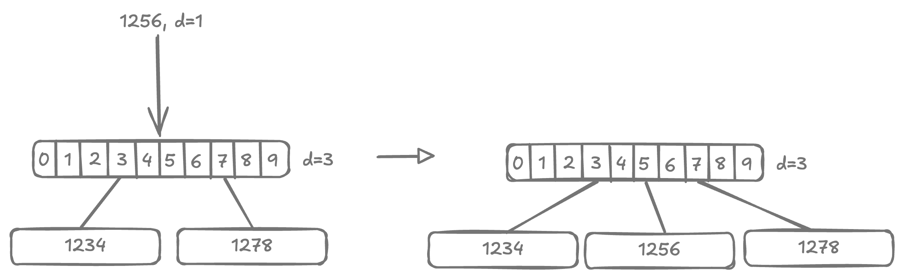

# Compressed Trie

<style>
.md-logo img {
  content: url('/data-structures/trie/logo.png');
}

:root [data-md-color-scheme=slate] .md-logo img  {
  content: url('/data-structures/trie/logo.png');
}
</style>

Let's go back to our example trie and consider the highlighted branch nodes.

{width=600px}

These branch nodes do not connect to any leaf nodes, but rather lead to another single branch node. These "highlighted" nodes and their descendant branches can be flattened, resulting into a compressed trie.

Branch nodes in compressed trie include an additional bit `digit`. This is the index of the key at which we are to branch.

## Insertion

### 1. In Leaf Node

<div markdown class="grid">

<div markdown>

<u>Case 1</u>) $\text{key} = \text{node.key}$

: Key already exists in trie, so nothing needs to be done.

</div>

<div markdown>


</div>

<hr>

<hr>

<div markdown>

<u>Case 2</u>) $\text{key}.starts\_with(\text{node.key})$ or the other way round

: either `key` is a prefix of `node.key`, or `node.key` is prefix of `key`.

</div>

<div markdown>


</div>

<hr>

<hr>

<div markdown>

<u>Case 3</u>) $\text{key} \ne \text{node.key}$

: fallback case, `key` and `node.key` are not the same and differ at some index.

</div>

<div markdown>


</div>

<hr>

<hr>

</div>

### 2. In Branch Node

<div markdown class="grid">

<div markdown>

<u>Case 1a</u>) $\text{depth} < \text{node.digit}$, inserting a lexicographically neighbouring key.

: key being inserted is close to existing keys of this node.

</div>

<div markdown>

{width=100%}

</div>

<br>

<hr>

<div markdown>

<u>Case 1b</u>) $\text{depth} < \text{node.digit}$, and inserting a lexicographically distant key.

: key being inserted is very far from existing keys of this node by dictionary order.

</div>

<div markdown>

{width=100%}

</div>

<hr>

<hr>

<div markdown>

<u>Case 2a</u>) $\text{depth} = \text{node.digit}$

: base case. `key` is at its intended depth.

</div>

<div markdown>

{width=100%}

</div>

<br>

<hr>

<div markdown>

<u>Case 2b</u>) $\text{depth} = \text{node.digit}$, leading to extraneous branch node

: base case. `key` is at its intended depth.

</div>

<div markdown>

{width=100%}

</div>

<hr>

<hr>

<div markdown>

<u>Case 3</u>) $\text{depth} > \text{node.digit}$

: not possible. In a valid compressed trie, $parent.digit < child.digit$, and $depth$ can only increment by $+1$ at each level.

</div>

<div></div>

</div>

### 3. In Prefix Node

<div markdown class="grid">

<div markdown>

<u>Case 1</u>) $\text{key}.starts\_with(\text{node.key})$

: $node.key$ is a prefix to the $key$ being inserted. It doesn't matter what $depth$ is.

</div>

<div markdown>

{width=100%}

</div>

<hr>

<hr>

<div markdown>

<u>Case 2</u>) $\text{node.key}.starts\_with(\text{key})$

: $key$ is a prefix to the $node$ itself.

</div>

<div markdown>

{width=100%}

</div>

<hr>

<hr>

<div markdown>

<u>Case 3</u>) $\text{otherwise}$

: $key$ has a mismatch with $node.key$.

</div>

<div markdown>

{width=100%}

</div>

<hr>

<hr>

</div>

## Implementation

```kotlin linenums="1"
package com.example.trie

import com.example.tree.PrintableNode
import com.example.tree.print
import java.util.TreeMap

private interface Node : PrintableNode

private interface HasKey: Node {
  val key: String
}

private interface IsBranch: Node {
  val digit: Int
  val branches: TreeMap<Char, Node>

  operator fun get(key: String): Node? = branches[key[digit]]
  operator fun set(key: String, child: Node?) {
    if (child == null) branches.remove(key[digit])
    else branches[key[digit]] = child
  }
}

private class LeafNode(override val key: String) : HasKey {
  override fun content(): String = "l($key)"
  override fun children(): List<PrintableNode> = listOf()
}

private class BranchNode(override val digit: Int) : IsBranch {
  override val branches = TreeMap<Char, Node> { a, b -> a.code - b.code }
  override fun content(): String = "b(${digit+1}▹${branches.keys.joinToString(separator = ",")})"
  override fun children(): List<PrintableNode> = branches.values.toList()
}

private class PrefixNode(override val key: String, override val digit: Int) : HasKey, IsBranch {
  override val branches = TreeMap<Char, Node> { a, b -> a.code - b.code }
  override fun content(): String = "p(${digit+1}▹$key|${branches.keys.joinToString(separator = ",")})"
  override fun children(): List<PrintableNode> = branches.values.toList()
}

class Trie {
  private var root: Node = BranchNode(digit = 0)

  fun search(key: String): Boolean {
    return internalSearch(root, key, LinkedList())
  }

  private fun internalSearch(node: Node?, key: String, trace: MutableList<Node>): Boolean {
    if (node == null) return false

    trace.addFirst(node)
    if (node is LeafNode) return key == node.key
    if (node is PrefixNode) {
      if (key == node.key) return true
      return internalSearch(node[key], key, trace)
    }
    if (node is BranchNode) {
      return internalSearch(node[key], key, trace)
    }
    return false
  }

  fun insert(key: String) {
    root = insert(root, key, keyRemaining = 0)
  }

  private fun insert(node: Node?, key: String, keyRemaining: Int): Node {
    return when(node) {
      null -> LeafNode(key)
      is LeafNode -> insertInLeaf(node, key)
      is BranchNode -> insertInBranch(node, key, keyRemaining)
      is PrefixNode -> insertInPrefix(node, key, keyRemaining)
      else -> throw IllegalStateException()
    }
  }

  private fun insertInLeaf(node: LeafNode, key: String): Node {
    // Case 1: node.key == key, nothing to do.
    val mismatch = mismatchAt(key, node.key) ?: return node

    // Case 3: node.key != key.
    if (mismatch < key.length && mismatch < node.key.length) {
      val branch = BranchNode(digit = mismatch)
      branch[node.key] = node
      branch[key] = LeafNode(key)
      return branch
    }

    // Case 2: node.key starts with key or key starts with node.key
    var str = key
    var startsWith = node.key
    if (key.length < startsWith.length) {
      str = node.key
      startsWith = key
    }

    val prefix = PrefixNode(key = startsWith, digit = mismatch)
    prefix[str] = LeafNode(str)
    return prefix
  }

  private fun insertInBranch(node: BranchNode, key: String, keyRemaining: Int): Node {
    // Case 1: depth < node.digit
    if (keyRemaining < node.digit) {
      val otherKey = anyKey(node) ?: ""
      val mismatch = mismatchAt(key, otherKey) ?: return node
      // Case 1b: inserting a key lexicographically distant key.
      if (mismatch < node.digit) {
        val branch = BranchNode(digit = mismatch)
        branch[key] = LeafNode(key)
        branch[otherKey] = node
        return branch
      }
      // inserting a lexicographically neighbouring key.
      node[key] = LeafNode(key)
      return node
    }

    // Case 2: depth = node.digit
    node[key] = insert(node[key], key, keyRemaining + 1)
    // Case 2b: key is at intended depth, can be compressed.
    if (node.branches.size == 1 && node.branches.values.first() is BranchNode) {
      return node.branches.values.first()
    }
    // Case 2a: key is at intended depth, no compression needed.
    return node
  }

  private fun insertInPrefix(node: PrefixNode, key: String, keyRemaining: Int): Node {
    val mismatch = mismatchAt(key, node.key) ?: return node
    // Case 1: node.key is prefix to key.
    if (mismatch >= node.key.length) {
      node[key] = insert(node[key], key, keyRemaining + 1)
      return node
    }
    // Case 2: key is prefix to node.key.
    if (mismatch == key.length) {
      val prefix = PrefixNode(key, mismatch)
      prefix[node.key] = node
      return prefix
    }
    // Case 3: otherwise
    val branch = BranchNode(digit = mismatch)
    branch[key] = LeafNode(key)
    branch[node.key] = node
    return branch
  }

  // Given a node, find any key it.
  private fun anyKey(node: Node) : String? {
    return when(node) {
      is LeafNode -> node.key
      is PrefixNode -> node.key
      is BranchNode -> node.branches.values.firstNotNullOfOrNull { anyKey(it) }
      else -> null
    }
  }

  override fun toString(): String {
    return print(root)
  }
}

/**
 * Find at which character two strings mismatch.
 *
 * @return index at which they differ. null is they are exact match.
 */
private fun mismatchAt(first: String, second: String, startIndex: Int = 0): Int? {
  var i = startIndex
  while (i < first.length && i < second.length) {
    if (first[i] != second[i]) return i
    i++
  }
  // if length were same, then all characters matched.
  return if (first.length == second.length) null else i
}
```

## Unit tests

```kotlin linenums="1"
package com.example.trie

import org.assertj.core.api.Assertions.assertThat
import org.junit.jupiter.api.BeforeEach
import org.junit.jupiter.api.Test

class TrieTest {

  private lateinit var trie: Trie

  @BeforeEach
  fun setup() {
    trie = Trie()
  }

  @Test
  fun empty() {
    assertThat(trie.toString()).isEqualTo("b(1▹)")
  }

  @Test
  fun singleKey() {
    trie.insert("hello")
    assertThat(trie.toString()).isEqualTo("""
       b(1▹h)
          |
      l(hello)
    """.trimIndent())

    assertThat(trie.search("hello")).isTrue()
  }

  @Test
  fun branchAtFirstCharacter() {
    trie.insert("hello")
    trie.insert("aloha")
    trie.insert("bonjour")
    assertThat(trie.toString()).isEqualTo("""
              b(1▹a,b,h)
          ┌────────┼────────┐
      l(aloha) l(bonjour) l(hello)
    """.trimIndent())

    assertThat(trie.search("hello")).isTrue()
    assertThat(trie.search("aloha")).isTrue()
    assertThat(trie.search("bonjour")).isTrue()
  }

  @Test
  fun branchAtSecondCharacter() {
    trie.insert("hello")
    trie.insert("hola")
    trie.insert("aloha")
    trie.insert("bonjour")
    assertThat(trie.toString()).isEqualTo("""
              b(1▹a,b,h)
          ┌────────┼────────────────┐
      l(aloha) l(bonjour)         b(2▹e,o)
                            ┌───────┴──────┐
                        l(hello)         l(hola)
    """.trimIndent())

    assertThat(trie.search("hello")).isTrue()
    assertThat(trie.search("hola")).isTrue()
    assertThat(trie.search("aloha")).isTrue()
    assertThat(trie.search("bonjour")).isTrue()
  }

  @Test
  fun branchCompression() {
    trie.insert("plant")
    trie.insert("planet")
    assertThat(trie.toString()).isEqualTo("""
               b(5▹e,t)
          ┌────────┴───────┐
      l(planet)         l(plant)
    """.trimIndent())

    assertThat(trie.search("plant")).isTrue()
    assertThat(trie.search("planet")).isTrue()
  }

  @Test
  fun branchDecompression() {
    trie.insert("plant")
    trie.insert("planet")
    assertThat(trie.toString()).isEqualTo("""
               b(5▹e,t)
          ┌────────┴───────┐
      l(planet)         l(plant)
    """.trimIndent())

    trie.insert("plywood")
    assertThat(trie.toString()).isEqualTo("""
                                b(3▹a,y)
                   ┌────────────────┴────────┐
               b(5▹e,t)                  l(plywood)
          ┌────────┴───────┐
      l(planet)         l(plant)
    """.trimIndent())

    trie.insert("plenty")
    assertThat(trie.toString()).isEqualTo("""
                               b(3▹a,e,y)
                   ┌────────────────┼──────────┐
               b(5▹e,t)          l(plenty)  l(plywood)
          ┌────────┴───────┐
      l(planet)         l(plant)
    """.trimIndent())

    trie.insert("alert")
    assertThat(trie.toString()).isEqualTo("""
                b(1▹a,p)
            ┌───────┴─────────────────────────────────┐
        l(alert)                                  b(3▹a,e,y)
                                     ┌────────────────┼──────────┐
                                 b(5▹e,t)          l(plenty)  l(plywood)
                            ┌────────┴───────┐
                        l(planet)         l(plant)
    """.trimIndent())

    assertThat(trie.search("alert")).isTrue()
    assertThat(trie.search("plant")).isTrue()
    assertThat(trie.search("planet")).isTrue()
    assertThat(trie.search("plywood")).isTrue()
    assertThat(trie.search("plenty")).isTrue()
  }

  @Test
  fun prefix() {
    trie.insert("1596")
    assertThat(trie.toString()).isEqualTo("""
      b(1▹1)
         |
      l(1596)
    """.trimIndent())

    trie.insert("15962")
    trie.insert("15968")
    assertThat(trie.toString()).isEqualTo("""
                 b(1▹1)
                    |
              p(5▹1596|2,8)
          ┌─────────┴──────────┐
      l(15962)              l(15968)
    """.trimIndent())

    trie.insert("159688")
    assertThat(trie.toString()).isEqualTo("""
                 b(1▹1)
                    |
              p(5▹1596|2,8)
          ┌─────────┴───────────┐
      l(15962)              p(6▹15968|8)
                                |
                            l(159688)
    """.trimIndent())

    trie.insert("159")
    assertThat(trie.toString()).isEqualTo("""
                 b(1▹1)
                    |
               p(4▹159|6)
                    |
              p(5▹1596|2,8)
          ┌─────────┴───────────┐
      l(15962)              p(6▹15968|8)
                                |
                            l(159688)
    """.trimIndent())

    trie.insert("1588")
    assertThat(trie.toString()).isEqualTo("""
             b(3▹8,9)
         ┌───────┴─────────────────┐
      l(1588)                  p(4▹159|6)
                                   |
                             p(5▹1596|2,8)
                         ┌─────────┴───────────┐
                     l(15962)              p(6▹15968|8)
                                               |
                                           l(159688)
    """.trimIndent())

    assertThat(trie.search("1588")).isTrue()
    assertThat(trie.search("159")).isTrue()
    assertThat(trie.search("1596")).isTrue()
    assertThat(trie.search("15962")).isTrue()
    assertThat(trie.search("15968")).isTrue()
    assertThat(trie.search("159688")).isTrue()
  }

  @Test
  fun example_sahani() {
    trie.insert("562-44-2169")
    trie.insert("271-16-3624")
    trie.insert("278-49-1515")
    trie.insert("951-23-7625")
    trie.insert("951-94-1654")
    assertThat(trie.toString()).isEqualTo("""
                                             b(1▹2,5,9)
                        ┌─────────────────────────┼────────────────────────┐
                    b(3▹1,8)                l(562-44-2169)               b(5▹2,9)
             ┌──────────┴──────────┐                             ┌──────────┴──────────┐
      l(271-16-3624)         l(278-49-1515)               l(951-23-7625)         l(951-94-1654)
    """.trimIndent())

    trie.insert("987-26-1615")
    assertThat(trie.toString()).isEqualTo("""
                                             b(1▹2,5,9)
                        ┌─────────────────────────┼───────────────────────────────────────────────┐
                    b(3▹1,8)                l(562-44-2169)                                      b(2▹5,8)
             ┌──────────┴──────────┐                                        ┌──────────────────────┴──────────┐
      l(271-16-3624)         l(278-49-1515)                             b(5▹2,9)                        l(987-26-1615)
                                                                ┌──────────┴──────────┐
                                                         l(951-23-7625)         l(951-94-1654)
    """.trimIndent())

    trie.insert("958-36-4194")
    assertThat(trie.toString()).isEqualTo("""
                                             b(1▹2,5,9)
                        ┌─────────────────────────┼──────────────────────────────────────────────────────────────────────┐
                    b(3▹1,8)                l(562-44-2169)                                                             b(2▹5,8)
             ┌──────────┴──────────┐                                                               ┌──────────────────────┴──────────┐
      l(271-16-3624)         l(278-49-1515)                                                    b(3▹1,8)                        l(987-26-1615)
                                                                           ┌──────────────────────┴──────────┐
                                                                       b(5▹2,9)                        l(958-36-4194)
                                                                ┌──────────┴──────────┐
                                                         l(951-23-7625)         l(951-94-1654)
    """.trimIndent())

    assertThat(trie.search("271-16-3624")).isTrue()
    assertThat(trie.search("562-44-2169")).isTrue()
    assertThat(trie.search("278-49-1515")).isTrue()
    assertThat(trie.search("951-23-7625")).isTrue()
    assertThat(trie.search("951-94-1654")).isTrue()
    assertThat(trie.search("987-26-1615")).isTrue()
    assertThat(trie.search("958-36-4194")).isTrue()
  }

}
```
