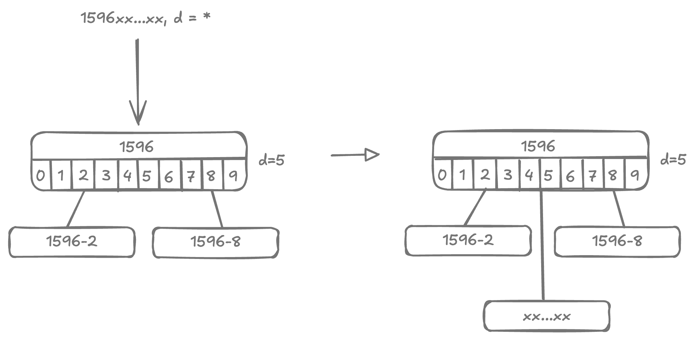

# Compressed Trie

<style>
.md-logo img {
  content: url('/data-structures/trie/logo.png');
}

:root [data-md-color-scheme=slate] .md-logo img  {
  content: url('/data-structures/trie/logo.png');
}
</style>

<script type="text/javascript" src="https://www.gstatic.com/charts/loader.js"></script>
<script type="text/javascript">
  google.charts.load('current', {'packages':['corechart']});
</script>

## Demo

```
                                                                                                                                                                                                                                                                                                                                                                                                                                                                                                                                                                                                                                                                                                                                                                                                                                                                                                                                                                                                                                                                                                                                                                                                                                                                                                                                                                                                                                                                                                                                                                                                                                                                                                                                                                                                                                                                                                                                                                                                                                                                                                                                                                                                                                                                                                                                                                                                                                                                                                    b(1▹a,b,c,d,e,f,g,h,i,j,k,l,m,n,o,p,q,r,s,t,u,v,w,y,z,å)
                                                                                        +--------------------------------------------------------------------------------------------------------------------------------------------------------------------------------------------------------------------------------------------------+------------------------------------------------------------------------------------------------------------------------------------------------------------------------------------------------------------------------------------------------------------------------------------------------------------------------------------------------------------------------------------------------------------------------------------------------------------------------------------------------------------------------------------------------------------------------------------------------------------+-------------------------------------------------------------------------------------------------------------+---------------------------------------------------------------------------------------------------------+----------------------------------------------------------------------------------------------------------------------------------+-------------------------------------------------------------------------------------------------------------------------------------------------------+---------------------------------------------------------------------------------------------------------------------------------------------------------------------+----------------------------------------------------------------------------------------------------------+----------------------------------------------------------------------------------------+----------------------------------------------------------+--------------------------------------------------------------------------------------------------------------------------------+-------------------------------------------------------------------------------------------------------------------------------------------------------------------------------------------------------------------------------------------------------------------------------------------------------------+----------------------------------------------------------------------------------------------------------------------------------------------------------------+-----------------------------------------------------------------------------------------------------------------------------+-------------------------------------------------------------------------------------+-----------------------------------------------------------------------------------------------------------------------------------------+----------------------------------------------------------------------------+-------------------------------+-------------------------------------------------------------------------------------------------------------------------------------------------------------------------------------------------------------------------------------------------------------------------------------------------------------------+-----------------------------------------------------------------------------------------------------------------------------------------------------------------------------------------------------------------------------------------------------------------------------------------------------------------------------------------------------------+----------------------------------------------------------------------------------------------------------------------------------------------------------------------------------------------------------+------------------------------------------------------------------------------------------------------------------------------------+--------------------------------------------+----------------------+------------------+-----------------------+
                                                                               b(2▹f,l,m,n,r,u,z)                                                                                                                                                                                                                                  b(2▹a,e,h,o,r,u)                                                                                                                                                                                                                                                                                                                                                                                                                                                                                                                                                                                          b(2▹a,e,h,o,r,u,y,z,ô)                                                                                             b(2▹e,i,j,o)                                                                                          b(2▹c,g,l,q,r,s,t,u)                                                                                                                    b(2▹a,i,r)                                                                                                                                           b(2▹a,e,h,i,r,u)                                                                                                                                                         b(2▹a,o,u)                                                                                               b(2▹c,n,r,s,t)                                                                             b(2▹a,e,o)                                              b(2▹a,e,i,o,u,y)                                                                                                                   b(2▹a,e,i,u)                                                                                                                                                                                                                                                                                                 b(2▹a,e,i,o,y)                                                                                                                                                                                                                                                                                  b(2▹a,e,i,o)                                                                             l(oman)                                                                                                                              b(2▹a,e,h,i,o,u)                                                                 l(qatar)                      b(2▹o,u,w,é)                                                                                                                                                                                                                                                                                               b(2▹a,e,i,l,o,p,r,t,u,v,w,y,ã)                                                                                                                                                                                                                                                                                                                                    b(2▹a,h,i,o,r,u,ü)                                                                                                                                                                                          b(2▹.,g,k,n,r,z)                                                                                                                        b(2▹a,e,i)                                   b(2▹a,e,o)              l(yemen)           b(2▹a,i)            l(åland islands)
       +----------------------+----------------------+----------------------------------+------------------------------------------------------+-------------------------------+--------------------+                                           +-------------------------------------------------------+--------------------+-------------+-----------------------------+------------------------------------------------------------------------+-------------------------------------------------------+                                                                                                                +----------------------------------------------------------------------------------+-------------------------------------------+------------------------------------------------------------------------------------------+--------------------------------------------------------------------------------------------------+-----------------------+------------------+----------+-------------+             +------------+--------------+----------+----------------+                +---------+-----------+-----------------+--------------------+--------------+--------------------+--------------------+----------+                             +--------------------------------+----------------------------+                                                             +----------------------------+------------------+------------+-------------+-----------------------+---------------------------------------------------------------------+                                    +--------------------+-------------------------------+          +------------------+--------------------------------------------+---------------------------------+-----------------+                   +----------------+---------+           +-----------+---------+--------------+-----------+---------+-----------+                   +-----------------------------------------------------+--------------------+-----------------------------------------+---------------------------+                                                                                                                       +---------------------------------------------------------------------------------------------------+-----------+----------------------------------------------------------------------------------+---------------------------------------+                                                                                +----------------------------+-----------------------------------------------------+------------------------+---------------------------------------+                                                                                       +------------------------------------------+-----------+---------------+----------------+------------------------+----------------------+                     +---------+-----------+---------+----------+                    +----------------------------------------------+----------------------------------------------+--------------------------------------------------------+---------------------------------------+-------------------------------------------------------+------------------+----------------------------------------------------------------------------+-----------------------------------------------------------------------------------------+--------------------------+--------------------------+----------------------+---------------+                           +------------------------+-------------+--------------------+------------------------+-----------------------------------------+--------------------------------------------+                                  +------------------------------+----------+-------------+---------------------------------------+-------------------------------+-----------+                      +-------------------------+-----------+              +-----------------+-------------+                 +---------+--------+
l(afghanistan)            b(3▹b,g)           l(american samoa)                     b(3▹d,g,t)                                             b(3▹g,m,u)                       b(6▹a,i)           l(azerbaijan)                                b(3▹h,n,r)                                              b(3▹l,n,r)            l(bhutan)                                  b(3▹l,s,t)                                                               b(3▹a,i,u)                                               b(3▹l,r)                                                                                                      b(3▹m,n,p,r,y)                                                                        b(3▹n,u)                                   b(3▹a,i,r)                                                                              b(3▹c,l,m,n,o,s)                                                                                      l(croatia)               b(3▹b,r)           l(cyprus) l(czechia) l(côte d’ivoire) l(denmark) l(diego garcia)             l(djibouti)    p(9▹dominica|n)    l(ecuador) l(egypt) l(el salvador) l(equatorial guinea)                     l(eritrea)            b(3▹t,w)            l(ethiopia) l(europe)                     b(3▹l,r)                         b(3▹j,n)                     b(3▹a,e)                                                      b(3▹b,m)                     b(3▹o,r)           l(ghana)                 l(gibraltar)              b(4▹e,n)                                                            b(3▹a,e,i,y)                           l(haiti)             b(4▹d,g)                       l(hungary) l(iceland)          b(4▹i,o)                                     b(3▹a,e)                          b(3▹l,r)          l(italy)            b(3▹m,p)         l(jersey) l(jordan) l(kazakhstan) l(kenya) l(kiribati)                 l(kosovo) l(kuwait) l(kyrgyzstan)         b(3▹o,t)                                              b(3▹b,s)                                                      b(3▹b,e,t)                 l(luxembourg)                                                                                                         b(3▹c,d,l,r,u,y)                                                                                        l(mexico) l(micronesia)                                                                      b(3▹l,n,r,z)                         l(myanmar (burma))                                                                    b(3▹m,u)                    b(3▹p,t,w)                                                                     b(3▹c,g,u)                              b(4▹f,t,w)                                                                            b(3▹k,l,n,p,r)                                 l(peru) l(philippines)                 l(pitcairn islands)           b(3▹l,r)            l(puerto rico)          l(romania) l(russia)             l(rwanda) l(réunion)           b(3▹m,n,u)                                     b(3▹n,r,y)                                      b(3▹e,n)                                                 b(5▹a,e)                               b(3▹l,m,u)                                               l(spain)         l(sri lanka)                                                              b(5▹b,h,k,l,m,p,v)                                                                             b(3▹d,r)            l(svalbard & jan mayen)           b(3▹e,i)               l(syria) l(são tomé & príncipe)            b(3▹i,j,n)               l(thailand) l(timor-leste)         b(3▹g,k,n)          l(trinidad & tobago)                           b(3▹n,r,v)                                   l(türkiye)                          b(6▹o,v)                       l(uganda) l(ukraine)                                            b(8▹a,k,s)                      l(uruguay) l(uzbekistan)            b(3▹n,t)                l(venezuela) l(vietnam) l(wallis & futuna) l(western sahara) l(world)          l(zambia)         l(zimbabwe)
                    +---------+--------+                            +-------------------+-------------------------+                +-----------+---------+          +----------+--------+                                  +--------------------+------------+                      +-------------------+----------+                                    +----------------+-----------------+          +-------------------------------------------+---------------------------------+          +----------+-----------------------+                              +-----------------------------+---------------------------+-------------------+--------------------+                      +------------------+------------+            +-----------------+---------------------+                       +------------------+-----------+-------------+----------------------------------+------------------------------+--------------+                                +--------+--------+                                                                                                        |                                                                                                       +---------+--------+                                     +--------------+-----------+           +--------+--------+         +---------+------------------------+                           +--------+-------+          +---------+--------+                                                 +----------+--------+                       +-----------------------+------------+-------------+------------+                   +----------+--------------+                                     +--------+---------+                  +---------------+--------+            +-----------+-------+                   +---------+-------+                                                                                                                +--------+------------------------+                  +---------+--------+                                +--------------------+--------------+                             +---------------+-------------------------------------------------------+------------------------------+-------------------------------+-----------------------------------+---------------------+                                  +--------------------+------------------------------------------------+----------+-----------+                                                                                       +---------+-------+        +-----------+----------------------------+                                    +------------+---------+            +----------------+-----------+                  +-------------------+------------------------------------+----------------+---------------+                                                                     +---------+--------+                                                                                        +----------+--------------+             +-----------------+------------------+              +------------+--------------------+                        +----------+--------+               +--------------+----------------------------+                                                                     +---------------+-----------------+------------------+---------------+-------------------+-------------------------+                  +--------+--------+                                  +---------+----------+                                           +-----------+------------+                                    +---------+---------+                              +-------------------------+---------------------------------+                            +----------------+--------------+                                                           +--------------------+-----------------+                                      +---------+----------+
               l(albania)         l(algeria)                   l(andorra)           b(4▹o,u)            l(antigua & barbuda) l(argentina) l(armenia) l(aruba) l(australia)         l(austria)                          b(4▹a,r)           l(bangladesh) l(barbados)            b(4▹a,g,i)           l(benin)  l(bermuda)                           l(bolivia) l(bosnia & herzegovina) l(botswana) l(brazil)                                   b(9▹i,v)                          l(brunei) l(bulgaria)                         b(4▹k,u)                       b(4▹b,e)                      b(5▹d,r)                  l(cape verde) l(caribbean netherlands) l(cayman islands) l(central african republic)         l(ceuta & melilla) l(chad)          b(4▹l,n)         l(christmas island) l(cocos (keeling) islands) l(colombia) l(comoros)                                        b(9▹b,k)                    l(cook islands) l(costa rica)                       l(cuba)         l(curaçao)                                                                                          l(dominican republic)                                                                                        l(estonia)         l(eswatini)                       l(falkland islands)         l(faroe islands) l(fiji)         l(finland) l(france)                          b(8▹g,p)                    l(gabon)         l(gambia) l(georgia)         l(germany)                                       l(greenland)         l(grenada)              b(4▹d,m,t)              l(guernsey)               p(7▹guinea|-)  l(guyana)          l(honduras)         l(hong kong sar china)                       l(india)         l(indonesia)         b(4▹n,q)                l(ireland) l(isle of man)         l(israel)          l(jamaica)         l(japan)                                                                                                          l(laos)                          b(4▹i,v)          l(lebanon)         l(lesotho)                        b(4▹e,y)         l(liechtenstein) l(lithuania)               l(macao sar china) l(madagascar)                                           b(4▹a,d,i,t)                                                     b(4▹s,t)                            b(7▹a,i)             l(mayotte)                         l(moldova)           b(4▹a,g,t)                                                  l(morocco) l(mozambique)                                                                            l(namibia)         l(nauru) l(nepal) l(netherlands)                  b(5▹c,z)                           l(nicaragua) p(6▹niger|i) l(niue) l(norfolk island) l(north korea) l(norway)         l(pakistan)          b(4▹a,e)                             l(panama)   l(papua new guinea) l(paraguay)                                                            l(poland)         l(portugal)                                                                               l(samoa) l(san marino) l(saudi arabia) l(senegal)       p(7▹serbia| )      l(seychelles) l(sierra leone)                      b(4▹g,t)                l(slovakia)         l(slovenia) l(solomon islands) l(somalia)                   b(7▹a,k,s)                                                         l(st. barthélemy) l(st. helena) l(st. kitts & nevis)   l(st. lucia)    l(st. martin) l(st. pierre & miquelon) l(st. vincent & grenadines) l(sudan)         l(suriname)                         l(sweden)         l(switzerland)                                 l(taiwan) l(tajikistan) l(tanzania)                            l(togo) l(tokelau) l(tonga)                      l(tunisia)                 b(5▹m,s)                          l(tuvalu)            l(u.s. outlying islands)         l(u.s. virgin islands)                                      l(united arab emirates) l(united kingdom) l(united states)                          l(vanuatu)         l(vatican city)
                                                                              +---------+--------+                                                                                                               +---------+--------+                                    +----------+---------+                                                                                                                             +---------------------+---------------+                                                  +------------+--------+          +----------+--------+          +---------+-----------+                                                                                                                                     +--------+-------+                                                                                                     +---------------+------------+                                                                                                                                                                                                                                                                                                                                                                                                                                                      +------------+------------+                                                                                                                                               +-----------+-----------+                                      |                                                                                                                             +--------+------+                                                                                                                                                                                                                              +------------+-------+                                                    +---------+-------+                                                                                               +--------------------+------------+--------+--------+                             +--------------+---------+             +-----------+---------+                                                        +----------+------------------------+                                                                                                                                                                                             +------------+----------+                                      |                                                                                 +--------+----------------+                                                                                                                                                                                                                                                                                                |                                                        +----------+----------+                                                                             +---------------+--------------+                                                                                                                                                                                                                                                                                                                                                                                                                                                +------------+---------------+
                                                                          l(angola)         l(anguilla)                                                                                                     l(bahamas)         l(bahrain)                           l(belarus) l(belgium) l(belize)                                                                                                         l(british indian ocean territory)         l(british virgin islands)                               l(burkina faso)         l(burundi) l(cambodia)         l(cameroon) l(canada)         l(canary islands)                                                                                                                         l(chile)         l(china)                                                                                       l(congo - brazzaville)         l(congo - kinshasa)                                                                                                                                                                                                                                                                                                                                                                                                                                     l(french guiana)         l(french polynesia)                                                                                                                                l(guadeloupe)  l(guam)  l(guatemala)                         l(guinea-bissau)                                                                                                                   l(iran)         l(iraq)                                                                                                                                                                                                                   l(latin america)         l(latvia)                                           l(liberia)         l(libya)                                                                                        b(5▹w,y)            l(maldives)             l(mali) l(malta)                 l(marshall islands)         l(martinique) l(mauritania)         l(mauritius)                                               l(monaco) l(mongolia)               b(5▹e,s)                                                                                                                                                                                  l(new caledonia)         l(new zealand)                           l(nigeria)                                                                         l(palau)         l(palestinian territories)                                                                                                                                                                                                                                                                        l(serbia and montenegro)                                       l(singapore)         l(sint maarten)                                                               l(south africa) l(south korea) l(south sudan)                                                                                                                                                                                                                                                                                                                                                                                                                                   l(turkmenistan)         l(turks & caicos islands)
                                                                                                                                                                                                                                                                                                                                                                                                                                                                                                                                                                                                                                                                                                                                                                                                                                                                                                                                                                                                                                                                                                                                                                                                                                                                                                                                                                                                                                                                                                                                                                                                                                                                                                                                                                                                                                                                                                                                                                                                                                                                                                                                                                    +---------+--------+                                                                                                                                                                                                                      +-----------+---------+
                                                                                                                                                                                                                                                                                                                                                                                                                                                                                                                                                                                                                                                                                                                                                                                                                                                                                                                                                                                                                                                                                                                                                                                                                                                                                                                                                                                                                                                                                                                                                                                                                                                                                                                                                                                                                                                                                                                                                                                                                                                                                                                                                                l(malawi)         l(malaysia)                                                                                                                                                                                                           l(montenegro)         l(montserrat)
```

Let's go back to our example trie and consider the highlighted branch nodes.

{width=600px}

These branch nodes do not connect to any leaf nodes, but rather lead to another single branch node. These "highlighted" nodes and their descendant branches can be flattened, resulting into a compressed trie.

Branch nodes in compressed trie include an additional bit `digit`. This is the index of the key at which we are to branch.

## Insertion

### 1. In Leaf Node

<div markdown class="grid">

<div markdown>

<u>Case 1</u>) $\text{key} = \text{node.key}$

: Key already exists in trie, so nothing needs to be done.

</div>

<div markdown>


</div>

<hr>

<hr>

<div markdown>

<u>Case 2</u>) $\text{key}.starts\_with(\text{node.key})$ or the other way round

: either `key` is a prefix of `node.key`, or `node.key` is prefix of `key`.

</div>

<div markdown>


</div>

<hr>

<hr>

<div markdown>

<u>Case 3</u>) $\text{key} \ne \text{node.key}$

: fallback case, `key` and `node.key` are not the same and differ at some index.

</div>

<div markdown>


</div>

<hr>

<hr>

</div>

### 2. In Branch Node

<div markdown class="grid">

<div markdown>

<u>Case 1a</u>) $\text{depth} < \text{node.digit}$, inserting a lexicographically neighbouring key.

: key being inserted is close to existing keys of this node.

</div>

<div markdown>

{width=100%}

</div>

<br>

<hr>

<div markdown>

<u>Case 1b</u>) $\text{depth} < \text{node.digit}$, and inserting a lexicographically distant key.

: key being inserted is very far from existing keys of this node by dictionary order.

</div>

<div markdown>

{width=100%}

</div>

<hr>

<hr>

<div markdown>

<u>Case 2a</u>) $\text{depth} = \text{node.digit}$

: base case. `key` is at its intended depth.

</div>

<div markdown>

{width=100%}

</div>

<br>

<hr>

<div markdown>

<u>Case 2b</u>) $\text{depth} = \text{node.digit}$, leading to extraneous branch node

: base case. `key` is at its intended depth.

</div>

<div markdown>

{width=100%}

</div>

<hr>

<hr>

<div markdown>

<u>Case 3</u>) $\text{depth} > \text{node.digit}$

: not possible. In a valid compressed trie, $parent.digit < child.digit$, and $depth$ can only increment by $+1$ at each level.

</div>

<div></div>

</div>

### 3. In Prefix Node

<div markdown class="grid">

<div markdown>

<u>Case 1</u>) $\text{key}.starts\_with(\text{node.key})$

: $node.key$ is a prefix to the $key$ being inserted. It doesn't matter what $depth$ is.

</div>

<div markdown>

{width=100%}

</div>

<hr>

<hr>

<div markdown>

<u>Case 2</u>) $\text{node.key}.starts\_with(\text{key})$

: $key$ is a prefix to the $node$ itself.

</div>

<div markdown>

{width=100%}

</div>

<hr>

<hr>

<div markdown>

<u>Case 3</u>) $\text{otherwise}$

: $key$ has a mismatch with $node.key$.

</div>

<div markdown>

{width=100%}

</div>

<hr>

<hr>

</div>

## Benchmark

<div id="benchmark" markdown></div>

## Implementation

```kotlin linenums="1"
package com.example.trie

import com.example.tree.PrintableNode
import com.example.tree.print
import java.util.LinkedList
import java.util.TreeMap

private interface Node : PrintableNode

private interface HasKey: Node {
  val key: String
}

private interface IsBranch: Node {
  val digit: Int
  val branches: TreeMap<Char, Node>

  operator fun get(key: String): Node? = branches[key[digit]]
  operator fun set(key: String, child: Node?) {
    if (child == null) branches.remove(key[digit])
    else branches[key[digit]] = child
  }
}

private class LeafNode(override val key: String) : HasKey {
  override fun content(): String = "l($key)"
  override fun children(): List<PrintableNode> = listOf()
}

private class BranchNode(override val digit: Int) : IsBranch {
  override val branches = TreeMap<Char, Node> { a, b -> a.code - b.code }
  override fun content(): String = "b(${digit+1}▹${branches.keys.joinToString(separator = ",")})"
  override fun children(): List<PrintableNode> = branches.values.toList()
}

private class PrefixNode(override val key: String, override val digit: Int) : HasKey, IsBranch {
  override val branches = TreeMap<Char, Node> { a, b -> a.code - b.code }
  override fun content(): String = "p(${digit+1}▹$key|${branches.keys.joinToString(separator = ",")})"
  override fun children(): List<PrintableNode> = branches.values.toList()
}

class Trie {
  private var root: Node = BranchNode(digit = 0)

  fun remove(key: String) {
    val trace = LinkedList<Node>()
    if (!internalSearch(root, key, trace)) return

    while (trace.isNotEmpty()) {
      val node = trace.poll()
      // Delete node from parent and propagate deletion up the chain.
      if (node is LeafNode) {
        val parent = (trace.poll() ?: continue) as IsBranch
        parent[node.key] = null
        continue
      }
      // We'd be here only if in some previous iteration a leaf node was deleted.
      if (node is BranchNode) {
        if (node.branches.isNotEmpty()) continue
        val parent = (trace.poll() ?: return) as IsBranch
        for ((k, v) in parent.branches) {
          if (v == node) {
            parent.branches.remove(k)
            break
          }
        }
        continue
      }
      if (node is PrefixNode) {
        val parent = (trace.poll() ?: continue) as IsBranch
        val branch = BranchNode(node.digit)
        branch.branches.putAll(node.branches)
        for ((k, v) in parent.branches) {
          if (v == node) {
            parent.branches[k] = branch
            break
          }
        }
      }
    }
    root = compress(root) ?: root
  }

  private fun compress(node: Node): Node? {
    if (node is LeafNode) return node
    if (node is IsBranch) {
      val iter = node.branches.iterator()
      while (iter.hasNext()) {
        val (k, v) = iter.next()
        with(compress(v)) {
          if (this == null) iter.remove()
          else node.branches[k] = this
        }
      }
    }
    if (node is PrefixNode) return node
    if (node is BranchNode) {
      if (node.branches.isEmpty()) return null
      if (node.branches.size > 1) return node
      val onlyChild = node.branches.values.first()
      if (onlyChild is BranchNode) return onlyChild
    }
    return node
  }

  fun search(key: String): Boolean {
    return internalSearch(root, key, LinkedList())
  }

  private fun internalSearch(node: Node?, key: String, trace: MutableList<Node>): Boolean {
    if (node == null) return false

    trace.addFirst(node)
    if (node is LeafNode) return key == node.key
    if (node is PrefixNode) {
      if (key == node.key) return true
      return internalSearch(node[key], key, trace)
    }
    if (node is BranchNode) {
      return internalSearch(node[key], key, trace)
    }
    return false
  }

  fun insert(key: String) {
    root = insert(root, key, keyRemaining = 0)
  }

  private fun insert(node: Node?, key: String, keyRemaining: Int): Node {
    return when(node) {
      null -> LeafNode(key)
      is LeafNode -> insertInLeaf(node, key)
      is BranchNode -> insertInBranch(node, key, keyRemaining)
      is PrefixNode -> insertInPrefix(node, key, keyRemaining)
      else -> throw IllegalStateException()
    }
  }

  private fun insertInLeaf(node: LeafNode, key: String): Node {
    // Case 1: node.key == key, nothing to do.
    val mismatch = mismatchAt(key, node.key) ?: return node

    // Case 3: node.key != key.
    if (mismatch < key.length && mismatch < node.key.length) {
      val branch = BranchNode(digit = mismatch)
      branch[node.key] = node
      branch[key] = LeafNode(key)
      return branch
    }

    // Case 2: node.key starts with key or key starts with node.key
    var str = key
    var startsWith = node.key
    if (key.length < startsWith.length) {
      str = node.key
      startsWith = key
    }

    val prefix = PrefixNode(key = startsWith, digit = mismatch)
    prefix[str] = LeafNode(str)
    return prefix
  }

  private fun insertInBranch(node: BranchNode, key: String, keyRemaining: Int): Node {
    // Case 1: depth < node.digit
    if (keyRemaining < node.digit) {
      val otherKey = anyKey(node)
      val mismatch = mismatchAt(key, otherKey ?: "") ?: return node
      // Case 1b: inserting a key lexicographically distant key.
      if (mismatch < node.digit) {
        val branch = BranchNode(digit = mismatch)
        branch[key] = LeafNode(key)
        if (otherKey != null) {
          branch[otherKey] = node
        }
        return branch
      }
      // inserting a lexicographically neighbouring key.
      node[key] = LeafNode(key)
      return node
    }

    // Case 2: depth = node.digit
    node[key] = insert(node[key], key, keyRemaining + 1)
    // Case 2b: key is at intended depth, can be compressed.
    if (node.branches.size == 1 && node.branches.values.first() is BranchNode) {
      return node.branches.values.first()
    }
    // Case 2a: key is at intended depth, no compression needed.
    return node
  }

  private fun insertInPrefix(node: PrefixNode, key: String, keyRemaining: Int): Node {
    val mismatch = mismatchAt(key, node.key) ?: return node
    // Case 1: node.key is prefix to key.
    if (mismatch >= node.key.length) {
      node[key] = insert(node[key], key, keyRemaining + 1)
      return node
    }
    // Case 2: key is prefix to node.key.
    if (mismatch == key.length) {
      val prefix = PrefixNode(key, mismatch)
      prefix[node.key] = node
      return prefix
    }
    // Case 3: otherwise
    val branch = BranchNode(digit = mismatch)
    branch[key] = LeafNode(key)
    branch[node.key] = node
    return branch
  }

  // Given a node, find any key it.
  private fun anyKey(node: Node) : String? {
    return when(node) {
      is LeafNode -> node.key
      is PrefixNode -> node.key
      is BranchNode -> node.branches.values.firstNotNullOfOrNull { anyKey(it) }
      else -> null
    }
  }

  override fun toString(): String {
    return print(root)
  }
}

/**
 * Find at which character two strings mismatch.
 *
 * @return index at which they differ. null is they are exact match.
 */
private fun mismatchAt(first: String, second: String, startIndex: Int = 0): Int? {
  var i = startIndex
  while (i < first.length && i < second.length) {
    if (first[i] != second[i]) return i
    i++
  }
  // if length were same, then all characters matched.
  return if (first.length == second.length) null else i
}
```

## Unit tests

```kotlin linenums="1"
package com.example.trie

import org.assertj.core.api.Assertions.assertThat
import org.junit.jupiter.api.BeforeEach
import org.junit.jupiter.api.Test
import java.util.*

class TrieTest {

  private lateinit var trie: Trie

  @BeforeEach
  fun setup() {
    trie = Trie()
  }

  @Test
  fun empty() {
    assertThat(trie.toString()).isEqualTo("b(1▹)")
  }

  @Test
  fun singleKey() {
    trie.insert("hello")
    assertThat(trie.toString()).isEqualTo(
      """
       b(1▹h)
          |
      l(hello)
    """.trimIndent()
    )

    assertThat(trie.search("hello")).isTrue()
  }

  @Test
  fun branchAtFirstCharacter() {
    trie.insert("hello")
    trie.insert("aloha")
    trie.insert("bonjour")
    assertThat(trie.toString()).isEqualTo(
      """
             b(1▹a,b,h)
        +---------+---------+
    l(aloha) l(bonjour) l(hello)
    """.trimIndent()
    )

    assertThat(trie.search("hello")).isTrue()
    assertThat(trie.search("aloha")).isTrue()
    assertThat(trie.search("bonjour")).isTrue()
  }

  @Test
  fun branchAtSecondCharacter() {
    trie.insert("hello")
    trie.insert("hola")
    trie.insert("aloha")
    trie.insert("bonjour")
    assertThat(trie.toString()).isEqualTo(
      """
               b(1▹a,b,h)
          +---------+------------------+
      l(aloha) l(bonjour)          b(2▹e,o)
                              +--------+------+
                          l(hello)         l(hola)
    """.trimIndent()
    )

    assertThat(trie.search("hello")).isTrue()
    assertThat(trie.search("hola")).isTrue()
    assertThat(trie.search("aloha")).isTrue()
    assertThat(trie.search("bonjour")).isTrue()
  }

  @Test
  fun branchCompression() {
    trie.insert("plant")
    trie.insert("planet")
    assertThat(trie.toString()).isEqualTo(
      """
                b(5▹e,t)
          +---------+-------+
      l(planet)         l(plant)
    """.trimIndent()
    )

    assertThat(trie.search("plant")).isTrue()
    assertThat(trie.search("planet")).isTrue()
  }

  @Test
  fun branchDecompression() {
    trie.insert("plant")
    trie.insert("planet")
    assertThat(trie.toString()).isEqualTo(
      """
              b(5▹e,t)
        +---------+-------+
    l(planet)         l(plant)
    """.trimIndent()
    )

    trie.insert("plywood")
    assertThat(trie.toString()).isEqualTo(
      """
                               b(3▹a,y)
                  +----------------+--------+
              b(5▹e,t)                 l(plywood)
        +---------+-------+
    l(planet)         l(plant)
    """.trimIndent()
    )

    trie.insert("plenty")
    assertThat(trie.toString()).isEqualTo(
      """
                              b(3▹a,e,y)
                  +----------------+----------+
              b(5▹e,t)         l(plenty) l(plywood)
        +---------+-------+
    l(planet)         l(plant)
    """.trimIndent()
    )

    trie.insert("alert")
    assertThat(trie.toString()).isEqualTo(
      """
             b(1▹a,p)
        +--------+----------------------------------+
    l(alert)                                   b(3▹a,e,y)
                                   +----------------+----------+
                               b(5▹e,t)         l(plenty) l(plywood)
                         +---------+-------+
                     l(planet)         l(plant)
    """.trimIndent()
    )

    assertThat(trie.search("alert")).isTrue()
    assertThat(trie.search("plant")).isTrue()
    assertThat(trie.search("planet")).isTrue()
    assertThat(trie.search("plywood")).isTrue()
    assertThat(trie.search("plenty")).isTrue()
  }

  @Test
  fun prefix() {
    trie.insert("1596")
    assertThat(trie.toString()).isEqualTo(
      """
      b(1▹1)
         |
      l(1596)
    """.trimIndent()
    )

    trie.insert("15962")
    trie.insert("15968")
    assertThat(trie.toString()).isEqualTo(
      """
                b(1▹1)
                   |
             p(5▹1596|2,8)
        +----------+----------+
    l(15962)              l(15968)
    """.trimIndent()
    )

    trie.insert("159688")
    assertThat(trie.toString()).isEqualTo(
      """
                b(1▹1)
                   |
             p(5▹1596|2,8)
        +----------+-------------+
    l(15962)              p(6▹15968|8)
                               |
                           l(159688)
    """.trimIndent()
    )

    trie.insert("159")
    assertThat(trie.toString()).isEqualTo(
      """
                b(1▹1)
                   |
              p(4▹159|6)
                   |
             p(5▹1596|2,8)
        +----------+-------------+
    l(15962)              p(6▹15968|8)
                               |
                           l(159688)
    """.trimIndent()
    )

    trie.insert("1588")
    assertThat(trie.toString()).isEqualTo(
      """
            b(3▹8,9)
       +--------+------------------+
    l(1588)                   p(4▹159|6)
                                   |
                             p(5▹1596|2,8)
                        +----------+-------------+
                    l(15962)              p(6▹15968|8)
                                               |
                                           l(159688)
    """.trimIndent()
    )

    assertThat(trie.search("1588")).isTrue()
    assertThat(trie.search("159")).isTrue()
    assertThat(trie.search("1596")).isTrue()
    assertThat(trie.search("15962")).isTrue()
    assertThat(trie.search("15968")).isTrue()
    assertThat(trie.search("159688")).isTrue()
  }

  @Test
  fun example_sahani() {
    trie.insert("562-44-2169")
    trie.insert("271-16-3624")
    trie.insert("278-49-1515")
    trie.insert("951-23-7625")
    trie.insert("951-94-1654")
    assertThat(trie.toString()).isEqualTo(
      """
                                            b(1▹2,5,9)
                       +-------------------------+--------------------------+
                   b(3▹1,8)               l(562-44-2169)                b(5▹2,9)
           +-----------+----------+                             +-----------+----------+
    l(271-16-3624)         l(278-49-1515)                l(951-23-7625)         l(951-94-1654)
    """.trimIndent()
    )

    trie.insert("987-26-1615")
    assertThat(trie.toString()).isEqualTo(
      """
                                            b(1▹2,5,9)
                       +-------------------------+-------------------------------------------------+
                   b(3▹1,8)               l(562-44-2169)                                       b(2▹5,8)
           +-----------+----------+                                         +----------------------+----------+
    l(271-16-3624)         l(278-49-1515)                               b(5▹2,9)                       l(987-26-1615)
                                                                +-----------+----------+
                                                         l(951-23-7625)         l(951-94-1654)
    """.trimIndent()
    )

    trie.insert("958-36-4194")
    assertThat(trie.toString()).isEqualTo(
      """
                                            b(1▹2,5,9)
                       +-------------------------+------------------------------------------------------------------------+
                   b(3▹1,8)               l(562-44-2169)                                                              b(2▹5,8)
           +-----------+----------+                                                                +----------------------+----------+
    l(271-16-3624)         l(278-49-1515)                                                      b(3▹1,8)                       l(987-26-1615)
                                                                            +----------------------+----------+
                                                                        b(5▹2,9)                       l(958-36-4194)
                                                                +-----------+----------+
                                                         l(951-23-7625)         l(951-94-1654)
    """.trimIndent()
    )

    assertThat(trie.search("271-16-3624")).isTrue()
    assertThat(trie.search("562-44-2169")).isTrue()
    assertThat(trie.search("278-49-1515")).isTrue()
    assertThat(trie.search("951-23-7625")).isTrue()
    assertThat(trie.search("951-94-1654")).isTrue()
    assertThat(trie.search("987-26-1615")).isTrue()
    assertThat(trie.search("958-36-4194")).isTrue()
  }

  @Test
  fun remove() {
    trie.insert("562-44-2169")
    trie.insert("271-16-3624")
    trie.insert("278-49-1515")
    trie.insert("951-23-7625")
    trie.insert("951-94-1654")
    trie.insert("987-26-1615")
    trie.insert("958-36-4194")
    assertThat(trie.toString()).isEqualTo(
      """
                                            b(1▹2,5,9)
                       +-------------------------+------------------------------------------------------------------------+
                   b(3▹1,8)               l(562-44-2169)                                                              b(2▹5,8)
           +-----------+----------+                                                                +----------------------+----------+
    l(271-16-3624)         l(278-49-1515)                                                      b(3▹1,8)                       l(987-26-1615)
                                                                            +----------------------+----------+
                                                                        b(5▹2,9)                       l(958-36-4194)
                                                                +-----------+----------+
                                                         l(951-23-7625)         l(951-94-1654)
    """.trimIndent()
    )

    trie.remove("562-44-2169")
    assertThat(trie.toString()).isEqualTo(
      """
                                          b(1▹2,9)
                       +----------------------+--------------------------------------------------------------------+
                   b(3▹1,8)                                                                                    b(2▹5,8)
           +-----------+----------+                                                         +----------------------+----------+
    l(271-16-3624)         l(278-49-1515)                                               b(3▹1,8)                       l(987-26-1615)
                                                                     +----------------------+----------+
                                                                 b(5▹2,9)                       l(958-36-4194)
                                                         +-----------+----------+
                                                  l(951-23-7625)         l(951-94-1654)
    """.trimIndent()
    )

    trie.remove("958-36-4194")
    assertThat(trie.toString()).isEqualTo(
      """
                                          b(1▹2,9)
                       +----------------------+---------------------------------------------+
                   b(3▹1,8)                                                             b(2▹5,8)
           +-----------+----------+                                  +----------------------+----------+
    l(271-16-3624)         l(278-49-1515)                        b(5▹2,9)                       l(987-26-1615)
                                                         +-----------+----------+
                                                  l(951-23-7625)         l(951-94-1654)
    """.trimIndent()
    )

    trie.remove("987-26-1615")
    assertThat(trie.toString()).isEqualTo(
      """
                                          b(1▹2,9)
                       +----------------------+----------------------+
                   b(3▹1,8)                                      b(5▹2,9)
           +-----------+----------+                      +-----------+----------+
    l(271-16-3624)         l(278-49-1515)         l(951-23-7625)         l(951-94-1654)
    """.trimIndent()
    )

    trie.remove("271-16-3624")
    assertThat(trie.toString()).isEqualTo(
      """
                   b(1▹2,9)
           +-----------+----------------------+
        b(3▹8)                            b(5▹2,9)
           |                      +-----------+----------+
    l(278-49-1515)         l(951-23-7625)         l(951-94-1654)
    """.trimIndent()
    )

    trie.remove("951-94-1654")
    assertThat(trie.toString()).isEqualTo(
      """
                   b(1▹2,9)
           +-----------+----------+
        b(3▹8)                 b(5▹2)
           |                      |
    l(278-49-1515)         l(951-23-7625)
    """.trimIndent()
    )

    trie.remove("278-49-1515")
    assertThat(trie.toString()).isEqualTo(
      """
          b(5▹2)
             |
      l(951-23-7625)
    """.trimIndent()
    )

    trie.remove("951-23-7625")
    assertThat(trie.toString()).isEqualTo("b(5▹)")

    trie.insert("278-49-1515")
    assertThat(trie.toString()).isEqualTo(
      """
          b(1▹2)
             |
      l(278-49-1515)
    """.trimIndent()
    )

    trie.insert("271-16-3624")
    assertThat(trie.toString()).isEqualTo(
      """
                   b(3▹1,8)
           +-----------+----------+
    l(271-16-3624)         l(278-49-1515)
    """.trimIndent()
    )
  }

  @Test
  fun countries() {
    for (locale in Locale.getAvailableLocales()) {
      if (locale.displayCountry.contains("West")) {
        println("-")
      }
      if (locale.displayCountry.isEmpty()) continue
      trie.insert(locale.displayCountry.lowercase())
    }
    assertThat(trie.toString()).isEqualTo("""
                                                                                                                                                                                                                                                                                                                                                                                                                                                                                                                                                                                                                                                                                                                                                                                                                                                                                                                                                                                                                                                                                                                                                                                                                                                                                                                                                                                                                                                                                                                                                                                                                                                                                                                                                                                                                                                                                                                                                                                                                                                                                                                                                                                                                                                                                                                                                                                                                                                                                                    b(1▹a,b,c,d,e,f,g,h,i,j,k,l,m,n,o,p,q,r,s,t,u,v,w,y,z,å)
                                                                                        +--------------------------------------------------------------------------------------------------------------------------------------------------------------------------------------------------------------------------------------------------+------------------------------------------------------------------------------------------------------------------------------------------------------------------------------------------------------------------------------------------------------------------------------------------------------------------------------------------------------------------------------------------------------------------------------------------------------------------------------------------------------------------------------------------------------------------------------------------------------------+-------------------------------------------------------------------------------------------------------------+---------------------------------------------------------------------------------------------------------+----------------------------------------------------------------------------------------------------------------------------------+-------------------------------------------------------------------------------------------------------------------------------------------------------+---------------------------------------------------------------------------------------------------------------------------------------------------------------------+----------------------------------------------------------------------------------------------------------+----------------------------------------------------------------------------------------+----------------------------------------------------------+--------------------------------------------------------------------------------------------------------------------------------+-------------------------------------------------------------------------------------------------------------------------------------------------------------------------------------------------------------------------------------------------------------------------------------------------------------+----------------------------------------------------------------------------------------------------------------------------------------------------------------+-----------------------------------------------------------------------------------------------------------------------------+-------------------------------------------------------------------------------------+-----------------------------------------------------------------------------------------------------------------------------------------+----------------------------------------------------------------------------+-------------------------------+-------------------------------------------------------------------------------------------------------------------------------------------------------------------------------------------------------------------------------------------------------------------------------------------------------------------+-----------------------------------------------------------------------------------------------------------------------------------------------------------------------------------------------------------------------------------------------------------------------------------------------------------------------------------------------------------+----------------------------------------------------------------------------------------------------------------------------------------------------------------------------------------------------------+------------------------------------------------------------------------------------------------------------------------------------+--------------------------------------------+----------------------+------------------+-----------------------+
                                                                               b(2▹f,l,m,n,r,u,z)                                                                                                                                                                                                                                  b(2▹a,e,h,o,r,u)                                                                                                                                                                                                                                                                                                                                                                                                                                                                                                                                                                                          b(2▹a,e,h,o,r,u,y,z,ô)                                                                                             b(2▹e,i,j,o)                                                                                          b(2▹c,g,l,q,r,s,t,u)                                                                                                                    b(2▹a,i,r)                                                                                                                                           b(2▹a,e,h,i,r,u)                                                                                                                                                         b(2▹a,o,u)                                                                                               b(2▹c,n,r,s,t)                                                                             b(2▹a,e,o)                                              b(2▹a,e,i,o,u,y)                                                                                                                   b(2▹a,e,i,u)                                                                                                                                                                                                                                                                                                 b(2▹a,e,i,o,y)                                                                                                                                                                                                                                                                                  b(2▹a,e,i,o)                                                                             l(oman)                                                                                                                              b(2▹a,e,h,i,o,u)                                                                 l(qatar)                      b(2▹o,u,w,é)                                                                                                                                                                                                                                                                                               b(2▹a,e,i,l,o,p,r,t,u,v,w,y,ã)                                                                                                                                                                                                                                                                                                                                    b(2▹a,h,i,o,r,u,ü)                                                                                                                                                                                          b(2▹.,g,k,n,r,z)                                                                                                                        b(2▹a,e,i)                                   b(2▹a,e,o)              l(yemen)           b(2▹a,i)            l(åland islands)
       +----------------------+----------------------+----------------------------------+------------------------------------------------------+-------------------------------+--------------------+                                           +-------------------------------------------------------+--------------------+-------------+-----------------------------+------------------------------------------------------------------------+-------------------------------------------------------+                                                                                                                +----------------------------------------------------------------------------------+-------------------------------------------+------------------------------------------------------------------------------------------+--------------------------------------------------------------------------------------------------+-----------------------+------------------+----------+-------------+             +------------+--------------+----------+----------------+                +---------+-----------+-----------------+--------------------+--------------+--------------------+--------------------+----------+                             +--------------------------------+----------------------------+                                                             +----------------------------+------------------+------------+-------------+-----------------------+---------------------------------------------------------------------+                                    +--------------------+-------------------------------+          +------------------+--------------------------------------------+---------------------------------+-----------------+                   +----------------+---------+           +-----------+---------+--------------+-----------+---------+-----------+                   +-----------------------------------------------------+--------------------+-----------------------------------------+---------------------------+                                                                                                                       +---------------------------------------------------------------------------------------------------+-----------+----------------------------------------------------------------------------------+---------------------------------------+                                                                                +----------------------------+-----------------------------------------------------+------------------------+---------------------------------------+                                                                                       +------------------------------------------+-----------+---------------+----------------+------------------------+----------------------+                     +---------+-----------+---------+----------+                    +----------------------------------------------+----------------------------------------------+--------------------------------------------------------+---------------------------------------+-------------------------------------------------------+------------------+----------------------------------------------------------------------------+-----------------------------------------------------------------------------------------+--------------------------+--------------------------+----------------------+---------------+                           +------------------------+-------------+--------------------+------------------------+-----------------------------------------+--------------------------------------------+                                  +------------------------------+----------+-------------+---------------------------------------+-------------------------------+-----------+                      +-------------------------+-----------+              +-----------------+-------------+                 +---------+--------+
l(afghanistan)            b(3▹b,g)           l(american samoa)                     b(3▹d,g,t)                                             b(3▹g,m,u)                       b(6▹a,i)           l(azerbaijan)                                b(3▹h,n,r)                                              b(3▹l,n,r)            l(bhutan)                                  b(3▹l,s,t)                                                               b(3▹a,i,u)                                               b(3▹l,r)                                                                                                      b(3▹m,n,p,r,y)                                                                        b(3▹n,u)                                   b(3▹a,i,r)                                                                              b(3▹c,l,m,n,o,s)                                                                                      l(croatia)               b(3▹b,r)           l(cyprus) l(czechia) l(côte d’ivoire) l(denmark) l(diego garcia)             l(djibouti)    p(9▹dominica|n)    l(ecuador) l(egypt) l(el salvador) l(equatorial guinea)                     l(eritrea)            b(3▹t,w)            l(ethiopia) l(europe)                     b(3▹l,r)                         b(3▹j,n)                     b(3▹a,e)                                                      b(3▹b,m)                     b(3▹o,r)           l(ghana)                 l(gibraltar)              b(4▹e,n)                                                            b(3▹a,e,i,y)                           l(haiti)             b(4▹d,g)                       l(hungary) l(iceland)          b(4▹i,o)                                     b(3▹a,e)                          b(3▹l,r)          l(italy)            b(3▹m,p)         l(jersey) l(jordan) l(kazakhstan) l(kenya) l(kiribati)                 l(kosovo) l(kuwait) l(kyrgyzstan)         b(3▹o,t)                                              b(3▹b,s)                                                      b(3▹b,e,t)                 l(luxembourg)                                                                                                         b(3▹c,d,l,r,u,y)                                                                                        l(mexico) l(micronesia)                                                                      b(3▹l,n,r,z)                         l(myanmar (burma))                                                                    b(3▹m,u)                    b(3▹p,t,w)                                                                     b(3▹c,g,u)                              b(4▹f,t,w)                                                                            b(3▹k,l,n,p,r)                                 l(peru) l(philippines)                 l(pitcairn islands)           b(3▹l,r)            l(puerto rico)          l(romania) l(russia)             l(rwanda) l(réunion)           b(3▹m,n,u)                                     b(3▹n,r,y)                                      b(3▹e,n)                                                 b(5▹a,e)                               b(3▹l,m,u)                                               l(spain)         l(sri lanka)                                                              b(5▹b,h,k,l,m,p,v)                                                                             b(3▹d,r)            l(svalbard & jan mayen)           b(3▹e,i)               l(syria) l(são tomé & príncipe)            b(3▹i,j,n)               l(thailand) l(timor-leste)         b(3▹g,k,n)          l(trinidad & tobago)                           b(3▹n,r,v)                                   l(türkiye)                          b(6▹o,v)                       l(uganda) l(ukraine)                                            b(8▹a,k,s)                      l(uruguay) l(uzbekistan)            b(3▹n,t)                l(venezuela) l(vietnam) l(wallis & futuna) l(western sahara) l(world)          l(zambia)         l(zimbabwe)
                    +---------+--------+                            +-------------------+-------------------------+                +-----------+---------+          +----------+--------+                                  +--------------------+------------+                      +-------------------+----------+                                    +----------------+-----------------+          +-------------------------------------------+---------------------------------+          +----------+-----------------------+                              +-----------------------------+---------------------------+-------------------+--------------------+                      +------------------+------------+            +-----------------+---------------------+                       +------------------+-----------+-------------+----------------------------------+------------------------------+--------------+                                +--------+--------+                                                                                                        |                                                                                                       +---------+--------+                                     +--------------+-----------+           +--------+--------+         +---------+------------------------+                           +--------+-------+          +---------+--------+                                                 +----------+--------+                       +-----------------------+------------+-------------+------------+                   +----------+--------------+                                     +--------+---------+                  +---------------+--------+            +-----------+-------+                   +---------+-------+                                                                                                                +--------+------------------------+                  +---------+--------+                                +--------------------+--------------+                             +---------------+-------------------------------------------------------+------------------------------+-------------------------------+-----------------------------------+---------------------+                                  +--------------------+------------------------------------------------+----------+-----------+                                                                                       +---------+-------+        +-----------+----------------------------+                                    +------------+---------+            +----------------+-----------+                  +-------------------+------------------------------------+----------------+---------------+                                                                     +---------+--------+                                                                                        +----------+--------------+             +-----------------+------------------+              +------------+--------------------+                        +----------+--------+               +--------------+----------------------------+                                                                     +---------------+-----------------+------------------+---------------+-------------------+-------------------------+                  +--------+--------+                                  +---------+----------+                                           +-----------+------------+                                    +---------+---------+                              +-------------------------+---------------------------------+                            +----------------+--------------+                                                           +--------------------+-----------------+                                      +---------+----------+
               l(albania)         l(algeria)                   l(andorra)           b(4▹o,u)            l(antigua & barbuda) l(argentina) l(armenia) l(aruba) l(australia)         l(austria)                          b(4▹a,r)           l(bangladesh) l(barbados)            b(4▹a,g,i)           l(benin)  l(bermuda)                           l(bolivia) l(bosnia & herzegovina) l(botswana) l(brazil)                                   b(9▹i,v)                          l(brunei) l(bulgaria)                         b(4▹k,u)                       b(4▹b,e)                      b(5▹d,r)                  l(cape verde) l(caribbean netherlands) l(cayman islands) l(central african republic)         l(ceuta & melilla) l(chad)          b(4▹l,n)         l(christmas island) l(cocos (keeling) islands) l(colombia) l(comoros)                                        b(9▹b,k)                    l(cook islands) l(costa rica)                       l(cuba)         l(curaçao)                                                                                          l(dominican republic)                                                                                        l(estonia)         l(eswatini)                       l(falkland islands)         l(faroe islands) l(fiji)         l(finland) l(france)                          b(8▹g,p)                    l(gabon)         l(gambia) l(georgia)         l(germany)                                       l(greenland)         l(grenada)              b(4▹d,m,t)              l(guernsey)               p(7▹guinea|-)  l(guyana)          l(honduras)         l(hong kong sar china)                       l(india)         l(indonesia)         b(4▹n,q)                l(ireland) l(isle of man)         l(israel)          l(jamaica)         l(japan)                                                                                                          l(laos)                          b(4▹i,v)          l(lebanon)         l(lesotho)                        b(4▹e,y)         l(liechtenstein) l(lithuania)               l(macao sar china) l(madagascar)                                           b(4▹a,d,i,t)                                                     b(4▹s,t)                            b(7▹a,i)             l(mayotte)                         l(moldova)           b(4▹a,g,t)                                                  l(morocco) l(mozambique)                                                                            l(namibia)         l(nauru) l(nepal) l(netherlands)                  b(5▹c,z)                           l(nicaragua) p(6▹niger|i) l(niue) l(norfolk island) l(north korea) l(norway)         l(pakistan)          b(4▹a,e)                             l(panama)   l(papua new guinea) l(paraguay)                                                            l(poland)         l(portugal)                                                                               l(samoa) l(san marino) l(saudi arabia) l(senegal)       p(7▹serbia| )      l(seychelles) l(sierra leone)                      b(4▹g,t)                l(slovakia)         l(slovenia) l(solomon islands) l(somalia)                   b(7▹a,k,s)                                                         l(st. barthélemy) l(st. helena) l(st. kitts & nevis)   l(st. lucia)    l(st. martin) l(st. pierre & miquelon) l(st. vincent & grenadines) l(sudan)         l(suriname)                         l(sweden)         l(switzerland)                                 l(taiwan) l(tajikistan) l(tanzania)                            l(togo) l(tokelau) l(tonga)                      l(tunisia)                 b(5▹m,s)                          l(tuvalu)            l(u.s. outlying islands)         l(u.s. virgin islands)                                      l(united arab emirates) l(united kingdom) l(united states)                          l(vanuatu)         l(vatican city)
                                                                              +---------+--------+                                                                                                               +---------+--------+                                    +----------+---------+                                                                                                                             +---------------------+---------------+                                                  +------------+--------+          +----------+--------+          +---------+-----------+                                                                                                                                     +--------+-------+                                                                                                     +---------------+------------+                                                                                                                                                                                                                                                                                                                                                                                                                                                      +------------+------------+                                                                                                                                               +-----------+-----------+                                      |                                                                                                                             +--------+------+                                                                                                                                                                                                                              +------------+-------+                                                    +---------+-------+                                                                                               +--------------------+------------+--------+--------+                             +--------------+---------+             +-----------+---------+                                                        +----------+------------------------+                                                                                                                                                                                             +------------+----------+                                      |                                                                                 +--------+----------------+                                                                                                                                                                                                                                                                                                |                                                        +----------+----------+                                                                             +---------------+--------------+                                                                                                                                                                                                                                                                                                                                                                                                                                                +------------+---------------+
                                                                          l(angola)         l(anguilla)                                                                                                     l(bahamas)         l(bahrain)                           l(belarus) l(belgium) l(belize)                                                                                                         l(british indian ocean territory)         l(british virgin islands)                               l(burkina faso)         l(burundi) l(cambodia)         l(cameroon) l(canada)         l(canary islands)                                                                                                                         l(chile)         l(china)                                                                                       l(congo - brazzaville)         l(congo - kinshasa)                                                                                                                                                                                                                                                                                                                                                                                                                                     l(french guiana)         l(french polynesia)                                                                                                                                l(guadeloupe)  l(guam)  l(guatemala)                         l(guinea-bissau)                                                                                                                   l(iran)         l(iraq)                                                                                                                                                                                                                   l(latin america)         l(latvia)                                           l(liberia)         l(libya)                                                                                        b(5▹w,y)            l(maldives)             l(mali) l(malta)                 l(marshall islands)         l(martinique) l(mauritania)         l(mauritius)                                               l(monaco) l(mongolia)               b(5▹e,s)                                                                                                                                                                                  l(new caledonia)         l(new zealand)                           l(nigeria)                                                                         l(palau)         l(palestinian territories)                                                                                                                                                                                                                                                                        l(serbia and montenegro)                                       l(singapore)         l(sint maarten)                                                               l(south africa) l(south korea) l(south sudan)                                                                                                                                                                                                                                                                                                                                                                                                                                   l(turkmenistan)         l(turks & caicos islands)
                                                                                                                                                                                                                                                                                                                                                                                                                                                                                                                                                                                                                                                                                                                                                                                                                                                                                                                                                                                                                                                                                                                                                                                                                                                                                                                                                                                                                                                                                                                                                                                                                                                                                                                                                                                                                                                                                                                                                                                                                                                                                                                                                                    +---------+--------+                                                                                                                                                                                                                      +-----------+---------+
                                                                                                                                                                                                                                                                                                                                                                                                                                                                                                                                                                                                                                                                                                                                                                                                                                                                                                                                                                                                                                                                                                                                                                                                                                                                                                                                                                                                                                                                                                                                                                                                                                                                                                                                                                                                                                                                                                                                                                                                                                                                                                                                                                l(malawi)         l(malaysia)                                                                                                                                                                                                           l(montenegro)         l(montserrat)
    """.trimIndent())
  }

  @Test
  fun benchmark() {
    val trie = Trie()
    val set = HashSet<String>()
    val bst = TreeSet<String>{a, b -> a.compareTo(b)}

    for (locale in Locale.getAvailableLocales()) {
      if (locale.displayCountry.isEmpty()) continue
      with(locale.displayCountry) {
        trie.insert(this)
        bst.add(this)
        set.add(this)
      }
    }
    println("""["Sample", "HashTable", "BST", "Trie"],""")
    for ((i, locale) in Locale.getAvailableLocales().toList().shuffled().withIndex()) {
      if (locale.displayCountry.isEmpty()) continue

      val durationSet = measureTime {
        val unused = set.contains(locale.displayCountry)
      }
      val durationBst = measureTime {
        val unused = bst.contains(locale.displayCountry)
      }
      val durationTrie = measureTime {
        val unused = trie.search(locale.displayCountry)
      }
      println("[%d, %d, %d, %d],".format(i+1,
        durationSet.inWholeNanoseconds,
        durationBst.inWholeNanoseconds,
        durationTrie.inWholeNanoseconds,))
    }
  }

}
```

<script type="text/javascript">
  function chart() {
    var data = google.visualization.arrayToDataTable(
      [
["Sample", "HashTable", "BST", "Trie"],
[2, 140958, 19208, 36750],
[3, 8000, 10666, 6334],
[4, 917, 1500, 2334],
[5, 750, 1208, 2125],
[6, 833, 1375, 2000],
[7, 792, 1125, 2208],
[8, 750, 1208, 2000],
[9, 792, 1042, 1750],
[10, 583, 1625, 1917],
[11, 750, 1208, 1708],
[12, 792, 833, 2542],
[13, 708, 1042, 1875],
[14, 667, 1042, 2000],
[15, 584, 1458, 1750],
[16, 583, 1000, 2166],
[17, 625, 792, 46042],
[18, 792, 2458, 2625],
[19, 583, 917, 2208],
[21, 625, 1917, 2125],
[22, 666, 1583, 1791],
[25, 625, 1000, 2000],
[26, 958, 1000, 2291],
[27, 708, 1291, 1666],
[28, 500, 875, 1583],
[29, 750, 958, 1666],
[30, 583, 917, 1416],
[31, 542, 1208, 1875],
[32, 625, 1000, 1625],
[33, 9583, 958, 1792],
[34, 625, 917, 1583],
[35, 708, 1166, 1666],
[36, 542, 875, 1583],
[37, 541, 7042, 3292],
[38, 709, 1917, 1958],
[40, 625, 3084, 2041],
[41, 583, 1209, 1917],
[42, 583, 833, 1416],
[43, 625, 833, 1875],
[44, 6625, 917, 1458],
[45, 459, 1417, 1375],
[46, 416, 875, 1416],
[47, 416, 1833, 1667],
[50, 375, 30042, 9666],
[51, 1750, 14250, 14458],
[52, 584, 958, 2625],
[53, 584, 1125, 2083],
[54, 417, 917, 1750],
[55, 542, 958, 1625],
[56, 542, 1000, 1583],
[58, 416, 750, 1542],
[60, 459, 792, 1625],
[62, 417, 667, 1375],
[63, 584, 708, 1375],
[68, 417, 750, 1583],
[69, 417, 666, 1458],
[71, 1083, 875, 1625],
[72, 458, 667, 4459],
[74, 417, 709, 1583],
[76, 375, 916, 1584],
[77, 417, 583, 1250],
[78, 667, 750, 1500],
[80, 500, 1416, 1584],
[81, 375, 583, 1333],
[83, 417, 875, 2000],
[84, 417, 708, 1500],
[85, 417, 666, 2417],
[87, 500, 708, 1417],
[88, 375, 542, 1334],
[90, 375, 708, 1375],
[95, 375, 667, 1292],
[96, 458, 666, 1792],
[97, 458, 625, 1500],
[98, 333, 667, 1417],
[99, 375, 625, 1458],
[100, 458, 917, 1292],
[101, 416, 625, 1167],
[103, 3709, 708, 1208],
[104, 416, 458, 1833],
[107, 417, 584, 1416],
[108, 417, 583, 1542],
[109, 375, 750, 1583],
[110, 417, 4583, 1542],
[111, 333, 625, 1541],
[112, 333, 584, 1583],
[113, 333, 542, 1583],
[115, 917, 542, 1417],
[116, 459, 625, 1459],
[117, 375, 667, 1417],
[118, 417, 542, 1542],
[119, 417, 625, 1500],
[120, 375, 584, 1208],
[121, 458, 667, 1625],
[123, 334, 625, 1250],
[125, 459, 625, 1208],
[126, 417, 542, 1833],
[127, 417, 500, 1625],
[128, 417, 542, 1625],
[130, 375, 542, 1292],
[131, 375, 583, 1667],
[132, 3750, 750, 1667],
[133, 541, 667, 3250],
[134, 417, 500, 1625],
[135, 459, 625, 1833],
[136, 292, 459, 1875],
[137, 417, 625, 1500],
[138, 334, 584, 1417],
[139, 458, 666, 1791],
[140, 375, 500, 1209],
[141, 375, 542, 1333],
[142, 458, 709, 1875],
[143, 417, 500, 1334],
[144, 500, 542, 1333],
[145, 417, 667, 1292],
[146, 459, 625, 1708],
[148, 417, 542, 1625],
[149, 375, 625, 1750],
[151, 417, 500, 1333],
[152, 334, 584, 1417],
[157, 375, 458, 1375],
[159, 375, 625, 1500],
[160, 458, 542, 1375],
[162, 458, 708, 1875],
[163, 334, 667, 1583],
[164, 334, 625, 1458],
[165, 334, 542, 1458],
[166, 3625, 584, 1250],
[167, 458, 583, 2125],
[171, 417, 1083, 2542],
[173, 458, 833, 1875],
[174, 416, 625, 1459],
[176, 333, 667, 7458],
[177, 416, 667, 2292],
[179, 334, 625, 1792],
[180, 292, 542, 1750],
[181, 458, 541, 1541],
[182, 375, 542, 3667],
[183, 416, 583, 5708],
[184, 500, 750, 3000],
[185, 416, 500, 1625],
[186, 375, 666, 1458],
[187, 417, 542, 1542],
[189, 500, 583, 1875],
[190, 583, 833, 1709],
[194, 500, 583, 1625],
[195, 583, 917, 2709],
[196, 500, 625, 1583],
[197, 458, 666, 1417],
[198, 500, 542, 1416],
[199, 375, 541, 1166],
[200, 334, 500, 1875],
[201, 959, 708, 1500],
[203, 500, 708, 1750],
[204, 459, 625, 1625],
[205, 459, 666, 1709],
[206, 458, 625, 1750],
[207, 458, 625, 4166],
[209, 541, 708, 5084],
[210, 583, 625, 1583],
[211, 458, 792, 1833],
[212, 417, 500, 1417],
[215, 1042, 1166, 2583],
[216, 584, 1042, 2208],
[217, 625, 1000, 14583],
[218, 542, 792, 1833],
[219, 375, 625, 1500],
[220, 541, 709, 1500],
[221, 458, 625, 1500],
[222, 500, 833, 1792],
[223, 542, 709, 5750],
[224, 375, 708, 1625],
[225, 416, 5834, 1708],
[226, 500, 583, 1458],
[228, 375, 625, 1542],
[229, 375, 583, 1375],
[230, 333, 541, 1500],
[237, 375, 583, 1084],
[238, 375, 625, 1458],
[239, 375, 625, 1292],
[240, 458, 584, 1500],
[241, 625, 708, 1834],
[243, 417, 541, 1500],
[245, 333, 500, 1583],
[246, 3834, 708, 1375],
[249, 458, 666, 1583],
[251, 375, 542, 1250],
[252, 375, 500, 1333],
[253, 375, 750, 1625],
[254, 375, 625, 3583],
[256, 458, 667, 1458],
[258, 417, 541, 1500],
[259, 292, 500, 1458],
[260, 417, 750, 1417],
[262, 625, 917, 1625],
[265, 333, 625, 1500],
[266, 416, 916, 1500],
[267, 417, 625, 20333],
[268, 1000, 1166, 2584],
[269, 459, 875, 2208],
[270, 541, 958, 2125],
[271, 417, 625, 1500],
[272, 375, 666, 1291],
[273, 375, 667, 1500],
[274, 375, 625, 1417],
[275, 416, 542, 1333],
[276, 375, 541, 1541],
[279, 416, 583, 1166],
[280, 417, 583, 1166],
[281, 375, 542, 1625],
[282, 333, 625, 1584],
[283, 375, 625, 1166],
[284, 334, 625, 1375],
[285, 375, 583, 1333],
[286, 375, 625, 1500],
[287, 1042, 667, 1500],
[288, 375, 583, 1791],
[289, 458, 708, 3667],
[290, 500, 792, 1584],
[292, 458, 750, 1500],
[293, 500, 667, 1958],
[294, 459, 666, 1958],
[295, 583, 625, 2750],
[296, 542, 666, 2083],
[300, 542, 625, 1417],
[301, 458, 708, 2750],
[302, 542, 625, 1458],
[303, 458, 750, 1708],
[304, 417, 708, 2041],
[305, 459, 709, 3250],
[306, 500, 792, 1791],
[307, 542, 750, 1750],
[309, 458, 792, 2709],
[311, 500, 791, 2459],
[312, 458, 667, 1417],
[313, 1833, 1542, 2000],
[314, 1375, 708, 1708],
[315, 459, 709, 1958],
[316, 458, 750, 1708],
[317, 542, 708, 1542],
[318, 417, 583, 1375],
[320, 500, 708, 1583],
[321, 542, 1291, 2250],
[322, 375, 667, 1750],
[323, 416, 625, 3208],
[324, 416, 583, 1375],
[327, 375, 542, 1292],
[328, 375, 625, 1416],
[330, 500, 667, 1917],
[332, 459, 708, 1291],
[333, 334, 542, 10542],
[334, 542, 709, 12333],
[335, 417, 709, 1583],
[336, 375, 500, 6625],
[337, 375, 584, 1250],
[338, 375, 542, 1250],
[339, 500, 541, 1750],
[340, 625, 1333, 3833],
[341, 584, 958, 6209],
[342, 458, 667, 1167],
[343, 417, 709, 2125],
[344, 417, 542, 1167],
[345, 417, 459, 1042],
[346, 375, 583, 1166],
[347, 417, 584, 1333],
[348, 375, 458, 1209],
[349, 375, 542, 1042],
[350, 375, 583, 1125],
[352, 416, 542, 1041],
[353, 458, 625, 1209],
[354, 375, 458, 1000],
[355, 334, 500, 1292],
[357, 375, 583, 1291],
[358, 459, 542, 1000],
[359, 375, 583, 1291],
[362, 375, 541, 1166],
[363, 375, 541, 1083],
[364, 500, 709, 1375],
[365, 500, 709, 1416],
[366, 542, 708, 1541],
[367, 459, 625, 1584],
[369, 500, 792, 2916],
[370, 500, 667, 1584],
[371, 375, 500, 1000],
[372, 458, 875, 1500],
[373, 458, 709, 8959],
[375, 375, 583, 1167],
[376, 334, 542, 1166],
[377, 375, 625, 1250],
[378, 333, 500, 1667],
[379, 375, 583, 1416],
[380, 375, 583, 917],
[383, 334, 542, 834],
[385, 375, 541, 666],
[387, 375, 542, 791],
[389, 416, 500, 709],
[391, 375, 583, 667],
[392, 375, 541, 750],
[393, 417, 500, 625],
[394, 375, 541, 917],
[395, 291, 3500, 1000],
[396, 375, 583, 833],
[397, 417, 541, 708],
[398, 333, 500, 750],
[399, 333, 541, 708],
[400, 375, 542, 791],
[401, 375, 583, 709],
[403, 375, 459, 667],
[405, 334, 458, 667],
[407, 334, 500, 709],
[408, 375, 542, 625],
[410, 333, 542, 750],
[411, 459, 708, 916],
[412, 416, 583, 791],
[413, 416, 500, 750],
[414, 375, 583, 667],
[415, 417, 542, 833],
[416, 375, 625, 750],
[417, 1000, 542, 667],
[419, 333, 542, 667],
[420, 416, 500, 708],
[421, 416, 541, 667],
[423, 417, 584, 750],
[424, 416, 500, 708],
[425, 375, 541, 1292],
[427, 375, 584, 666],
[428, 416, 584, 666],
[429, 416, 542, 708],
[430, 458, 583, 750],
[431, 416, 500, 708],
[432, 458, 500, 709],
[435, 333, 500, 3708],
[437, 542, 583, 750],
[438, 459, 625, 709],
[439, 875, 750, 750],
[440, 1542, 542, 1333],
[441, 333, 542, 667],
[442, 292, 459, 625],
[443, 333, 417, 583],
[444, 334, 542, 666],
[445, 375, 583, 750],
[446, 416, 500, 583],
[447, 1542, 542, 625],
[448, 333, 625, 667],
[449, 333, 583, 625],
[450, 375, 541, 667],
[451, 334, 458, 625],
[453, 334, 500, 667],
[454, 333, 500, 666],
[455, 1916, 500, 792],
[456, 333, 459, 708],
[458, 333, 458, 666],
[462, 334, 500, 708],
[463, 333, 416, 750],
[464, 333, 500, 708],
[465, 375, 500, 667],
[466, 1750, 541, 666],
[467, 375, 417, 750],
[468, 333, 542, 875],
[470, 334, 541, 1208],
[471, 375, 541, 709],
[472, 291, 542, 792],
[473, 333, 542, 750],
[474, 1625, 583, 750],
[476, 416, 459, 666],
[478, 333, 500, 625],
[479, 334, 500, 708],
[481, 500, 917, 875],
[483, 333, 541, 666],
[484, 375, 500, 750],
[486, 1666, 500, 625],
[487, 333, 584, 625],
[489, 333, 458, 584],
[490, 375, 542, 708],
[491, 334, 500, 709],
[492, 333, 458, 667],
[493, 292, 417, 667],
[494, 1458, 542, 709],
[495, 334, 500, 625],
[496, 333, 500, 667],
[497, 459, 542, 709],
[499, 375, 458, 625],
[500, 333, 541, 791],
[501, 291, 459, 1333],
[502, 1625, 583, 1416],
[504, 292, 958, 875],
[505, 333, 667, 625],
[506, 334, 542, 625],
[507, 292, 458, 1334],
[508, 291, 584, 792],
[509, 333, 542, 666],
[511, 1500, 667, 667],
[513, 334, 500, 625],
[514, 333, 500, 625],
[516, 375, 500, 666],
[517, 333, 500, 583],
[519, 333, 500, 1459],
[520, 375, 541, 625],
[521, 1708, 542, 666],
[522, 292, 500, 625],
[524, 333, 459, 583],
[525, 1750, 500, 625],
[526, 375, 417, 792],
[527, 375, 458, 625],
[528, 416, 500, 625],
[529, 375, 459, 583],
[530, 292, 500, 709],
[531, 375, 542, 625],
[532, 333, 541, 750],
[533, 417, 542, 708],
[534, 375, 583, 667],
[535, 375, 459, 584],
[536, 333, 542, 667],
[537, 333, 541, 1417],
[538, 417, 500, 708],
[540, 417, 583, 1042],
[541, 333, 584, 667],
[542, 333, 541, 625],
[543, 375, 542, 667],
[545, 333, 542, 1041],
[547, 416, 500, 666],
[548, 459, 500, 584],
[549, 375, 541, 625],
[550, 417, 500, 1083],
[551, 375, 500, 583],
[552, 333, 459, 625],
[553, 375, 458, 666],
[554, 375, 584, 750],
[555, 334, 542, 625],
[556, 375, 500, 666],
[557, 375, 458, 709],
[558, 417, 458, 667],
[559, 417, 459, 667],
[560, 459, 500, 666],
[561, 417, 542, 709],
[562, 375, 500, 625],
[565, 375, 541, 917],
[566, 375, 458, 625],
[567, 417, 500, 708],
[568, 417, 542, 625],
[569, 458, 458, 542],
[570, 375, 459, 667],
[571, 334, 417, 667],
[573, 417, 459, 583],
[575, 375, 458, 625],
[576, 459, 459, 584],
[578, 416, 458, 667],
[580, 375, 542, 750],
[582, 291, 500, 625],
[583, 333, 542, 709],
[584, 375, 458, 584],
[585, 333, 458, 709],
[586, 334, 458, 667],
[587, 375, 542, 666],
[588, 333, 500, 708],
[589, 333, 458, 583],
[590, 333, 459, 709],
[591, 292, 458, 625],
[592, 375, 625, 750],
[593, 291, 458, 625],
[595, 292, 542, 666],
[596, 334, 458, 708],
[597, 417, 500, 875],
[599, 375, 583, 625],
[600, 375, 500, 708],
[602, 334, 458, 666],
[603, 375, 500, 625],
[604, 375, 500, 708],
[605, 416, 458, 666],
[607, 333, 417, 583],
[608, 375, 542, 583],
[609, 292, 459, 750],
[610, 417, 584, 625],
[611, 334, 500, 708],
[612, 375, 584, 667],
[613, 334, 500, 625],
[614, 291, 416, 583],
[615, 375, 500, 667],
[616, 417, 459, 1250],
[617, 375, 500, 542],
[618, 417, 500, 625],
[619, 334, 542, 750],
[621, 500, 500, 750],
[622, 542, 542, 875],
[623, 458, 666, 833],
[626, 375, 459, 709],
[627, 416, 541, 708],
[628, 416, 458, 625],
[629, 417, 458, 666],
[630, 291, 583, 1125],
[632, 375, 584, 792],
[633, 2125, 1750, 1084],
[634, 1375, 500, 625],
[635, 292, 542, 708],
[636, 334, 500, 583],
[638, 333, 459, 709],
[642, 1834, 458, 708],
[643, 417, 458, 625],
[644, 333, 541, 792],
[645, 417, 542, 708],
[646, 459, 459, 583],
[647, 334, 500, 625],
[648, 417, 500, 750],
[649, 1750, 26666, 1625],
[650, 333, 7625, 833],
[651, 459, 4333, 791],
[652, 333, 1041, 625],
[654, 458, 916, 666],
[655, 417, 4584, 1041],
[656, 584, 833, 750],
[657, 1750, 625, 792],
[659, 459, 750, 667],
[660, 333, 500, 2375],
[661, 417, 2542, 2750],
[662, 667, 833, 1042],
[665, 500, 667, 625],
[667, 541, 750, 708],
[668, 2166, 750, 792],
[669, 4792, 4166, 5875],
[670, 500, 708, 834],
[672, 333, 583, 666],
[674, 333, 583, 750],
[675, 417, 584, 792],
[677, 542, 709, 750],
[678, 458, 708, 666],
[679, 375, 666, 875],
[680, 458, 625, 708],
[681, 375, 625, 625],
[682, 334, 542, 792],
[683, 375, 500, 709],
[684, 375, 750, 709],
[685, 542, 666, 1042],
[687, 333, 667, 667],
[688, 458, 583, 709],
[689, 458, 625, 583],
[691, 375, 625, 792],
[692, 375, 708, 708],
[693, 458, 916, 708],
[694, 416, 625, 625],
[696, 375, 625, 708],
[698, 458, 667, 709],
[699, 542, 584, 708],
[700, 1750, 667, 584],
[701, 416, 625, 625],
[702, 416, 625, 667],
[703, 417, 584, 583],
[704, 417, 625, 833],
[705, 417, 584, 625],
[706, 375, 583, 583],
[707, 542, 1875, 750],
[708, 417, 750, 667],
[711, 334, 583, 666],
[712, 375, 541, 666],
[714, 375, 584, 583],
[715, 333, 584, 667],
[716, 375, 709, 1542],
[717, 583, 1875, 584],
[720, 333, 583, 625],
[721, 333, 667, 709],
[722, 375, 542, 625],
[723, 375, 667, 708],
[724, 417, 625, 750],
[725, 334, 583, 583],
[726, 542, 2041, 708],
[727, 375, 625, 666],
[730, 333, 542, 792],
[731, 375, 541, 625],
[732, 375, 625, 583],
[733, 375, 500, 584],
[735, 333, 542, 625],
[737, 500, 666, 1916],
[738, 375, 542, 625],
[739, 375, 583, 666],
[740, 375, 667, 584],
[741, 917, 584, 625],
[743, 375, 625, 667],
[744, 375, 584, 750],
[745, 625, 2125, 708],
[747, 333, 583, 709],
[748, 375, 583, 625],
[749, 458, 1125, 791],
[750, 375, 625, 750],
[751, 375, 625, 666],
[752, 375, 625, 792],
[753, 500, 750, 1792],
[754, 417, 584, 708],
[757, 375, 500, 750],
[758, 375, 625, 792],
[759, 333, 625, 625],
[761, 417, 500, 1333],
[763, 458, 625, 709],
[764, 417, 708, 1708],
[765, 459, 542, 625],
[766, 416, 500, 667],
[767, 375, 667, 625],
[768, 375, 584, 584],
[770, 375, 584, 667],
[772, 334, 667, 709],
[774, 541, 708, 1708],
[775, 375, 500, 625],
[776, 458, 542, 833],
[779, 459, 584, 709],
[780, 375, 625, 792],
[781, 417, 542, 709],
[783, 333, 625, 708],
[784, 417, 750, 2208],
[785, 417, 583, 750],
[786, 375, 583, 625],
[789, 375, 583, 153959],
[790, 916, 1375, 2500],
[793, 542, 1250, 1167],
[794, 458, 875, 709],
[795, 458, 959, 3500],
[796, 792, 1458, 1583],
[798, 541, 750, 1500],
[802, 375, 833, 1041],
[805, 375, 583, 709],
[806, 459, 667, 917],
[807, 417, 708, 708],
[808, 459, 833, 3083],
[809, 416, 500, 708],
[810, 458, 583, 709],
[813, 417, 625, 666],
[814, 416, 666, 625],
[816, 459, 584, 667],
[818, 542, 541, 625],
[819, 375, 750, 792],
[820, 500, 709, 792],
[821, 375, 8625, 916],
[822, 500, 625, 625],
[825, 458, 792, 875],
[826, 542, 750, 667],
[828, 458, 625, 2333],
[830, 333, 792, 875],
[832, 417, 708, 708],
[833, 417, 667, 875],
[834, 542, 1542, 791],
[835, 541, 1125, 625],
[836, 375, 625, 916],
[838, 416, 708, 708],
[839, 416, 583, 1625],
[840, 417, 4292, 2417],
[841, 417, 666, 833],
[842, 500, 625, 583],
[845, 375, 542, 792],
[846, 416, 583, 625],
[847, 375, 500, 667],
[848, 375, 625, 833],
[849, 416, 625, 750],
[850, 416, 708, 750],
[851, 375, 625, 708],
[852, 416, 625, 1541],
[853, 417, 709, 625],
[855, 375, 542, 667],
[856, 3083, 7209, 6625],
[857, 1125, 1667, 2291],
[858, 875, 1416, 1667],
[859, 834, 1125, 1500],
[860, 375, 625, 834],
[861, 334, 583, 750],
[863, 375, 625, 666],
[864, 542, 625, 833],
[865, 416, 708, 666],
[867, 375, 500, 750],
[868, 458, 583, 667],
[870, 292, 542, 792],
[871, 333, 583, 666],
[873, 333, 542, 667],
[875, 375, 500, 833],
[877, 417, 625, 708],
[878, 334, 458, 583],
[879, 375, 667, 625],
[880, 1416, 1667, 3542],
[881, 958, 1500, 5042],
[882, 1083, 1542, 1916],
[884, 2500, 1333, 1875],
[885, 458, 792, 1125],
[886, 459, 625, 1709],
[887, 417, 542, 708],
[888, 375, 542, 792],
[889, 333, 541, 625],
[890, 458, 709, 667],
[892, 1875, 625, 750],
[893, 333, 500, 625],
[895, 375, 667, 625],
[896, 542, 666, 750],
[897, 375, 625, 666],
[898, 416, 750, 750],
[899, 417, 666, 625],
[900, 583, 2125, 750],
[901, 333, 542, 750],
[903, 375, 500, 625],
[904, 458, 625, 708],
[906, 291, 542, 750],
[907, 375, 708, 666],
[908, 334, 667, 708],
[909, 375, 625, 791],
[910, 375, 625, 667],
[912, 375, 667, 625],
[913, 333, 709, 667],
[914, 375, 583, 584],
[915, 375, 625, 750],
[916, 375, 667, 750],
[917, 417, 667, 625],
[919, 334, 625, 666],
[920, 375, 625, 875],
[922, 375, 625, 625],
[923, 416, 583, 583],
[924, 333, 542, 750],
[926, 333, 542, 667],
[927, 375, 500, 667],
[928, 334, 583, 666],
[929, 1500, 750, 833],
[930, 416, 542, 709],
[931, 375, 959, 750],
[932, 4791, 541, 833],
[933, 333, 541, 708],
[934, 791, 666, 625],
[935, 375, 584, 2084],
[936, 333, 584, 709],
[937, 375, 583, 750],
[938, 375, 750, 667],
[939, 1375, 834, 875],
[940, 417, 667, 875],
[941, 417, 542, 625],
[942, 375, 625, 750],
[943, 417, 541, 625],
[944, 333, 625, 584],
[945, 333, 542, 709],
[946, 375, 542, 583],
[947, 417, 500, 625],
[948, 375, 541, 625],
[949, 375, 625, 750],
[950, 417, 542, 667],
[951, 375, 416, 875],
[952, 416, 500, 1291],
[953, 333, 500, 958],
[954, 333, 584, 667],
[955, 375, 625, 667],
[957, 375, 583, 584],
[958, 417, 584, 792],
[959, 416, 666, 666],
[960, 375, 541, 667],
[964, 375, 583, 709],
[965, 375, 583, 625],
[966, 1625, 625, 1000],
[969, 416, 542, 1250],
[970, 459, 1208, 708],
[971, 1166, 500, 750],
[972, 416, 583, 625],
[974, 417, 625, 5167],
[975, 1583, 750, 875],
[976, 458, 625, 750],
[978, 334, 542, 583],
[981, 334, 542, 666],
[982, 458, 625, 667],
[984, 416, 666, 708],
[985, 375, 542, 708],
[986, 541, 708, 666],
[987, 416, 625, 666],
[989, 333, 500, 583],
[990, 334, 584, 625],
[992, 459, 542, 625],
[993, 375, 583, 667],
[994, 583, 708, 791],
[995, 542, 625, 792],
[996, 375, 583, 708],
[997, 584, 625, 708],
[998, 333, 584, 4208],
[999, 417, 1125, 13083],
[1000, 458, 750, 750],
[1005, 417, 583, 708],
[1006, 375, 500, 750],
[1007, 458, 625, 708],
[1008, 417, 583, 917],
[1009, 417, 584, 834],
[1010, 375, 625, 667],
[1012, 375, 625, 708],
[1016, 458, 584, 708],
[1017, 584, 625, 750],
[1018, 541, 625, 708],
[1019, 416, 416, 583],
[1020, 375, 625, 625],
[1024, 375, 416, 666],
[1026, 458, 583, 750],
[1028, 375, 417, 500],
[1030, 333, 666, 667],
[1031, 417, 625, 792],
[1032, 375, 416, 541],
[1033, 500, 542, 708],
[1034, 417, 1250, 708],
[1036, 375, 625, 708],
[1037, 417, 583, 708],
[1038, 375, 500, 584],
[1039, 459, 667, 667],
[1040, 417, 625, 791],
[1042, 417, 542, 709],
[1046, 375, 625, 709],
[1047, 375, 792, 709],
[1048, 375, 542, 625],
[1049, 375, 584, 708],
[1050, 416, 625, 709],
[1051, 417, 583, 791],
[1052, 417, 541, 583],
[1053, 417, 542, 708],
[1056, 375, 584, 708],
[1058, 375, 541, 625],
[1061, 375, 625, 583],
[1063, 333, 583, 708],
[1064, 417, 750, 625],
[1065, 459, 542, 584],
[1066, 375, 625, 625],
[1069, 333, 542, 583],
      ]
    );

    var options = {
      title: 'Trie search latency vs HashTable and BST',
      curveType: 'function',
      legend: {
        position: 'bottom',
      },
      hAxis: {
        title: 'Sample',
        logScale: false,
        viewWindow: {
          min: 1,
          max: 811,
        }
      },
      vAxis: {
        title: 'Latency',
        viewWindow: {
          min: 0,
          max: 10000
        },
      }
    };

    const chart = new google.visualization.LineChart(document.getElementById('benchmark'));
    chart.draw(data, options);
  };
  google.charts.setOnLoadCallback(chart);
</script>
