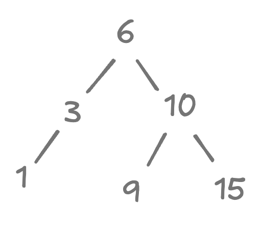
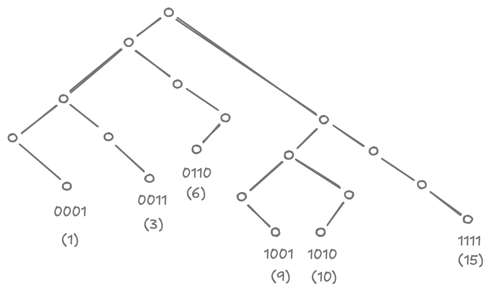
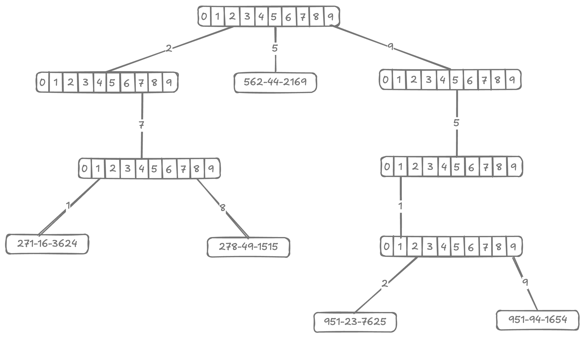
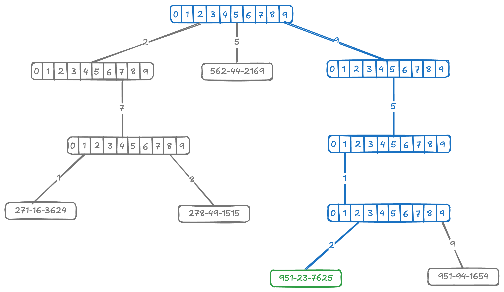
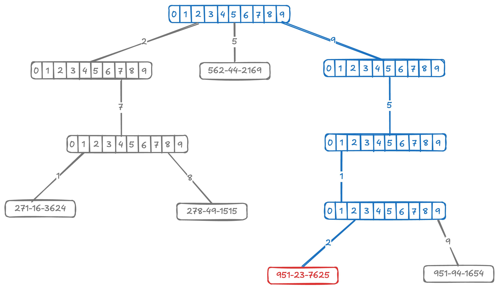
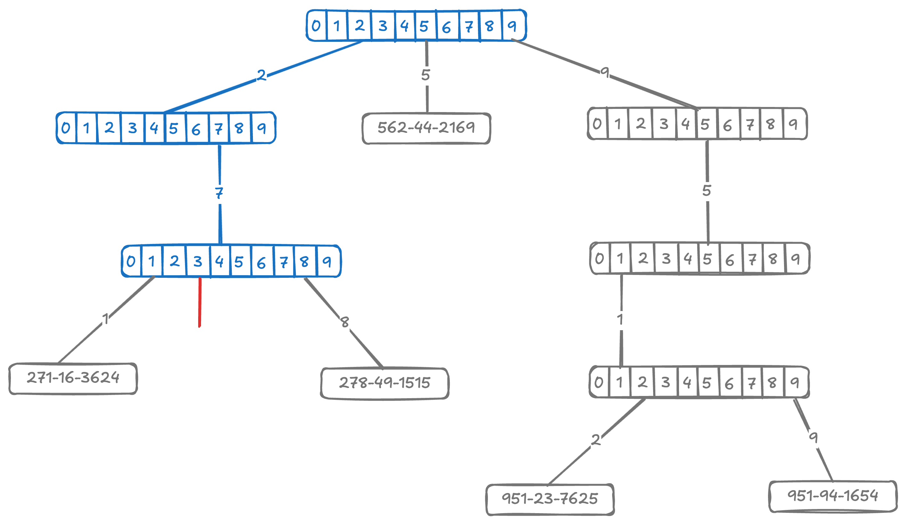
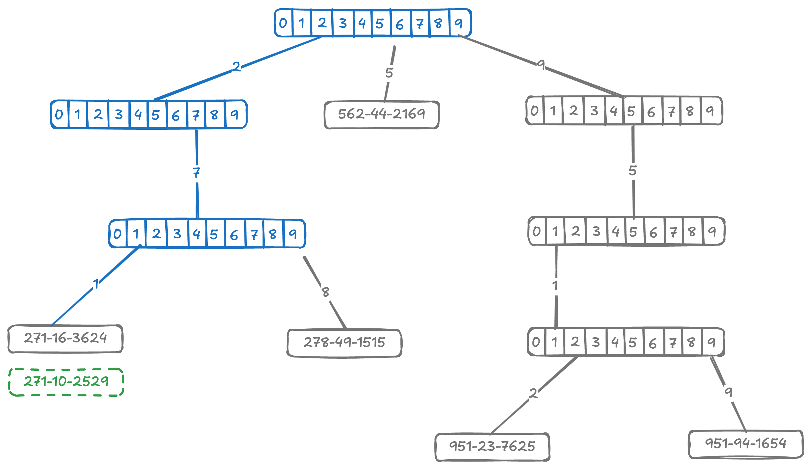
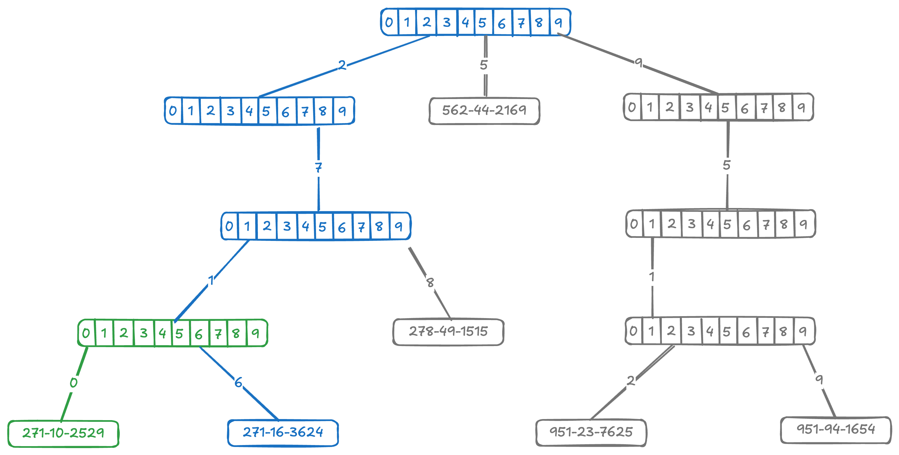
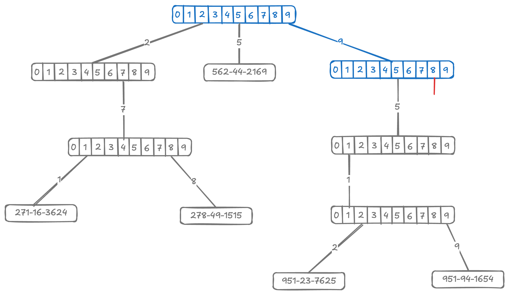
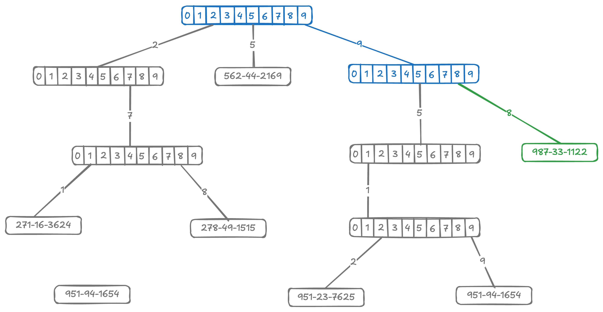

# Introduction

<style>
.md-logo img {
  content: url('/data-structures/trie/logo.png');
}

:root [data-md-color-scheme=slate] .md-logo img  {
  content: url('/data-structures/trie/logo.png');
}
</style>

## About

The idea behind _Trie_ (pronounced "try"), also known as Radix-trees, is to store keys only at the leaf nodes of the tree. The resulting data structure has a number of interesting properties.

- The structure of a trie is independent of the key insertion order. There is a unique trie for any given set of distinct keys.
- The height of a trie is the length of the longest key it contains.
- Keys can be looked up by their prefix alone, without having to process the entire key.

## Details

The core premise behind Trie can be better understood in constrast against BST.

Consider for example a BST container numbers $6, 3, 1, 10, 9, 15$.

{width=150px}

now consider the same keys in a trie.

{width=500px}

<div markdown class="grid">

<hr>

<hr>

<div markdown>
In a BST, searching for a key involves repeatedly comparing said key against the keys stored in the tree nodes. This is, of course, an $O(1)$ operation when it comes to simple integers. But it's not so straighforward when dealing with strings.

Comparing two strings of length $d$ is an $O(d)$ operation, so searching in a string BST would be $O(dh)$ operation, where $h$ is the height of BST.

</div>

<div markdown>
In a Trie, on the other hand, searching for a key of length $d$ is an $O(d)$ operation. In fact, we may be able to look up a key without ever actually having to process it in its entirety.
</div>

<hr>

<hr>

<div markdown>
In a BST, we decide which branch to take depending on the whole key.
</div>

<div markdown>
In a Trie, branching decision is based on individual digits of the key.
</div>

<hr>

<hr>

<div markdown>
BST maintains keys in all nodes, internal and leaf both.
</div>

<div markdown>
Trie keys are all saved in leaf nodes. Do not confuse the branches to imply that the key can be derived during search alone. See as an example:

```
          b(5▹e,t)
    ┌────────┴───────┐
l(planet)         l(plant)
```

</div>

</div>

## Example

### Search

<div markdown class="grid">



We search for a key by starting at the root and following the branches down until either hitting a leaf node or falling off the trie.

<hr>

<hr>

Search for key `951-23-7625` ending with success on a leaf node.



<hr>

<hr>



Search for key `951-23-1669` ending with failure on a leaf node.

<hr>

<hr>

Search for key `273-11-1341` ending with failure as we jump off a branch node to `null`.



</div>

### Insertion

<div markdown class="grid">


To insert an element in a Trie, we first search the element. If the trie already contains it, there is nothing else to do. If not, then we run into two possible scenarios.

<hr>

<hr>

<div markdown>

Searching `271-10-2529` leads us to a leaf node. Since the key doesn't match what we are looking for, the next step is then to insert a branch instead.

</div>

<div markdown>

=== "Search"

    

=== "Insert"

    

</div>

<div markdown>

=== "Search"

    

=== "Insert"

    

</div>

<div markdown>

Searching `987-33-1122` leds us to fall off the trie. It's where we insert the new node.

</div>

</div>

### Deletion

Removing elements is pretty straightforward. Once again we start with search.

- If there is no matching element, then there's nothing to do.
- If a match is found, then we remove the node and retrace the path from match to the root and "trim".

Trimming here means removing any obsolete branch nodes, i.e. branches with only one element. Removing this only element makes are branch pointless and it can be deleted too.
