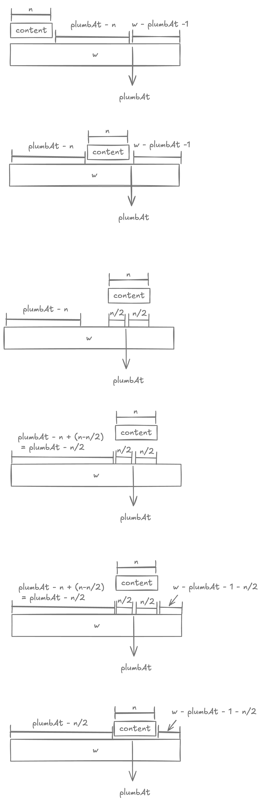

# Tree Printer

## Example

```
                                                              Once_upon_a_midnight_dreary_while_I_pondered_weak_and_weary
                                ┌─────────────────────────────────────────────────────────────────┤
                      Over_many_a_quaint                                                     and_curious
            ┌───────────────────┤                                           ┌─────────────────────┤
volume_of_forgotten_lore While_I_nodded                              nearly_napping suddenly_there_came_a_tapping
                                                ┌───────────────────────────┤
                                          As_of_some_one              gently_rapping
                                                              ┌─────────────┤
                                                        rapping_at_my chamber_door
```

## Breakdown

<div markdown class="grid">

<div markdown>
We begin with outlining a recursive solution. It'll be similar to `toString()` in a way where each node knows how to print itself knowing how to print its children. To this end, we will operate on a interface `PrintableNode`.
</div>

<div markdown>

```kotlin linenums="1"
interface PrintableNode {

  fun content(): String

  fun children(): List<PrintableNode>

  fun leaf(): Boolean = children().isEmpty()
}
```

</div>

<div markdown>

```kotlin linenums="1"
private data class PrintedSubtree(
  var plumbAt: Int = -1,
  val rows: MutableList<StringBuilder> = mutableListOf()
)
```

</div>

<div markdown>
Consider now what our recursive solution will return back? For this, we can declare a new type `PrintedSubtree`. This is because each subtree will end up being multiline and will need to know the position of its root, which we'll plug in `plumbAt`.
</div>

<div markdown>
Each recursive solution needs a base case. In our recursive solution `printHelper`, we being with laying out the base case of priting a leaf node.

```
  ┌
foobar
```

This will return this `PrintedSubtree` where the body is simply the content of the node and the `plumbAt` is the middle of the string.

</div>

<div markdown>
```kotlin linenums="1"
private fun printHelper(node: PrintableNode): PrintedSubtree {
  if (node.leaf()) {
    return PrintedSubtree(
      node.content().length / 2,
      mutableListOf(StringBuilder(node.content()))
    )
  }
  ...
```
</div>

<div markdown>
```kotlin linenums="1"
val children = mutableListOf<PrintedSubtree>()
for (child in node.children()) {
  children.add(printHelper(child))
}
```
</div>

<div markdown>
For the non-base / recursive scenario, lets jump ahead and assume that we have already figured out everything. Under this assumption, we'll emit out a `PrintedSubtree` for each of the child node.
</div>

<div markdown>
Once we have printed all children nodes, we need to make sure that they are gaps in-between.
</div>

<div markdown>

```kotlin linenums="1" hl_lines="5"
val children = mutableListOf<PrintedSubtree>()
for (child in node.children()) {
  children.add(printHelper(child))
}
addColumnGutter(children)
...


private fun addColumnGutter(subtrees: List<PrintedSubtree>) {
  for ((c, column) in subtrees.withIndex()) {
    if (c == subtrees.size - 1) continue
    for (row in column.rows) {
      row.append(' ')
    }
  }
}
```

</div>

<div markdown>

```kotlin linenums="1" hl_lines="6"
val children = mutableListOf<PrintedSubtree>()
for (child in node.children()) {
  children.add(printHelper(child))
}
addColumnGutter(children)
normalizeHeight(children)
...

/**
  *  c1   c2   c3      c1   c2   c3
  * [--] [-] [---]    [--] [-] [---]
  * [--] [-]       => [--] [-] [---]
  *      [-]          [--] [-] [---]
  */
private fun normalizeHeight(subtrees: List<PrintedSubtree>) {
  val maxDepth = subtrees.maxOf { it.rows.size }
  for (subtree in subtrees) {
    val width = subtree.rows.first().length
    while (subtree.rows.size < maxDepth) {
      subtree.rows.add(StringBuilder(" ".repeat(width)))
    }
  }
}
```

</div>

<div markdown>
Now note that each child subtree may end up having different height. So we need to add empty rows filled with nothing but whitespace to shorter subtrees.
</div>

<div markdown>

Once we have all the subtrees printed and of equal height, there is no point keeping them separate and instead they can be stitched together. We'll get back to how `mergeSubtrees` works.

For now consider one edge case: we can run into scenario where a parent node is wider than its children. In this case, we need to add left and right padding to the printed subtree, i.e. enforce a minimum width. This needs to be done **after** stiching the subtress in `mergeSubtrees`.

</div>

<div markdown>

```kotlin linenums="1" hl_lines="8 9"
val children = mutableListOf<PrintedSubtree>()
for (child in node.children()) {
  children.add(printHelper(child))
}
addColumnGutter(children)
normalizeHeight(children)

val merged = mergeSubtrees(children)
normalizeWidth(node.content().length, merged)
...


/**
  * foobar    foobar
  *  [-]   => [----]
  *  [-]      [----]
  */
private fun normalizeWidth(minWidth: Int, subtree: PrintedSubtree) {
  val remaining = minWidth - subtree.rows.first().length
  if (remaining <= 0) return

  for ((r, row) in subtree.rows.withIndex()) {
    val sb = StringBuilder()
      .append(" ".repeat(remaining / 2))
      .append(row)
      .append(" ".repeat(remaining - remaining / 2))
    subtree.rows[r] = sb
  }
  subtree.plumbAt += remaining / 2
}
```

</div>

<div markdown>

```kotlin linenums="1"
/**
  *  c1   c2   c3       ┌─┼─┐
  * [--] [-] [---]    [------]
  * [--] [-]       => [------]
  *      [-]          [------]
  */
private fun mergeSubtrees(subtrees: List<PrintedSubtree>): PrintedSubtree {
  val merged = plumbing(subtrees)

  val maxDepth = subtrees.maxOf { it.rows.size }
  for (r in 0..<maxDepth) {
    val row = subtrees.first().rows[r]
    for ((c, column) in subtrees.withIndex()) {
      if (c == 0) continue
      row.append(column.rows[r])
    }
    merged.rows.add(row)
  }

  return merged
}
```

</div>

<div markdown>
Going back, see how `mergeSubtrees` works. Mostly it's straightforward, rows at same depth across all subtrees are appended together. What's tricky is preparing the "plumbing". That's the lines connecting the subtrees' roots to the parent node.
</div>

<div markdown>
`plumbing` internally figures out the left and right whitespace padding for the generated row. Within the generated row, it finds out the "joint" character for each node, e.g. `┌`, `┬`, `┤` etc.

Notice that when we merged subtrees, we were left with incorrect `plumbAt` for all but the very first subtree. The `plumbAt` of second subtree needs to be shifted right by the width of the first subtree. Similary, `plumbAt` of third subtree needs to be shifted right by the total width of first and second subtree...and so on.

Finally, we need to figure out the position of the root node of this merged subtree. We'll place it just above the subtree in the middle.

</div>

<div markdown>

```kotlin linenums="1"
private fun plumbing(subtrees: List<PrintedSubtree>): PrintedSubtree {
  val row = StringBuilder()
  val count = subtrees.size
  var rootPlumbAt = -1

  var prevPlumbAt = -1
  var offset = 0

  for (i in subtrees.indices) {
    val plumbAt = subtrees[i].plumbAt + offset
    val width = subtrees[i].rows.first().length + offset
    if (i == count / 2) rootPlumbAt = plumbAt
    val joint = joint(i, count)

    when(i) {
      // "     ┌"
      0 -> {
        row
          .append(" ".repeat(plumbAt))
          .append(joint)

        if (count == 1) {
          row.append(" ".repeat(width - plumbAt - 1))
        }
      }
      // "┌     "
      count - 1 -> {
        row
          .append("─".repeat(plumbAt - prevPlumbAt - 1))
          .append(joint)
          .append(" ".repeat(width - plumbAt - 1))
      }
      else -> {
        // "┌────┬"
        // "┬────┐"
        row
          .append("─".repeat(plumbAt - prevPlumbAt - 1))
          .append(joint)
      }
    }

    offset += subtrees[i].rows.first().length
    prevPlumbAt = plumbAt
  }
  return PrintedSubtree(rootPlumbAt, mutableListOf(row))
}

private fun joint(index: Int, count: Int): Char {
  val left = 0..<count/2
  val below = count / 2

  return when (index) {
    below -> if (count == 1) '|' else if (index < count - 1) '┼' else '┤'
    in left -> if (index == 0) '┌' else '┬'
    else -> if (index == count - 1) '┐' else '┬'
  }
}
```

</div>

<div markdown>

```kotlin linenums="1" hl_lines="11-14"
val children = mutableListOf<PrintedSubtree>()
for (child in node.children()) {
  children.add(printHelper(child))
}
addColumnGutter(children)
normalizeHeight(children)

val merged = mergeSubtrees(children)
normalizeWidth(node.content().length, merged)

var w = merged.rows.first().length
val topRow = StringBuilder()
if (w == node.content().length) {
  topRow.append(node.content())
} else {
  ...
}

merged.rows.addFirst(topRow)
return merged
```

</div>

<div markdown>

Going back to `printHelper`, we need to account for two scenarios. First what happens when the merged subtrees were too narrow, narrower than the wide of the parent's content.

```hl_lines="1"
bonjour     // prepended in line 14
   |        // from merged
 hello      // from merged
```

In this case all we need to do is prepend the `node.content()` as a new row, and that's the result of our `printHelper` call.

</div>

<div markdown>

Now to account for the second and the most common case where the merged subtree will much wider than the content of parent node.

```hl_lines="3"
root                 // node.content()

  ┌──────┼─────┐     // from merged
first second third   // from merged
```

We need to left pad `node.content()` just the right amount such that its middle sits at `merged.plumbAt`, followed by adding right padding to it's as wide merged subtree's rows.



Ok, that explains line #21 and #23, but what's with check for `remaining > 0`? That's to account for situations where when we try to place `node.content()` above `plumbAt`, it spills the resultant row wider than `subtree.rows`. Hence we need to `normalizeWidth` again.

</div>

<div markdown>

```kotlin linenums="1" hl_lines="16-25"
val children = mutableListOf<PrintedSubtree>()
for (child in node.children()) {
  children.add(printHelper(child))
}
addColumnGutter(children)
normalizeHeight(children)

val merged = mergeSubtrees(children)
normalizeWidth(node.content().length, merged)

var w = merged.rows.first().length
val topRow = StringBuilder()
if (w == node.content().length) {
  topRow.append(node.content())
} else {
  val n = node.content().length
  topRow.append(" ".repeat(merged.plumbAt - n / 2))
  topRow.append(node.content())

  w = max(w, topRow.length)
  val remaining = w - merged.plumbAt - 1 - n/2
  if (remaining > 0) {
    topRow.append(" ".repeat(remaining))
  }
  normalizeWidth(topRow.length, merged)
}

merged.rows.addFirst(topRow)
return merged
```

</div>

<div markdown>

```kotlin linenums="1"
fun print(root: PrintableNode): String {
  val tree = printHelper(root)
  val trim = trimSize(tree)
  return tree.rows.map { it.substring(trim) }.joinToString(separator = "\n")
}

private fun trimSize(subtree: PrintedSubtree): Int {
  fun leftPadding(str: CharSequence): Int {
    var padding = 0
    for (c in str) {
      if (c != ' ') break
      padding++
    }
    return padding
  }

  return subtree.rows.minOf { leftPadding(it) }
}
```

</div>

<div markdown>
We now come out of our recursive solution and see how the `PrintedSubtree` is converted to a simple `String`. It's quite straightforward: we just join all rows, one below another.

```
•••••••••••root•••••••
••••••┌──────┼─────┐••
••••first second third
```

One final thing we need to do before doing so though is to shave off excess padding. Why? Recall the `normalizeWidth` step. During the recursive call this can add excess padding to child subtree, but as the recusion unwinds, the subtree may end up getting new sibling and this merged subtree end up getting wider than parent `node.content()`, making the excess padding we had added redundant.

</div>

</div>

## Implementation

### PrintableNode

Methods a tree-like structure needs to implement for it being printable.

```kotlin linenums="1"
interface PrintableNode {

  fun content(): String

  fun children(): List<PrintableNode>

  fun leaf(): Boolean = children().isEmpty()

}
```

### TreePrinter

```kotlin linenums="1"
package com.example.tree

import kotlin.math.max

object TreePrinter {

  fun print(root: PrintableNode): String {
    val tree = printHelper(root)
    val trim = trimSize(tree)
    return tree.rows.joinToString(separator = "\n")
  }

  private fun trimSize(subtree: PrintedSubtree): Int {
    fun leftPadding(str: CharSequence): Int {
      var padding = 0
      for (c in str) {
        if (c != ' ') break
        padding++
      }
      return padding
    }

    return subtree.rows.minOf { leftPadding(it) }
  }

  /**
   * Print given node.
   *
   * @return index at which to wire the arrow.
   */
  private fun printHelper(node: PrintableNode): PrintedSubtree {
    if (node.leaf()) {
      return PrintedSubtree(node.content().length / 2, mutableListOf(StringBuilder(node.content())))
    }

    val children = mutableListOf<PrintedSubtree>()
    for (child in node.children()) {
      children.add(printHelper(child))
    }
    addColumnGutter(children)

    // ┌─┼─┐
    // a b c
    normalizeHeight(children)
    val merged = mergeSubtrees(children)
    normalizeWidth(node.content().length, merged)

    var w = merged.rows.first().length
    val topRow = StringBuilder()
    if (w == node.content().length) {
      topRow.append(node.content())
    } else {
      val n = node.content().length
      topRow.append(" ".repeat(merged.plumbAt - n / 2))
      topRow.append(node.content())

      w = max(w, topRow.length)
      val remaining = w - merged.plumbAt - 1 - n/2
      if (remaining > 0) {
        topRow.append(" ".repeat(remaining))
      }
      normalizeWidth(topRow.length, merged)
    }
    merged.rows.addFirst(topRow)

    return merged
  }

  private fun addColumnGutter(subtrees: List<PrintedSubtree>) {
    for ((c, column) in subtrees.withIndex()) {
      if (c == subtrees.size - 1) continue
      for (row in column.rows) {
        row.append(' ')
      }
    }
  }

  /**
   *  c1   c2   c3      c1   c2   c3
   * [--] [-] [---]    [--] [-] [---]
   * [--] [-]       => [--] [-] [---]
   *      [-]          [--] [-] [---]
   */
  private fun normalizeHeight(subtrees: List<PrintedSubtree>) {
    val maxDepth = subtrees.maxOf { it.rows.size }
    for (subtree in subtrees) {
      val width = subtree.rows.first().length
      while (subtree.rows.size < maxDepth) {
        subtree.rows.add(StringBuilder(" ".repeat(width)))
      }
    }
  }

  /**
   * foobar    foobar
   *  [-]   => [----]
   *  [-]      [----]
   */
  private fun normalizeWidth(minWidth: Int, subtree: PrintedSubtree) {
    val remaining = minWidth - subtree.rows.first().length
    if (remaining <= 0) return

    for ((r, row) in subtree.rows.withIndex()) {
      val sb = StringBuilder()
        .append(" ".repeat(remaining / 2))
        .append(row)
        .append(" ".repeat(remaining - remaining / 2))
      subtree.rows[r] = sb
    }
    subtree.plumbAt += remaining / 2
  }

  /**
   *  c1   c2   c3       ┌─┼─┐
   * [--] [-] [---]    [------]
   * [--] [-]       => [------]
   *      [-]          [------]
   */
  private fun mergeSubtrees(subtrees: List<PrintedSubtree>): PrintedSubtree {
    val merged = plumbing(subtrees)

    val maxDepth = subtrees.maxOf { it.rows.size }
    for (r in 0..<maxDepth) {
      val row = subtrees.first().rows[r]
      for ((c, column) in subtrees.withIndex()) {
        if (c == 0) continue
        row.append(column.rows[r])
      }
      merged.rows.add(row)
    }

    return merged
  }

  private fun plumbing(subtrees: List<PrintedSubtree>): PrintedSubtree {
    val row = StringBuilder()
    val count = subtrees.size
    var rootPlumbAt = -1

    var prevPlumbAt = -1
    var offset = 0

    for (i in subtrees.indices) {
      val plumbAt = subtrees[i].plumbAt + offset
      val width = subtrees[i].rows.first().length + offset
      if (i == count / 2) rootPlumbAt = plumbAt
      val joint = joint(i, count)

      when(i) {
        // "     ┌"
        0 -> {
          row
            .append(" ".repeat(plumbAt))
            .append(joint)

          if (count == 1) {
            row.append(" ".repeat(width - plumbAt - 1))
          }
        }
        // "┌     "
        count - 1 -> {
          row
            .append("─".repeat(plumbAt - prevPlumbAt - 1))
            .append(joint)
            .append(" ".repeat(width - plumbAt - 1))
        }
        else -> {
          // "┌────┬"
          // "┬────┐"
          row
            .append("─".repeat(plumbAt - prevPlumbAt - 1))
            .append(joint)
        }
      }

      offset += subtrees[i].rows.first().length
      prevPlumbAt = plumbAt
    }
    return PrintedSubtree(rootPlumbAt, mutableListOf(row))
  }

  private fun joint(index: Int, count: Int): Char {
    val left = 0..<count/2
    val below = count / 2

    return when (index) {
      below -> if (count == 1) '|' else if (index < count - 1) '┼' else '┤'
      in left -> if (index == 0) '┌' else '┬'
      else -> if (index == count - 1) '┐' else '┬'
    }
  }
}

private data class PrintedSubtree(var plumbAt: Int = -1, val rows: MutableList<StringBuilder> = mutableListOf())
```

## Unit tests

```kotlin linenums="1"
package com.example.tree

import org.assertj.core.api.Assertions.assertThat
import org.junit.jupiter.api.Test

class TreePrinterTest {

  @Test
  fun leaf() {
    val root = TextNode("hello")
    println(TreePrinter.print(root))
    assertThat(TreePrinter.print(root)).isEqualTo("hello")
  }

  @Test
  fun oneChild() {
    val root = TextNode("root")
      .addChild(TextNode("first"))
    assertThat(TreePrinter.print(root)).isEqualTo(
      """
        root
          |
        first
    """.trimIndent()
    )
  }

  @Test
  fun twoChildren() {
    val root = TextNode("root")
      .addChild(TextNode("first"))
      .addChild(TextNode("second"))
    assertThat(TreePrinter.print(root)).isEqualTo(
      """
             root
        ┌──────┤
      first second
    """.trimIndent()
    )
  }

  @Test
  fun threeChildren() {
    val root = TextNode("root")
      .addChild(TextNode("first"))
      .addChild(TextNode("second"))
      .addChild(TextNode("third"))
    assertThat(TreePrinter.print(root)).isEqualTo(
      """
             root
        ┌──────┼─────┐
      first second third
    """.trimIndent()
    )
  }

  @Test
  fun fourChildren() {
    val root = TextNode("root")
      .addChild(TextNode("first"))
      .addChild(TextNode("second"))
      .addChild(TextNode("third"))
      .addChild(TextNode("fourth"))
    assertThat(TreePrinter.print(root)).isEqualTo(
      """
                   root
        ┌──────┬─────┼──────┐
      first second third fourth
    """.trimIndent()
    )
  }

  @Test
  fun fiveChildren() {
    val root = TextNode("root")
      .addChild(TextNode("first"))
      .addChild(TextNode("second"))
      .addChild(TextNode("third"))
      .addChild(TextNode("fourth"))
      .addChild(TextNode("fifth"))
    assertThat(TreePrinter.print(root)).isEqualTo(
      """
                   root
        ┌──────┬─────┼──────┬─────┐
      first second third fourth fifth
    """.trimIndent()
    )
  }

  @Test
  fun fiveChildren_firstOneChild() {
    val root = TextNode("root")
      .addChild(
        TextNode("first")
          .addChild(TextNode("first-first"))
      )
      .addChild(TextNode("second"))
      .addChild(TextNode("third"))
      .addChild(TextNode("fourth"))
      .addChild(TextNode("fifth"))
    assertThat(TreePrinter.print(root)).isEqualTo(
      """
                         root
           ┌─────────┬─────┼──────┬─────┐
         first    second third fourth fifth
           |
      first-first
    """.trimIndent()
    )
  }

  @Test
  fun fiveChildren_firstTwoChild() {
    val root = TextNode("root")
      .addChild(
        TextNode("first")
        .addChild(TextNode("first-first"))
        .addChild(TextNode("first-second"))
      )
      .addChild(TextNode("second"))
      .addChild(TextNode("third"))
      .addChild(TextNode("fourth"))
      .addChild(TextNode("fifth"))
    assertThat(TreePrinter.print(root)).isEqualTo(
      """
                                root
                  ┌─────────┬─────┼──────┬─────┐
                first    second third fourth fifth
     ┌────────────┤
first-first first-second
    """.trimIndent()
    )
  }

  @Test
  fun fiveChildren_firstTwoChild_secondTwoChild() {
    val root = TextNode("root")
      .addChild(
        TextNode("first")
        .addChild(TextNode("first-first"))
        .addChild(TextNode("first-second"))
      )
      .addChild(
        TextNode("second")
          .addChild(TextNode("second-first"))
          .addChild(TextNode("second-second"))
      )
      .addChild(TextNode("third"))
      .addChild(TextNode("fourth"))
      .addChild(TextNode("fifth"))
    assertThat(TreePrinter.print(root)).isEqualTo(
      """
                                                   root
                  ┌─────────────────────────┬────────┼──────┬─────┐
                first                    second    third fourth fifth
     ┌────────────┤            ┌────────────┤
first-first first-second second-first second-second
    """.trimIndent()
    )
  }

  @Test
  fun fiveChildren_firstTwoChild_thirdTwoChild() {
    val root = TextNode("root")
      .addChild(
        TextNode("first")
          .addChild(TextNode("first-first"))
          .addChild(TextNode("first-second"))
      )
      .addChild(TextNode("second"))
      .addChild(
        TextNode("third")
          .addChild(TextNode("third-first"))
          .addChild(TextNode("third-second"))
      )
      .addChild(TextNode("fourth"))
      .addChild(TextNode("fifth"))
    assertThat(TreePrinter.print(root)).isEqualTo(
      """
                                                root
                  ┌─────────┬─────────────────────┼─────────┬─────┐
                first    second                 third    fourth fifth
     ┌────────────┤                  ┌────────────┤
first-first first-second        third-first third-second
    """.trimIndent()
    )
  }

  @Test
  fun fiveChildren_firstTwoChild_thirdTwoChild_fifthTower() {
    val root = TextNode("root")
      .addChild(
        TextNode("first")
          .addChild(TextNode("first-first"))
          .addChild(TextNode("first-second"))
      )
      .addChild(TextNode("second"))
      .addChild(
        TextNode("third")
          .addChild(TextNode("third-first"))
          .addChild(TextNode("third-second"))
      )
      .addChild(TextNode("fourth"))
      .addChild(
        TextNode("fifth")
          .addChild(
            TextNode("fifth-first")
              .addChild(TextNode("first-first-first"))
          )
      )
    assertThat(TreePrinter.print(root)).isEqualTo(
      """
                                                root
                  ┌─────────┬─────────────────────┼─────────┬───────────┐
                first    second                 third    fourth       fifth
     ┌────────────┤                  ┌────────────┤                     |
first-first first-second        third-first third-second           fifth-first
                                                                        |
                                                                first-first-first
    """.trimIndent()
    )
  }

  @Test
  fun fiveChildren_fifthOneChild() {
    val root = TextNode("root")
      .addChild(TextNode("first"))
      .addChild(TextNode("second"))
      .addChild(TextNode("third"))
      .addChild(TextNode("fourth"))
      .addChild(
        TextNode("fifth")
          .addChild(TextNode("fifth-first"))
      )
    assertThat(TreePrinter.print(root)).isEqualTo(
      """
             root
  ┌──────┬─────┼──────┬────────┐
first second third fourth    fifth
                               |
                          fifth-first
    """.trimIndent()
    )
  }

  @Test
  fun fiveChildren_fifthTwoChild() {
    val root = TextNode("root")
      .addChild(TextNode("first"))
      .addChild(TextNode("second"))
      .addChild(TextNode("third"))
      .addChild(TextNode("fourth"))
      .addChild(
        TextNode("fifth")
          .addChild(TextNode("fifth-first"))
          .addChild(TextNode("fifth-second"))
      )
    assertThat(TreePrinter.print(root)).isEqualTo(
      """
             root
  ┌──────┬─────┼──────┬─────────────────────┐
first second third fourth                 fifth
                               ┌────────────┤
                          fifth-first fifth-second
    """.trimIndent()
    )
  }

  @Test
  fun top_wide() {
    val root = TextNode("000-000-000-000-000-000-000")
      .addChild(TextNode("111-111-111").addChild(TextNode("222")))
    assertThat(TreePrinter.print(root)).isEqualTo(
      """
000-000-000-000-000-000-000
             |
        111-111-111
             |
            222
    """.trimIndent()
    )
  }

  @Test
  fun top_wide_twoChild() {
    val root = TextNode("000-000-000-000-000-000-000")
      .addChild(TextNode("111-111-111").addChild(TextNode("222")))
      .addChild(TextNode("333"))
    assertThat(TreePrinter.print(root)).isEqualTo(
      """
000-000-000-000-000-000-000
           ┌───────┤
      111-111-111 333
           |
          222
    """.trimIndent()
    )
  }

  @Test
  fun edgar_allen_poe() {
    val root = TextNode("Once_upon_a_midnight_dreary_while_I_pondered_weak_and_weary")
      .addChild(
        TextNode("Over_many_a_quaint")
          .addChild(TextNode("volume_of_forgotten_lore"))
          .addChild(TextNode("While_I_nodded"))
      )
      .addChild(
        TextNode("and_curious")
          .addChild(
            TextNode("nearly_napping")
              .addChild(TextNode("As_of_some_one"))
              .addChild(
                TextNode("gently_rapping")
                  .addChild(TextNode("rapping_at_my"))
                  .addChild(TextNode("chamber_door"))
              )
          )
          .addChild(TextNode("suddenly_there_came_a_tapping"))
      )
    assertThat(TreePrinter.print(root)).isEqualTo(
      """
                                                                      Once_upon_a_midnight_dreary_while_I_pondered_weak_and_weary
                                        ┌─────────────────────────────────────────────────────────────────┤
                              Over_many_a_quaint                                                     and_curious
                    ┌───────────────────┤                                           ┌─────────────────────┤
        volume_of_forgotten_lore While_I_nodded                              nearly_napping suddenly_there_came_a_tapping
                                                        ┌───────────────────────────┤
                                                 As_of_some_one              gently_rapping
                                                                      ┌─────────────┤
                                                                rapping_at_my chamber_door
    """.trimIndent()
    )
  }

}

private class TextNode(val content: String) : PrintableNode {

  private val children = mutableListOf<PrintableNode>()

  override fun content(): String = content

  override fun children(): List<PrintableNode> = children

  fun addChild(node: PrintableNode): TextNode {
    children.add(node)
    return this
  }

}
```
