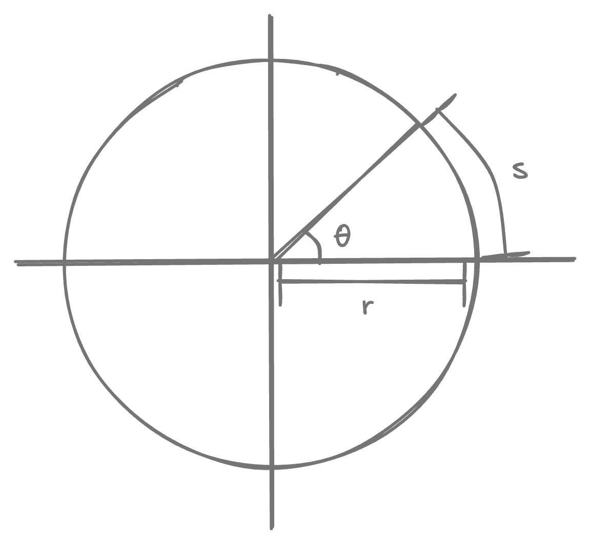
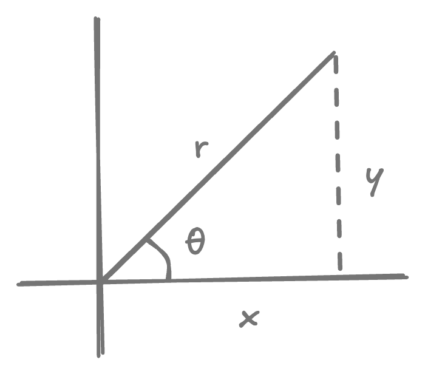

# Functions

<!-- https://mauriciopoppe.github.io/function-plot/ -->
<!--  -->

If value of one variable $y$ depends on the value of another variable $x$ then we say that "$y$ is a function of $x$", or symbolically:

$$
y = f(x)
$$

where $x$ is the independent variable and $y$ is the dependent variable.

## Functions and their graphs

### Domain & Range

Set $D$ of all possible input values of $x$ is called the **domain** of $f$. The set of all output values $f(x)$ is called the **range**. The set of all values that a $f$ could output is called its **codomain**, with $range \subseteq codomain$.

### Graphs of functions

consists of the points in Cartesian plane whose coordinates are:

$$
\{ \ \ (x, f(x)) \ \ | \ \ x \in D \ \ \}
$$

$$y = x+2$$

$$y = x^2$$

$$y = \sqrt x$$

$$y = \frac{1}{x}$$

### Vertical line text for a function

Not every curve in coordinate place can be a function graph. A function can only map on value $f(x)$ for each $x$ in the domain, so no vertical line can intersect the graph of a plane in more than one places.

$$x^2 + y^2 = 1 \text{, not a function}$$

$$y = \sqrt{1 - x^2} \text{, a function}$$

### Piecewise-defined function

is when a function is described in pieces by using different formulas on different part of its domain. For example $|x|$:

$$
abs(x) = \begin{cases}
x, & x \ge 0 \\
-x, & x < 0
\end{cases}
$$

### Even and odd functions

A function $f$ is an:

- **even function** if $f(-x) = f(x)$, i.e. mirrors about y-axis.
- **odd function** if $f(-x) = -f(x)$, i.e. mirrors about the origin.

$$y = x^2 \text{, even function}$$

$$y = x^3 \text{, odd function}$$

### Polynomial

a function $p$ is a polynomial if

$$
p(x) = a_n x^n + a_{n-1} x^{n-1} + \dots + a_1 x + a_0
$$

where $n \in \mathrm{Z}_{\ge 0}$ and $a_i$ are real constants, called **coefficients** of the polynomial.

$$
\begin{align}
y &= x^2 + x + 1 \\
\text{quadratic } & \text{function with one bend}
\end{align}
$$

$$
\begin{align}
y &= x^3 + x^2 + x + 1 \\
\text{cubic } & \text{function with two bend}
\end{align}
$$

$$
\begin{align}
y &= x^2 + 2x + 1
\end{align}
$$

$$
\begin{align}
y &= x^3 + 2x^2 + x + 1
\end{align}
$$

    
$$
\begin{align}
\text{and so on} \dots
\end{align}
$$

$$
\begin{align}
y = x^4 + x^3 & - x^2 - x - 1 \\
\text{with } & \text{three bends}
\end{align}
$$

### Rational function

is a quotient (ratio) $f(x) = \dfrac{p(x)}{q(x)}$ where $q(x) \ne 0$.

### Inverse function

The inverse function $f^{-1}$ is defined by

$$
f^{-1}(b) = a \text{ if } f(a) = b
$$

where the domain of $f^{-1}$ is range of $f$, and range of $f^{-1}$ is domain of $f$.

## Combining functions

### Sum, difference, product and quotient

$$
\begin{align}
(f + g)(x) &= f(x) + g(x) \\
\\
(f - g)(x) &= f(x) - g(x) \\
\\
(fg)(x) &= f(x) g(x) \\
\\
{\large(}\dfrac{f}{g}{\large)}(x) &= \dfrac{f(x)}{g(x)} \text{ where} g(x) \ne 0 \\
\end{align}
$$

### Composing functions

"$f$ composed with $g$" is defined as

$$
(f \circ g)(x) = f(g(x))
$$

### Graph shifting

- $y = f(x) + k$ will shift the graph **vertically up** by $k$.
- $y = f(x + k)$ will shift the graph **horizontally left** by $k$.

### Graph scaling

If $c > 1$, then:

- $y = cf(x)$ will stretch the graph **vertically** by factor of $c$.
- $y = \dfrac{1}{c}f(x)$ will compress the graph **vertically** by factor of $c$.
- $y = f(cx)$ will compress the graph **horizontally** by factor of $c$.
- $y = f(\dfrac{x}{c})$ will stretch the graph **horizontally** by factor of $c$.

If $c = -1$, then:

- $y = -f(x)$ will reflect the graph across $x$-axis.
- $y = f-(x)$ will reflect the graph across $y$-axis.

## Trignometric functions

### Radian and degree

{width=300}

Angles are measured in radians or degress. An angle of $\theta$ radian defines the relationship between the radius $r$ and the arc $s$ as:

$$
s = r\theta
$$

In a circle with radius $r = 1$, we get $\theta$ measured simply as the length of the arc that the angle cuts from the unit circle. Angles are measured in counter-clockwise direction (right to left), so clockwise direction is negative value.

| radian           | degree      |
| ---------------- | ----------- |
| $\pi$            | $180^\circ$ |
| $\dfrac{\pi}{2}$ | $90^\circ$  |
| $\dfrac{\pi}{3}$ | $60^\circ$  |
| $\dfrac{\pi}{4}$ | $45^\circ$  |
| $\dfrac{\pi}{6}$ | $30^\circ$  |

{width=200}

### Basic functions

- $\sin \theta = \dfrac{y}{r}$
- $\cos \theta = \dfrac{x}{r}$
- $\tan \theta = \dfrac{y}{x}$

- $\csc \theta = \dfrac{r}{y} = \dfrac{1}{\sin \theta}$
- $\sec \theta = \dfrac{r}{x} = \dfrac{1}{\cos \theta}$
- $\cot \theta = \dfrac{x}{y} = \dfrac{1}{\tan \theta}$

### Trignometric graphs

$$y = \sin(x)$$

$$y = \cos(x)$$

$$y = \tan(x)$$

### Trignometric identities

$$
\begin{align}
\sin^2 \theta + \cos^2 \theta &= 1 \\
1  + \tan^2 \theta &= \sec^2 \theta \\
1 + \cot^2 \theta &= \csc^2 \theta \\
\end{align}
$$

### Trignometric formulas

$$
\begin{align}
\sin(A + B) &= \sin A \cos B + \cos A \sin B \\
\cos(A + B) &= \cos A \cos B - \sin A \sin B \\
\\
\sin 2 \theta &= 2 \sin \theta \cos \theta \\
\cos 2 \theta &= \cos^2 \theta - \sin^2 \theta \\
\end{align}
$$
