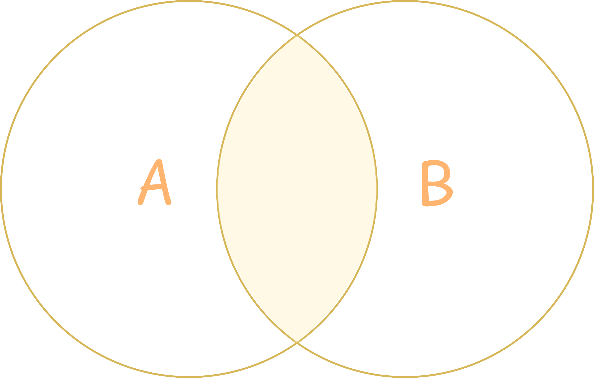

# Sets

## Operations

### Union

Given set $A$ and set $B$, the union of the two is $A \cup B$.

$$
A \cup B = \lbrace x \in A \text{ or } x \in B\rbrace
$$

{ width="200" }

### Intersection

Given set $A$ and set $B$, the intersection of the two is $A \cap B$.

$$
A \cap B = \lbrace x \in A \text{ and } x \in B\rbrace
$$

{ width="200" }

## Difference

Given set $A$ and set $B$, the difference of the two is $A - B$.

$$
A - B = \lbrace x \in A \text{ and } \not \in B\rbrace
$$

{ width="200" }
{ width="200" }

### Complement

Given set $A$ which is a subset of the universal set $U$, the complement of $A$ is $\overline A$.

$$
\begin{alignat}{1}
\overline A & = \lbrace x \in U \text{ and } x \not \in A\rbrace \\
& = U - A
\end{alignat}
$$

{ width="200" }
{ width="200" }

## Propeties

$$
\begin{alignat}{1}
\text{ commutative }A \cup B &= B \cup A\\
A \cap B &= B \cap A \\
\\
\text{ associative }(A \cup B) \cup C &= A \cup (B \cup C) \\
(A \cap B) \cap C &= A \cap (B \cap C) \\
\\
\text{ identity }A \cup \phi &= A \\
A \cap \phi &= \phi \\
\\
\text{ idempotent }A \cup A &= A \\
A \cap A &= A \\
\\
A \cup U &= U \\
A \cap U &= A \\
\\
\text{ distributive }A \cup (B \cap C) &= (A \cup B) \cap (A \cup C) \\
A \cap (B \cup C) &= (A \cap B) \cup (A \cap C) \\
\\
A \cup \overline A &= U \\
A \cap \overline A &= \phi \\
\overline{ (\overline A) } &= A \\
\\
\overline \phi &= U \\
\overline U &= \phi \\
\\
\overline{ A \cup B } &= \overline A \cap \overline B \\
\overline{ A \cap B } &= \overline A \cup \overline B \\
\\
|A - B| &= |A| - |A \cap B| \\
\Rightarrow |A \cap B| &= |A| - |A - B| \\
\Rightarrow |A| &= |A \cap B| + |A - B|
\end{alignat}
$$

## Inclusion–exclusion principle

$$
\begin{alignat}{1}
|A \cup B| &= |A-B| + |B-A| + |A \cap B| \\
&= \hspace{1em} |A| - |A \cap B| \\ & \hspace{1em} + |B| - |A \cap B| \\ & \hspace{3.5em} + |A \cap B| \\
&= |A| + |B| - |A \cap B|
\end{alignat}
$$

$$
|A \cup B \cup C| = |A| + |B| + |C| - |A \cap B| - |B \cap C| - |C \cap A| + |A \cap B \cap C|
$$
