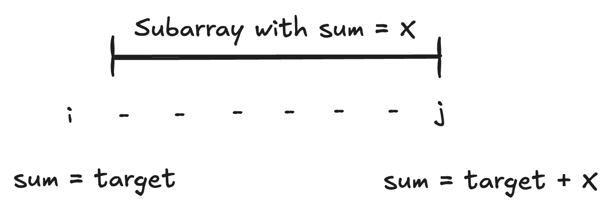

# Find longest sub-array having given Sum

## Description

Given an integer array, find the longest subarray with specified sum.

## Example

=== "First"

    $target = 8$

    $$
    5, 6, \fbox{-5, 5, 3, 5}, 3, -2, 0
    $$

=== "Second"

    $target = 15$

    $$
    \fbox{10, 5, 2, 7, 1, -10}
    $$

=== "Third"

    $target = 5$

    $$
    \fbox{-5, 8, -14, 2, 4, 12}, 4
    $$

## Placeholder

```kotlin
fun findMaxSubarrayWithSum(nums: IntArray, target: Int): IntArray {
  // Fill here
}

@Test
fun simple() {
  assertThat(
    findMaxSubarrayWithSum(intArrayOf(5, 6, -5, 5, 3, 5, 3, -2, 0), 8)
  ).isEqualTo(intArrayOf(-5, 5, 3, 5))

  assertThat(
    findMaxSubarrayWithSum(intArrayOf(10, 5, 2, 7, 1, -10), 15)
  ).isEqualTo(intArrayOf(10, 5, 2, 7, 1, -10))

  assertThat(
    findMaxSubarrayWithSum(intArrayOf(-5, 8, -14, 2, 4, 12), -5)
  ).isEqualTo(intArrayOf(-5, 8, -14, 2, 4))

  assertThat(
    findMaxSubarrayWithSum(intArrayOf(10, -10, 20, 30), 5)
  ).isEmpty()
}
```

## Hint

??? "Expand"

    Mostly same as [001-check-subarray-with-0-sum-exists-not](001-check-subarray-with-0-sum-exists-not.md)

## Solution

??? "Expand"

    Run from left to right keeping track of the `sum` of elements seen so far. If you see `sum = target`, you've found a candidate subarray. But that's not all. During every iteration, also check if you have seen `sum - target` as well.

    

    ```kotlin
    fun findMaxSubarrayWithSum(nums: IntArray, target: Int): IntArray {
      if (nums.isEmpty()) return intArrayOf()

      var solution: IntRange = IntRange.EMPTY
      var sum = 0
      val sumSeen = mutableMapOf(0 to mutableListOf(-1))

      for ((i, n) in nums.withIndex()) {
        sum += n

        sumSeen.putIfAbsent(sum, mutableListOf())
        sumSeen[sum]?.add(i) // subarray [0, i] had sum = [sum]

        if (sum == target) {
          if (i + 1 > solution.count()) {
            solution = 0..i
          }
        } else if (sum - target in sumSeen) {
          for (start in sumSeen[sum - target]!!) {
            val range = (start+1)..i
            if (range.count() > solution.count()) {
              solution = range
            }
          }
        }
      }

      return nums.sliceArray(solution)
    }
    ```
