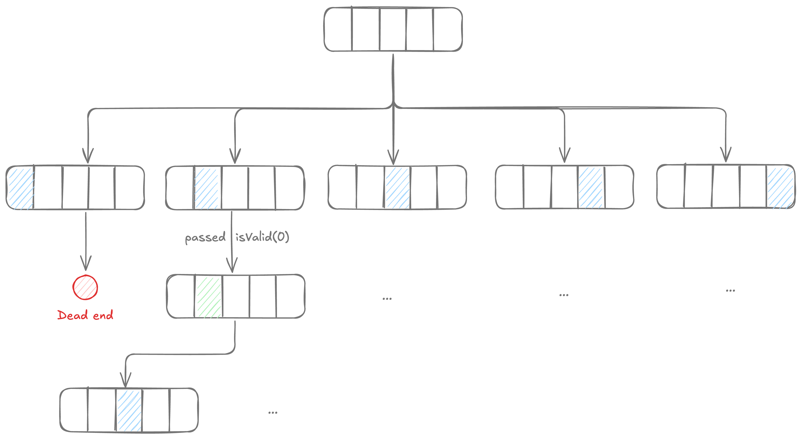

# About Backtracking

People often struggle utilizing backtracking and the reason is that they have a vague sense of the overall approach, but don't understand why they are doing it. It will help a lot if you see backtracking for what it is: **DFSing over the solution space**.

## Illustrative example

Consider a generic problem where we are given as an input an array $[\phi, \phi, \phi, \phi, \phi]$ where $\phi$ is some null character. We can fill any index $i$ with $X$ if some arbitrary evaluation check passes `isValid(i)`.

Now imagine we are tasked with filling out a valid configuration (or all) of the passed-in array, say $[\phi, X, \phi, X, X]$.



Backtracking then becomes about running DFS on this solution space until we find a valid solution.

## Components analogous to DFS

Recall that in DFS, we have two key components:

1. A way to mark nodes already visited.
2. Traversal from neighbour to neighbour.

In every backtracking implementation, we have the same:

1. We update our "partial solution" in each recursion, using this partial state as a way to mark a node in the solution space as **visited**.
2. Use aforementioned `isValid` check from one node in solution space to another (its neighbour).

## High level structure

All backtracking implementation will end up taking a general form like one of these:

<div markdown class="grid">

```kotlin
fun helper(input: Bag<?>, cursor: ?) {
  if boundCheck(cursor) == BEYOND_BOUNDS {
    yield(input)
    return
  }

  input += bag[cursor]
  helper(input, cursor + 1)
  input -= bag[cursor]
}
```

```kotlin
fun helper(input: Bag<?>, cursor: ?) {
  input += bag[cursor]
  if boundCheck(cursor) == BEYOND_BOUNDS {
    yield(input)
    input -= bag[cursor]
    return
  }

  helper(input, cursor + 1)
  input -= bag[cursor]
}
```

```kotlin
fun helper(input: Bag<?>, cursor: ?) {
  if boundCheck(cursor) == BEYOND_BOUNDS {
    yield(input)
    return
  }

  for (some loop derived from [cursor]) {
    input += X
    helper(input, next(cursor))
    input -= X
  }
}
```

<div markdown>

<br><br><br>

$$
\dots
$$

</div>

</div>

Noticed something?

!!! tip

    **Always cleanup after yourself**. <br> That is, if some value $X$ is added to the partial solution during the recursive call, then it must be removed before that recursive call returns.

## Handling duplicates

Consider the problem [**Find ways to calculate a target from elements of the specified array**](10-find-ways-calculate-target-elements-array.md). Or even something as simple as listing all the permutations of a string.

Here we run into the issue of coming up with duplicate outputs over and over. We can handle this by using `index` of the element instead of `element` itself.
