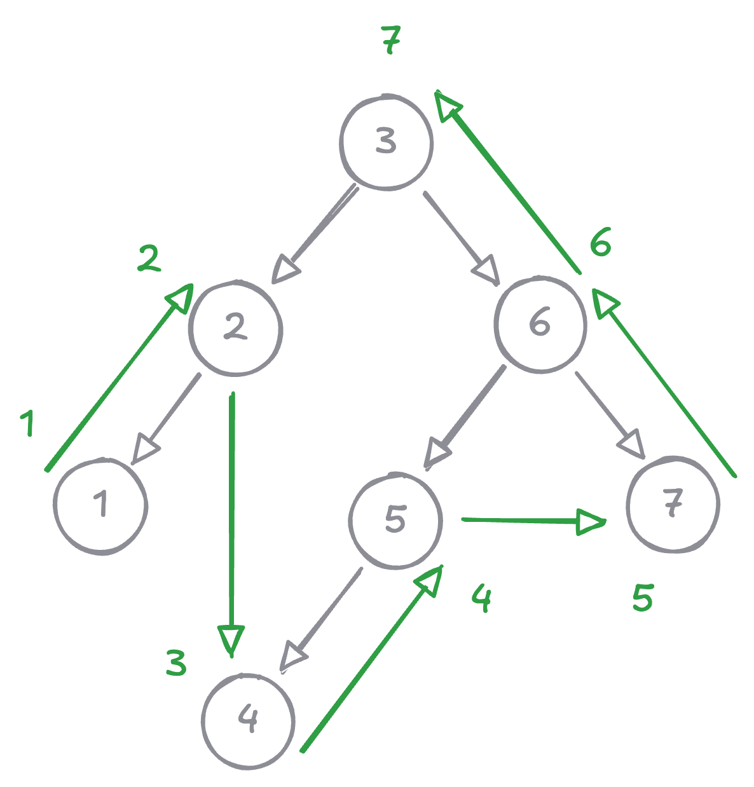

# Postorder tree traversal

## Problem

Postorder traverse a binary tree iteratively. That is:

1. visit current node's left subtree
2. visit current node's right subtree
3. visit currect root

## Example

{width=400}

## Minimum setup

```kotlin linenums="1"
class Node(val value: Int, val left: Node? = null, val right: Node? = null) {

  override fun toString(): String {
    return "$value"
  }
}
```

## Hint

??? "First"

    Follow the example diagram.

??? "Second"

    How will you ensure that right child is popped off stack before left child?

## Solution

??? "Recursive"

    ```kotlin linenums="1"
    fun postorderRecursive(node: Node?): List<Int> {
      val list = ArrayList<Int>()
      postHelper(node, list)
      return list
    }

    private fun postHelper(node: Node?, list: MutableList<Int>) {
      if (node == null) return
      node.left?.let {
        postHelper(it, list)
      }
      node.right?.let {
        postHelper(it, list)
      }
      list.add(node.value)
    }
    ```

??? "Iterative"

    ```kotlin linenums="1"
    fun postorderIterative(node: Node?): List<Int> {
      val result = ArrayList<Int>()
      if (node == null) return result

      val stack = ArrayDeque<Node>()
      stack.add(node)

      while (stack.isNotEmpty()) {
        val n = stack.removeLast()
        result.add(n.value)

        n.left?.let { stack.add(it) }
        n.right?.let { stack.add(it) }
      }

      return result.reversed()
    }
    ```

## Unit tests

```kotlin linenums="1"
@Test
fun postorder_empty() {
  val root: Node? = null
  assertThat(postorderRecursive(root)).isEqualTo(listOf<Int>())
  assertThat(postorderIterative(root)).isEqualTo(listOf<Int>())
}

@Test
fun postorder_leaf() {
  val root = Node(1)
  assertThat(postorderRecursive(root)).isEqualTo(listOf(1))
  assertThat(postorderIterative(root)).isEqualTo(listOf(1))
}

@Test
fun postorder_onlyLeftChild() {
  val root = Node(2, Node(1))
  assertThat(postorderRecursive(root)).isEqualTo(listOf(1, 2))
  assertThat(postorderIterative(root)).isEqualTo(listOf(1, 2))
}

@Test
fun postorder_onlyRightChild() {
  val root = Node(1,  left = null, right = Node(2))
  assertThat(postorderRecursive(root)).isEqualTo(listOf(2, 1))
  assertThat(postorderIterative(root)).isEqualTo(listOf(2, 1))
}

@Test
fun postorder_bothLeftRightChild() {
  val root = Node(2,  left = Node(1), right = Node(3))
  assertThat(postorderRecursive(root)).isEqualTo(listOf(1, 3, 2))
  assertThat(postorderIterative(root)).isEqualTo(listOf(1, 3, 2))
}

@Test
fun postorder_leftLeftChild() {
  val root = Node(3,
    left = Node(2, left = Node(1)),
    right = Node(4)
  )
  assertThat(postorderRecursive(root)).isEqualTo(listOf(1, 2, 4, 3))
  assertThat(postorderIterative(root)).isEqualTo(listOf(1, 2, 4, 3))
}

@Test
fun postorder_leftRightChild() {
  val root = Node(3,
    left = Node(1, left = null, right = Node(2)),
    right = Node(4)
  )
  assertThat(postorderRecursive(root)).isEqualTo(listOf(2, 1, 4, 3))
  assertThat(postorderIterative(root)).isEqualTo(listOf(2, 1, 4, 3))
}

@Test
fun postorder_leftBothChild() {
  val root = Node(4,
    left = Node(2, left = Node(1), right = Node(3)),
    right = Node(5)
  )
  assertThat(postorderRecursive(root)).isEqualTo(listOf(1, 3, 2, 5, 4))
  assertThat(postorderIterative(root)).isEqualTo(listOf(1, 3, 2, 5, 4))
}

@Test
fun postorder_rightLeftChild() {
  val root = Node(2,
    left = Node(1),
    right = Node(4, left = Node(3), right = Node(5))
  )
  assertThat(postorderRecursive(root)).isEqualTo(listOf(1, 3, 5, 4, 2))
  assertThat(postorderIterative(root)).isEqualTo(listOf(1, 3, 5, 4, 2))
}
```
