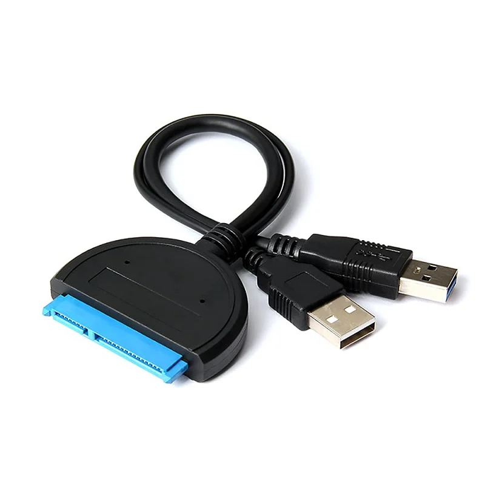

# NTFS Mount

<style>
.md-logo img {
  content: url('/ubuntu/ubuntu.svg');
}
</style>

## Background

I want to mount an external HDD to my raspberry pi server on start.

## Heads up

Before anything else, note that hdd draws more power than what raspberry pi can delivery over its usb ports. So we need a special cable, like this:

{width=200px}

## Steps

First create a folder to mound hdd to:

```bash
$ mkdir -p ~/hdd
```

Connect the hard disk and figure out its device id:

```bash
$ blkid
...
/dev/sda1: LABEL="JohnDoe" BLOCK_SIZE="512" UUID="A48AD85B8BE8292E" TYPE="ntfs" PARTUUID="b9ada862-01"
```

Then add a new row in `/etc/fstab`:

```
UUID=A48AD85B8BE8292E /home/johndoe/hdd ntfs defaults 0 0
```
